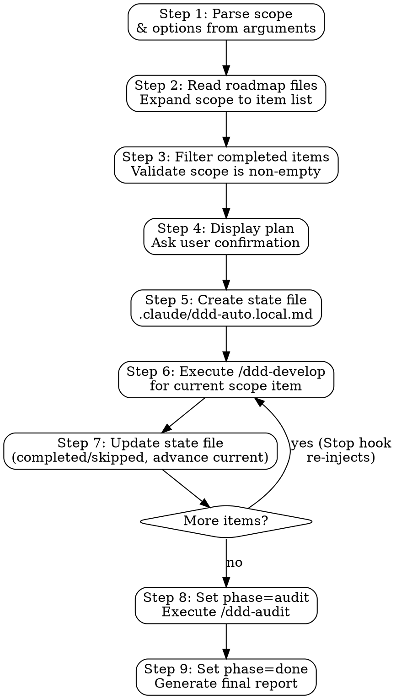

# ddd-auto Skill Implementation Plan

> **For agentic workers:** REQUIRED SUB-SKILL: Use superpowers:subagent-driven-development (recommended) or superpowers:executing-plans to implement this plan task-by-task. Steps use checkbox (`- [ ]`) syntax for tracking.

**Goal:** Add a `ddd-auto` skill that auto-executes `ddd-develop` through a roadmap scope, then runs `ddd-audit`, using a Stop hook for reliable looping.

**Architecture:** Lightweight Stop hook (~80 lines bash) blocks Claude's exit and re-injects prompts. SKILL.md handles all complex logic (scope parsing, state management, phase transitions). State file (`.claude/ddd-auto.local.md`) bridges both — YAML frontmatter readable by bash, body managed by Claude.

**Tech Stack:** Bash (stop-hook), Markdown (skill/commands), jq (JSON handling in hook)

**Source:** Design spec: `docs/superpowers/specs/2026-04-12-ddd-auto-design.md`

---

## File Structure

| File | Action | Responsibility |
|------|--------|----------------|
| `hooks/hooks.json` | Create | Register Stop hook with Claude Code |
| `hooks/stop-hook.sh` | Create | Lightweight loop engine — read state, block/allow exit |
| `commands/ddd-auto.md` | Create | `/ddd-auto` slash command entry point |
| `commands/cancel-ddd-auto.md` | Create | `/cancel-ddd-auto` cancellation command |
| `skills/ddd-auto/SKILL.md` | Create | Main skill — scope parsing, state management, orchestration |
| `package.json` | Modify | Bump version 1.5.0 → 1.6.0 |
| `.claude-plugin/plugin.json` | Modify | Bump version, update description |
| `.claude-plugin/marketplace.json` | Modify | Bump version, update description, add keywords |
| `README.md` | Modify | Add ddd-auto documentation (English) |
| `README.zh-CN.md` | Modify | Add ddd-auto documentation (Chinese) |

---

### Task 1: Create hooks/hooks.json

**Files:**
- Create: `hooks/hooks.json`

- [ ] **Step 1: Create the hooks directory and hooks.json**

```json
{
  "description": "ddd-auto stop hook for automated roadmap execution loops",
  "hooks": {
    "Stop": [
      {
        "hooks": [
          {
            "type": "command",
            "command": "bash \"${CLAUDE_PLUGIN_ROOT}/hooks/stop-hook.sh\""
          }
        ]
      }
    ]
  }
}
```

- [ ] **Step 2: Verify JSON is valid**

Run: `cat hooks/hooks.json | python3 -m json.tool > /dev/null && echo "VALID" || echo "INVALID"`
Expected: `VALID`

- [ ] **Step 3: Commit**

```bash
git add hooks/hooks.json
git commit -m "feat: add Stop hook registration for ddd-auto loop"
```

---

### Task 2: Create hooks/stop-hook.sh

**Files:**
- Create: `hooks/stop-hook.sh`

This is the lightweight loop engine. It reads ONLY scalar fields from the state file's YAML frontmatter and outputs a JSON decision. All complex logic (scope parsing, progress tracking, phase transitions) is handled by Claude via SKILL.md.

- [ ] **Step 1: Write the stop-hook.sh script**

```bash
#!/bin/bash
# ddd-auto Stop Hook
# Lightweight loop engine: reads state file scalar fields, blocks exit when loop is active.
# Claude (via SKILL.md) handles all complex logic: scope parsing, progress tracking, phase transitions.

set -euo pipefail

STATE_FILE=".claude/ddd-auto.local.md"

# 1. No state file → allow exit
if [[ ! -f "$STATE_FILE" ]]; then
  exit 0
fi

# 2. Parse YAML frontmatter (between --- delimiters) into scalar fields
FRONTMATTER=$(sed -n '/^---$/,/^---$/{ /^---$/d; p; }' "$STATE_FILE")

active=$(echo "$FRONTMATTER" | grep '^active:' | sed 's/active: *//' | head -1)
session_id=$(echo "$FRONTMATTER" | grep '^session_id:' | sed 's/session_id: *//' | sed 's/^"\(.*\)"$/\1/' | head -1)
iteration=$(echo "$FRONTMATTER" | grep '^iteration:' | sed 's/iteration: *//' | head -1)
max_iterations=$(echo "$FRONTMATTER" | grep '^max_iterations:' | sed 's/max_iterations: *//' | head -1)
phase=$(echo "$FRONTMATTER" | grep '^phase:' | sed 's/phase: *//' | sed 's/^"\(.*\)"$/\1/' | head -1)
policy=$(echo "$FRONTMATTER" | grep '^policy:' | sed 's/policy: *//' | sed 's/^"\(.*\)"$/\1/' | head -1)
policy_preset=$(echo "$FRONTMATTER" | grep '^policy_preset:' | sed 's/policy_preset: *//' | sed 's/^"\(.*\)"$/\1/' | head -1)

# 3. Read hook input from stdin (JSON with session_id, transcript_path)
HOOK_INPUT=$(cat)
HOOK_SESSION=$(echo "$HOOK_INPUT" | jq -r '.session_id // ""')

# 4. Not active → allow exit
if [[ "$active" != "true" ]]; then
  exit 0
fi

# 5. Session mismatch → allow exit (don't trap other sessions)
if [[ -n "$HOOK_SESSION" ]] && [[ -n "$session_id" ]] && [[ "$session_id" != "$HOOK_SESSION" ]]; then
  exit 0
fi

# 6. Validate numeric fields
if [[ ! "$iteration" =~ ^[0-9]+$ ]]; then
  echo "⚠️  ddd-auto: State file corrupted (iteration: '$iteration'). Stopping loop." >&2
  rm -f "$STATE_FILE"
  exit 0
fi

if [[ ! "$max_iterations" =~ ^[0-9]+$ ]]; then
  echo "⚠️  ddd-auto: State file corrupted (max_iterations: '$max_iterations'). Stopping loop." >&2
  rm -f "$STATE_FILE"
  exit 0
fi

# 7. Safety cap reached → cleanup, allow exit
if [[ $max_iterations -gt 0 ]] && [[ $iteration -ge $max_iterations ]]; then
  echo "🛑 ddd-auto: Max iterations ($max_iterations) reached. Stopping loop." >&2
  rm -f "$STATE_FILE"
  exit 0
fi

# 8. Phase done → cleanup, allow exit
if [[ "$phase" == "done" ]]; then
  rm -f "$STATE_FILE"
  exit 0
fi

# 9. Build policy hint for injection
POLICY_HINT=""
if [[ -n "$policy" ]]; then
  POLICY_HINT="Decision policy: $policy."
elif [[ -n "$policy_preset" ]]; then
  POLICY_HINT="Decision policy preset: $policy_preset."
fi

# 10. Increment iteration in state file
NEXT_ITERATION=$((iteration + 1))
TEMP_FILE="${STATE_FILE}.tmp.$$"
sed "s/^iteration: .*/iteration: $NEXT_ITERATION/" "$STATE_FILE" > "$TEMP_FILE"
mv "$TEMP_FILE" "$STATE_FILE"

# 11. Phase develop → block exit, inject develop prompt
if [[ "$phase" == "develop" ]]; then
  SYSTEM_MSG="🔄 ddd-auto iteration $NEXT_ITERATION/$max_iterations | phase: develop | /cancel-ddd-auto to stop"

  jq -n \
    --arg reason "Continue ddd-auto: Read .claude/ddd-auto.local.md to find the 'current' scope item. Execute /ddd-develop for that specific roadmap item. $POLICY_HINT After ddd-develop completes, update the state file: add completed item to 'completed' list (or 'skipped' if BLOCKED), advance 'current' to next incomplete scope item. If no scope items remain incomplete, set phase to 'audit'. Do NOT ask the user for confirmation — proceed automatically." \
    --arg msg "$SYSTEM_MSG" \
    '{"decision": "block", "reason": $reason, "systemMessage": $msg}'
  exit 0
fi

# 12. Phase audit → block exit, inject audit prompt
if [[ "$phase" == "audit" ]]; then
  SYSTEM_MSG="🔄 ddd-auto iteration $NEXT_ITERATION | phase: audit | /cancel-ddd-auto to stop"

  jq -n \
    --arg reason "Continue ddd-auto: Execute /ddd-audit (full project audit). After audit completes, update .claude/ddd-auto.local.md: set phase to 'done'. Then generate the final ddd-auto execution report summarizing all completed items, skipped items, key decisions, and audit results." \
    --arg msg "$SYSTEM_MSG" \
    '{"decision": "block", "reason": $reason, "systemMessage": $msg}'
  exit 0
fi

# Fallback: unknown phase → allow exit
echo "⚠️  ddd-auto: Unknown phase '$phase'. Stopping loop." >&2
rm -f "$STATE_FILE"
exit 0
```

- [ ] **Step 2: Make the script executable**

Run: `chmod +x hooks/stop-hook.sh`

- [ ] **Step 3: Verify the script parses a mock state file correctly**

Create a temporary test state file and run the hook in dry mode:

```bash
mkdir -p .claude
cat > .claude/ddd-auto.test.md << 'TESTEOF'
---
active: true
session_id: "test-session-123"
iteration: 2
max_iterations: 50
started_at: "2026-04-12T10:00:00Z"
phase: "develop"
policy: "prefer simple implementations"
policy_preset: "pragmatic"
scope:
  - "P0.1.1"
  - "P0.1.2"
completed: ["P0.1.1"]
skipped: []
current: "P0.1.2"
---

## Original Command

/ddd-auto P0.1.1 - P0.1.2
TESTEOF

# Test: Parse frontmatter scalars
FRONTMATTER=$(sed -n '/^---$/,/^---$/{ /^---$/d; p; }' ".claude/ddd-auto.test.md")
echo "active: $(echo "$FRONTMATTER" | grep '^active:' | sed 's/active: *//')"
echo "session_id: $(echo "$FRONTMATTER" | grep '^session_id:' | sed 's/session_id: *//' | sed 's/^"\(.*\)"$/\1/')"
echo "iteration: $(echo "$FRONTMATTER" | grep '^iteration:' | sed 's/iteration: *//')"
echo "phase: $(echo "$FRONTMATTER" | grep '^phase:' | sed 's/phase: *//' | sed 's/^"\(.*\)"$/\1/')"
echo "policy: $(echo "$FRONTMATTER" | grep '^policy:' | sed 's/policy: *//' | sed 's/^"\(.*\)"$/\1/')"

# Cleanup
rm .claude/ddd-auto.test.md
```

Expected output:
```
active: true
session_id: test-session-123
iteration: 2
phase: develop
policy: prefer simple implementations
```

- [ ] **Step 4: Test the full hook with piped JSON input (phase=done → allow exit)**

```bash
cat > .claude/ddd-auto.local.md << 'TESTEOF'
---
active: true
session_id: "test-session-123"
iteration: 5
max_iterations: 50
phase: "done"
policy_preset: "pragmatic"
---
TESTEOF

echo '{"session_id":"test-session-123","transcript_path":"/tmp/fake"}' | bash hooks/stop-hook.sh
echo "Exit code: $?"
test ! -f .claude/ddd-auto.local.md && echo "State file cleaned up: YES" || echo "State file cleaned up: NO"
```

Expected: Exit code 0, no JSON output (allow exit), state file removed.

- [ ] **Step 5: Test the hook with phase=develop (should output block JSON)**

```bash
cat > .claude/ddd-auto.local.md << 'TESTEOF'
---
active: true
session_id: "test-session-123"
iteration: 3
max_iterations: 50
phase: "develop"
policy: "prefer simple implementations"
policy_preset: "pragmatic"
scope:
  - "P0.1.1"
completed: []
skipped: []
current: "P0.1.1"
---
TESTEOF

OUTPUT=$(echo '{"session_id":"test-session-123","transcript_path":"/tmp/fake"}' | bash hooks/stop-hook.sh)
echo "$OUTPUT" | python3 -m json.tool
echo "Decision: $(echo "$OUTPUT" | jq -r '.decision')"

# Verify iteration was incremented
UPDATED_ITER=$(sed -n 's/^iteration: *//p' .claude/ddd-auto.local.md | head -1)
echo "Updated iteration: $UPDATED_ITER"

# Cleanup
rm -f .claude/ddd-auto.local.md
```

Expected:
- Valid JSON with `"decision": "block"`
- `reason` field contains "Continue ddd-auto" and "/ddd-develop"
- `systemMessage` field shows iteration count
- Updated iteration: 4

- [ ] **Step 6: Commit**

```bash
git add hooks/stop-hook.sh
git commit -m "feat: add lightweight Stop hook for ddd-auto loop engine"
```

---

### Task 3: Create commands/ddd-auto.md

**Files:**
- Create: `commands/ddd-auto.md`

- [ ] **Step 1: Create the commands directory and ddd-auto.md**

```markdown
---
description: "Auto-execute ddd-develop through a roadmap scope, then run ddd-audit"
argument-hint: "[SCOPE] [--policy <text|preset>] [--max-iterations <N>]"
---

# ddd-auto

Invoke the ddd-auto skill to automatically execute all roadmap items in the specified scope, then run a full-project audit.

**Scope syntax:**
- Single item: `/ddd-auto P0.1.1`
- Range: `/ddd-auto P0.1.1 - P1.3.1`
- Mixed: `/ddd-auto P0.1.1 - P1.3.1, P2.1.1`
- Phase: `/ddd-auto P0`
- All: `/ddd-auto` (no args = all incomplete items)

**Options:**
- `--policy <text|preset>` — Decision policy for autonomous choices. Presets: `pragmatic` (default), `strict-ddd`, `fast`. Or free text: `--policy "prefer simple implementations"`
- `--max-iterations <N>` — Safety cap (default: 50)

Use the ddd-auto skill with these arguments: $ARGUMENTS
```

- [ ] **Step 2: Commit**

```bash
git add commands/ddd-auto.md
git commit -m "feat: add /ddd-auto slash command"
```

---

### Task 4: Create commands/cancel-ddd-auto.md

**Files:**
- Create: `commands/cancel-ddd-auto.md`

- [ ] **Step 1: Create cancel-ddd-auto.md**

```markdown
---
description: "Cancel a running ddd-auto loop"
allowed-tools: ["Bash(test -f .claude/ddd-auto.local.md:*)", "Bash(rm .claude/ddd-auto.local.md)", "Read(.claude/ddd-auto.local.md)"]
---

# Cancel ddd-auto

To cancel the ddd-auto loop:

1. Check if `.claude/ddd-auto.local.md` exists using Bash: `test -f .claude/ddd-auto.local.md && echo "EXISTS" || echo "NOT_FOUND"`

2. **If NOT_FOUND**: Say "No active ddd-auto loop found."

3. **If EXISTS**:
   - Read `.claude/ddd-auto.local.md` to get the current state (iteration, phase, completed items, skipped items)
   - Remove the file using Bash: `rm .claude/ddd-auto.local.md`
   - Report a summary:
     ```
     Cancelled ddd-auto loop.
     - Iteration: [N]
     - Phase: [develop/audit]
     - Completed: [list or count]
     - Skipped: [list or count]
     ```
```

- [ ] **Step 2: Commit**

```bash
git add commands/cancel-ddd-auto.md
git commit -m "feat: add /cancel-ddd-auto slash command"
```

---

### Task 5: Create skills/ddd-auto/SKILL.md

**Files:**
- Create: `skills/ddd-auto/SKILL.md`

This is the largest task — the main skill file that orchestrates the entire ddd-auto workflow. It handles scope parsing, state file creation, ddd-develop invocation, and the overall flow. The Stop hook provides the mechanical loop guarantee; this file provides the intelligence.

- [ ] **Step 1: Write the SKILL.md file**

```markdown
---
name: ddd-auto
description: Use when auto-executing multiple roadmap items in sequence - triggers on "auto develop", "batch develop", "ddd-auto", "/ddd-auto", "run roadmap items P0 to P1", or "/ddd-auto <scope>". Automatically loops through ddd-develop for each item in scope, then runs ddd-audit. Requires Stop hook for loop reliability.
---

# DDD Auto

Automated roadmap execution: loop through `ddd-develop` for each item in a user-specified scope, then run a full-project `ddd-audit`. Uses a Stop hook to guarantee the loop continues even if Claude tries to exit.

**Announce at start:** "Using ddd-auto to execute roadmap items [scope description]."

## Input Modes

1. **Scoped** — `/ddd-auto P0.1.1 - P1.3.1, P2.1.1` executes specific items
2. **Phase-level** — `/ddd-auto P0` or `/ddd-auto P0 - P1` executes entire phases
3. **All** — `/ddd-auto` with no scope executes all incomplete roadmap items

**Options (parsed from arguments):**
- `--policy <text|preset>` — Decision policy for autonomous choices (default: `pragmatic`)
- `--max-iterations <N>` — Safety cap to prevent infinite loops (default: 50)

## Preset Decision Policies

| Preset | Bias |
|--------|------|
| `pragmatic` (default) | Practical first. Reuse existing patterns. Choose simplest viable approach. Avoid over-engineering. |
| `strict-ddd` | Strict DDD layer compliance even if it means more code. Domain purity over convenience. |
| `fast` | Minimum viable implementation. Skip non-essential optimization. Deliver first, refine later. |

## Execution Flow



**The Stop hook guarantees the loop.** After Claude completes each ddd-develop cycle and tries to exit, the Stop hook reads the state file and:
- If `phase=develop` → blocks exit, re-injects prompt to continue with next item
- If `phase=audit` → blocks exit, re-injects prompt to run ddd-audit
- If `phase=done` → allows exit (loop complete)

---

## Step 1: Parse Scope & Options

Parse the user's arguments to extract:

1. **Scope identifiers**: `P0`, `P0.1`, `P0.1.1`, ranges (`P0.1.1 - P1.3.1`), mixed (`P0.1.1 - P1.3.1, P2.1.1`)
2. **--policy**: Free text or preset name (`pragmatic`, `strict-ddd`, `fast`). Default: `pragmatic`
3. **--max-iterations**: Integer, default 50

**Parsing rules:**
- Scope tokens are `P` followed by digits and dots: `P[0-3]`, `P[0-3].[1-9]`, `P[0-3].[1-9].[1-9]`
- Ranges use ` - ` (space-hyphen-space) between two scope tokens
- Commas or spaces separate enumerated items
- `--policy` consumes the next token (quoted string or single word)
- `--max-iterations` consumes the next integer token

**If no scope provided:** scope = all phases (P0 through P3).

## Step 2: Read Roadmap & Expand Scope

1. Read roadmap files: `docs/roadmap/P[0-3]-*.md`
2. For each file, extract the phase/feature-area/sub-feature hierarchy by parsing markdown headings:
   - `# P[N]: ...` → phase
   - `## [N].M ...` → feature area
   - `### [N].M.K ...` → sub-feature (this is the item level)
3. Expand scope identifiers to concrete sub-feature IDs:
   - `P0` → all sub-features in P0 (e.g., P0.1.1, P0.1.2, P0.2.1, ...)
   - `P0.1` → all sub-features under feature area 0.1 (e.g., P0.1.1, P0.1.2, ...)
   - `P0.1.1` → specific sub-feature
   - `P0.1.1 - P1.3.1` → all sub-features from P0.1.1 to P1.3.1 in roadmap order
4. Maintain natural roadmap order (phase → feature area → sub-feature)

## Step 3: Filter & Validate

1. For each sub-feature in the expanded scope, check if it has any unchecked items (`- [ ]`)
2. Remove sub-features where all items are already `- [x]` or `✅`
3. If no incomplete items remain, inform the user: "All items in scope [scope] are already complete." and exit
4. Build the final ordered list of sub-feature IDs to execute

## Step 4: Display Plan & Confirm

Present the execution plan to the user:

```
ddd-auto execution plan:

**Scope**: [original scope expression]
**Policy**: [policy text or preset name]
**Max iterations**: [N]
**Items to execute** ([count] items):

1. P0.1.1 — [sub-feature title from roadmap]
2. P0.1.2 — [sub-feature title from roadmap]
3. P0.2.1 — [sub-feature title from roadmap]
...

Each item will be developed via /ddd-develop (with TDD, audit, and verification).
After all items complete, a full-project /ddd-audit will run.

Proceed?
```

Wait for user confirmation. If the user says no or wants changes, adjust scope and re-present.

## Step 5: Create State File

After user confirms, create `.claude/ddd-auto.local.md`:

```markdown
---
active: true
session_id: "[current CLAUDE_CODE_SESSION_ID — use $CLAUDE_CODE_SESSION_ID env var]"
iteration: 1
max_iterations: [N from --max-iterations or 50]
started_at: "[current UTC timestamp in ISO 8601]"
scope:
  - "P0.1.1"
  - "P0.1.2"
  - "P0.2.1"
completed: []
skipped: []
current: "[first item in scope list]"
phase: "develop"
policy: "[free text policy if provided, otherwise empty]"
policy_preset: "[preset name if provided, otherwise empty]"
---

## Original Command

/ddd-auto [original arguments]

## Progress Log

```

**CRITICAL:** Use `$CLAUDE_CODE_SESSION_ID` for the session_id field. This enables session isolation — the Stop hook only traps the session that started the loop.

To create this file, use the Write tool to write the complete content to `.claude/ddd-auto.local.md`.

## Step 6: Execute /ddd-develop for Current Item

Look at the `current` field in the state file. This is the sub-feature ID (e.g., `P0.1.1`) to develop next.

Invoke ddd-develop with the specific item as an ad-hoc requirement. Frame it as:

```
/ddd-develop Implement roadmap item [current]: [sub-feature title and description from roadmap]. This is part of an automated ddd-auto run.
```

**Decision policy injection:** If a policy is set, prepend to the ddd-develop invocation:

```
Decision policy for this implementation: [policy text]. When encountering design choices, apply this policy to choose autonomously without asking the user. Log key decisions in your commit messages.
```

**ddd-develop will execute its full 6-phase cycle** (LOCATE → PLAN → IMPLEMENT → AUDIT → VERIFY → COMPLETE) for this single item. Do not interfere with its workflow.

## Step 7: Update State File After Each Item

After ddd-develop completes (or reports BLOCKED):

### If DONE:
1. Add the current item to `completed` list in frontmatter
2. Append to Progress Log: `- [YYYY-MM-DD HH:MM] [item ID] — DONE (commit: [short SHA])`
3. Record any key decisions: `  - Decision: [what was decided] (policy: [rationale])`

### If BLOCKED/SKIPPED:
1. Add the current item to `skipped` list in frontmatter
2. Append to Progress Log: `- [YYYY-MM-DD HH:MM] [item ID] — SKIPPED (BLOCKED: [reason])`

### Advance to Next Item:
1. Find the next item in `scope` that is NOT in `completed` and NOT in `skipped`
2. Update `current` to that item's ID
3. If no items remain → set `phase` to `"audit"` (the Stop hook will inject the audit prompt on next exit)

**Use the Edit tool** to update the state file. Edit the YAML frontmatter fields and append to the Progress Log section.

## Step 8: Full-Project Audit

When phase transitions to `audit`, the Stop hook will inject a prompt to run `/ddd-audit`.

Execute `/ddd-audit` (full project, no scope restriction). Let ddd-audit run its complete pipeline:
1. Project scan
2. Generate audit plan
3. Execute phases (baseline → layers → integration → docs)
4. Generate final report with scores
5. Generate fix roadmap

**Do NOT fix findings in this audit** — this is a final assessment, not the incremental audit-fix loop that ddd-develop does internally. The purpose is to evaluate the overall project state after all development items.

## Step 9: Generate Final Report & Set Phase to Done

After ddd-audit completes, generate the ddd-auto execution report and update the state file.

### Update State File:
Set `phase` to `"done"` in the YAML frontmatter. The Stop hook will allow exit on the next attempt.

### Generate Report:

Read the state file's Progress Log and the audit report to compile:

```markdown
## ddd-auto Execution Report

**Scope**: [original scope expression]
**Iterations**: [final iteration count]
**Duration**: [started_at] → [current time]
**Policy**: [policy description]

### Completed ([N] items)

| # | Item | Description | Commit |
|---|------|-------------|--------|
| 1 | P0.1.1 | [sub-feature title] | [short SHA] |
| 2 | P0.2.1 | [sub-feature title] | [short SHA] |

### Skipped ([N] items)

| # | Item | Reason |
|---|------|--------|
| 1 | P0.1.2 | BLOCKED: [reason] |

### Key Decisions

| Item | Decision | Rationale |
|------|----------|-----------|
| P0.1.1 | [what was decided] | [policy rationale] |

### Audit Results

- **Score**: [overall score]%
- **Verdict**: [READY / NOT READY]
- **Findings**: CRITICAL: [N], HIGH: [N], MEDIUM: [N], LOW: [N]
- **Full report**: [path to audit-report.md]
- **Fix roadmap**: [path to fix-roadmap.md]
```

Present this report to the user. The loop will end naturally — the Stop hook sees `phase=done` and allows exit.

---

## BLOCKED Handling

When ddd-develop reports BLOCKED for a scope item:

1. **Do NOT stop the loop.** Skip the item and continue.
2. Update state file: add to `skipped`, advance `current`, log the reason.
3. If ALL remaining scope items are BLOCKED (nothing left to develop), transition to `phase=audit` early.

## Cancellation

The user can run `/cancel-ddd-auto` at any time to:
1. Delete `.claude/ddd-auto.local.md`
2. The Stop hook finds no state file and allows the next exit

## Safety Mechanisms

| Mechanism | Purpose |
|-----------|---------|
| `max_iterations` (default 50) | Prevent infinite loops |
| Session ID isolation | Only the originating session is trapped |
| `/cancel-ddd-auto` | Immediate manual termination |
| State file cleanup on `phase=done` | No leftover state after loop ends |
| Scope confirmation before start | User reviews expanded items before committing |
| Decision logging in Progress Log | All autonomous choices are auditable |

## Integration

**Requires:**
- Stop hook registered in `hooks/hooks.json`
- `jq` available on system (for hook JSON handling)

**Invokes:**
- **ddd-develop** (per-item, ad-hoc mode with specific roadmap item reference)
- **ddd-audit** (full-project mode, after all develop items complete)

**Consumes:**
- Roadmap files from `docs/roadmap/P[0-3]-*.md` (generated by ddd-roadmap)

**Produces:**
- Updated roadmap with completed items (`- [x]`)
- State file with full execution log (`.claude/ddd-auto.local.md`, cleaned up on completion)
- Final execution report (displayed to user)
- Audit report and fix roadmap (in `docs/audit/`)
```

- [ ] **Step 2: Verify the skill frontmatter is valid YAML**

Run: `head -3 skills/ddd-auto/SKILL.md`
Expected: Lines starting with `---`, `name:`, `description:`

- [ ] **Step 3: Commit**

```bash
git add skills/ddd-auto/SKILL.md
git commit -m "feat: add ddd-auto skill for automated roadmap execution"
```

---

### Task 6: Update version and metadata files

**Files:**
- Modify: `package.json`
- Modify: `.claude-plugin/plugin.json`
- Modify: `.claude-plugin/marketplace.json`

- [ ] **Step 1: Update package.json version**

Change `"version": "1.5.0"` to `"version": "1.6.0"` in `package.json`.

Add `"automation"` and `"loop"` to the keywords array.

- [ ] **Step 2: Update .claude-plugin/plugin.json**

Change `"version": "1.5.0"` to `"version": "1.6.0"`.

Update description to: `"DDD development skill suite: roadmap generation, TDD implementation, 8-dimension architecture audit, and automated roadmap execution"`.

Add `"automation"` and `"loop"` to keywords array.

- [ ] **Step 3: Update .claude-plugin/marketplace.json**

Change `"version": "1.5.0"` to `"version": "1.6.0"` in the plugin entry.

Update both description fields to include "automated roadmap execution".

Add `"automation"` and `"loop"` to the keywords array.

- [ ] **Step 4: Verify all three files have consistent version**

Run: `grep -r '"version"' package.json .claude-plugin/plugin.json .claude-plugin/marketplace.json`
Expected: All show `"1.6.0"`

- [ ] **Step 5: Commit**

```bash
git add package.json .claude-plugin/plugin.json .claude-plugin/marketplace.json
git commit -m "chore: bump version to 1.6.0 and update metadata for ddd-auto"
```

---

### Task 7: Update README.md (English)

**Files:**
- Modify: `README.md`

- [ ] **Step 1: Update the pipeline diagram**

Change:
```
ddd-roadmap  →  ddd-develop  →  ddd-audit
 (plan)         (implement)      (audit)
```

To:
```
ddd-roadmap  →  ddd-develop  →  ddd-audit
 (plan)         (implement)      (audit)
                     ↑               ↑
                 ddd-auto ───────────┘
                (automate)
```

- [ ] **Step 2: Add ddd-auto to the intro paragraph**

After the paragraph describing ddd-audit, add:

```markdown
**ddd-auto** loops through `ddd-develop` for a user-specified scope of roadmap items, then runs a full-project `ddd-audit`. Specify ranges (`/ddd-auto P0.1.1 - P1.3.1`), individual items, or entire phases. Uses a Stop hook for reliable looping with configurable decision policies.
```

- [ ] **Step 3: Add ddd-auto to the Skills table**

Add a row:
```markdown
| **ddd-auto** | Automated batch roadmap execution + audit | `/ddd-auto`, `/ddd-auto <scope>`, `/cancel-ddd-auto` |
```

- [ ] **Step 4: Add ddd-auto section after ddd-audit section**

```markdown
### ddd-auto

Automated roadmap execution with a Stop hook loop. Specify a scope, and the system executes all items via `ddd-develop`, then runs a full-project `ddd-audit`.

Scope syntax:
- `/ddd-auto P0.1.1` — single item
- `/ddd-auto P0.1.1 - P1.3.1` — range of items
- `/ddd-auto P0.1.1 - P1.3.1, P2.1.1` — mixed range + individual
- `/ddd-auto P0` — entire phase
- `/ddd-auto` — all incomplete roadmap items

Options:
- `--policy <text|preset>` — Decision policy for autonomous choices. Presets: `pragmatic` (default), `strict-ddd`, `fast`
- `--max-iterations <N>` — Safety cap (default: 50)

Cancel anytime with `/cancel-ddd-auto`.

Features:
- Reliable loop via Stop hook (no manual re-invocation needed)
- Session isolation (only the session that started the loop is affected)
- Decision policy (presets or free text for autonomous design choices)
- Progress tracking with full execution log
- Automatic skip on BLOCKED items
- Final execution report with audit results
```

- [ ] **Step 5: Update the usage examples section**

Add after the "Full Workflow Example" section:

```markdown
### Automated Batch Execution

Execute a range of roadmap items automatically:

```
You: /ddd-auto P0.1.1 - P1.3.1

# The skill will:
# 1. Expand the scope to all sub-features from P0.1.1 through P1.3.1
# 2. Show the execution plan and ask for confirmation
# 3. Loop through each item via /ddd-develop (TDD, audit, commit)
# 4. Run a full-project /ddd-audit after all items complete
# 5. Generate a final execution report
```

With a decision policy:

```
You: /ddd-auto P0 --policy "prefer simple implementations, reuse existing libraries"
```

Cancel anytime:

```
You: /cancel-ddd-auto
```
```

- [ ] **Step 6: Update the project structure section**

Add `hooks/`, `commands/` directories and `ddd-auto` to the tree:

```
ddd-coding-skills/
├── .claude-plugin/
│   └── plugin.json          # Claude Code plugin manifest
├── .codex/
│   └── INSTALL.md           # Codex CLI installation guide
├── commands/
│   ├── ddd-auto.md          # /ddd-auto slash command
│   └── cancel-ddd-auto.md   # /cancel-ddd-auto slash command
├── hooks/
│   ├── hooks.json           # Stop hook registration
│   └── stop-hook.sh         # Loop engine for ddd-auto
├── skills/
│   ├── ddd-roadmap/
│   │   └── SKILL.md         # Roadmap generation
│   ├── ddd-develop/
│   │   └── SKILL.md         # Development workflow
│   ├── ddd-auto/
│   │   └── SKILL.md         # Automated roadmap execution
│   └── ddd-audit/
│       └── SKILL.md         # 8-dimension audit
├── LICENSE                  # MIT
├── package.json
└── README.md
```

- [ ] **Step 7: Update the "How It Works" paragraph to mention the 4th skill**

Change: "Three composable skills that cover the full lifecycle"
To: "Four composable skills that cover the full lifecycle: planning, implementing, auditing, and automated batch execution."

- [ ] **Step 8: Commit**

```bash
git add README.md
git commit -m "docs: add ddd-auto documentation to README"
```

---

### Task 8: Update README.zh-CN.md (Chinese)

**Files:**
- Modify: `README.zh-CN.md`

Mirror all changes from Task 7 in Chinese. Key translations:

- [ ] **Step 1: Update pipeline diagram** (same ASCII art as English)

- [ ] **Step 2: Add ddd-auto intro paragraph**

```markdown
**ddd-auto** 按用户指定的路线图范围自动循环执行 `ddd-develop`，完成后运行全项目 `ddd-audit`。支持范围指定（`/ddd-auto P0.1.1 - P1.3.1`）、单个条目或整个阶段。通过 Stop hook 实现可靠循环，支持可配置的决策策略。
```

- [ ] **Step 3: Add ddd-auto to skills table**

```markdown
| **ddd-auto** | 自动批量执行路线图 + 审计 | `/ddd-auto`、`/ddd-auto <范围>`、`/cancel-ddd-auto` |
```

- [ ] **Step 4: Add ddd-auto section**

```markdown
### ddd-auto

基于 Stop hook 的自动化路线图执行。指定范围后，系统自动通过 `ddd-develop` 逐个实现所有条目，最后运行全项目 `ddd-audit`。

范围语法：
- `/ddd-auto P0.1.1` — 单个条目
- `/ddd-auto P0.1.1 - P1.3.1` — 范围
- `/ddd-auto P0.1.1 - P1.3.1, P2.1.1` — 混合（范围 + 单项）
- `/ddd-auto P0` — 整个阶段
- `/ddd-auto` — 所有未完成的路线图条目

选项：
- `--policy <文本|预设>` — 自主决策策略。预设：`pragmatic`（默认，实用优先）、`strict-ddd`（严格 DDD）、`fast`（快速交付）
- `--max-iterations <N>` — 安全上限（默认：50）

随时可用 `/cancel-ddd-auto` 取消。

特性：
- 通过 Stop hook 实现可靠循环（无需手动重复调用）
- 会话隔离（仅启动循环的会话受影响）
- 决策策略（预设或自由文本，用于自主设计决策）
- 进度追踪与完整执行日志
- 遇到 BLOCKED 自动跳过
- 最终执行报告含审计结果
```

- [ ] **Step 5: Add usage examples**

```markdown
### 自动批量执行

自动执行一个范围内的路线图条目：

```
You: /ddd-auto P0.1.1 - P1.3.1

# 技能将会：
# 1. 展开范围为 P0.1.1 到 P1.3.1 之间所有子功能
# 2. 显示执行计划并请求确认
# 3. 逐个通过 /ddd-develop 实现（TDD、审计、提交）
# 4. 全部完成后运行全项目 /ddd-audit
# 5. 生成最终执行报告
```

带决策策略：

```
You: /ddd-auto P0 --policy "偏向简单实现，复用已有库"
```

随时取消：

```
You: /cancel-ddd-auto
```
```

- [ ] **Step 6: Update project structure tree** (same as English, with Chinese comments)

```
ddd-coding-skills/
├── .claude-plugin/
│   └── plugin.json          # Claude Code 插件清单
├── .codex/
│   └── INSTALL.md           # Codex CLI 安装指南
├── commands/
│   ├── ddd-auto.md          # /ddd-auto 命令
│   └── cancel-ddd-auto.md   # /cancel-ddd-auto 命令
├── hooks/
│   ├── hooks.json           # Stop hook 注册
│   └── stop-hook.sh         # ddd-auto 循环引擎
├── skills/
│   ├── ddd-roadmap/
│   │   └── SKILL.md         # 路线图生成
│   ├── ddd-develop/
│   │   └── SKILL.md         # 开发工作流
│   ├── ddd-auto/
│   │   └── SKILL.md         # 自动化路线图执行
│   └── ddd-audit/
│       └── SKILL.md         # 8 维度审计
├── LICENSE                  # MIT
├── package.json
└── README.md
```

- [ ] **Step 7: Update the intro to mention 4 skills**

Change: "三个可组合的技能覆盖完整生命周期：规划、实现、审计"
To: "四个可组合的技能覆盖完整生命周期：规划、实现、审计和自动化批量执行。"

- [ ] **Step 8: Commit**

```bash
git add README.zh-CN.md
git commit -m "docs: add ddd-auto documentation to README.zh-CN.md"
```

---

### Task 9: Final verification

**Files:** None (verification only)

- [ ] **Step 1: Verify all new files exist**

Run: `ls -la hooks/hooks.json hooks/stop-hook.sh commands/ddd-auto.md commands/cancel-ddd-auto.md skills/ddd-auto/SKILL.md`
Expected: All 5 files listed.

- [ ] **Step 2: Verify stop-hook.sh is executable**

Run: `test -x hooks/stop-hook.sh && echo "EXECUTABLE" || echo "NOT EXECUTABLE"`
Expected: `EXECUTABLE`

- [ ] **Step 3: Verify version consistency**

Run: `grep '"version"' package.json .claude-plugin/plugin.json .claude-plugin/marketplace.json`
Expected: All show `"1.6.0"`

- [ ] **Step 4: Verify hooks.json references the correct script path**

Run: `grep 'stop-hook.sh' hooks/hooks.json`
Expected: Contains `${CLAUDE_PLUGIN_ROOT}/hooks/stop-hook.sh`

- [ ] **Step 5: Verify skill frontmatter is parseable**

Run: `head -4 skills/ddd-auto/SKILL.md`
Expected: `---`, `name: ddd-auto`, `description: ...`, `---`

- [ ] **Step 6: Run the full hook test (develop → block)**

```bash
# Create test state file
cat > .claude/ddd-auto.local.md << 'EOF'
---
active: true
session_id: "final-test"
iteration: 1
max_iterations: 50
phase: "develop"
policy_preset: "pragmatic"
---
EOF

# Run hook with matching session
OUTPUT=$(echo '{"session_id":"final-test","transcript_path":"/tmp/fake"}' | bash hooks/stop-hook.sh)
DECISION=$(echo "$OUTPUT" | jq -r '.decision')
echo "Decision: $DECISION"

# Cleanup
rm -f .claude/ddd-auto.local.md
```

Expected: `Decision: block`

- [ ] **Step 7: Run the full hook test (no state file → allow)**

```bash
# Ensure no state file
rm -f .claude/ddd-auto.local.md

# Run hook
echo '{"session_id":"test"}' | bash hooks/stop-hook.sh
echo "Exit code: $?"
```

Expected: Exit code 0, no output (allow exit).

- [ ] **Step 8: Check git log for all commits**

Run: `git log --oneline -10`
Expected: See commits for hooks.json, stop-hook.sh, commands, SKILL.md, metadata, README, README.zh-CN.
