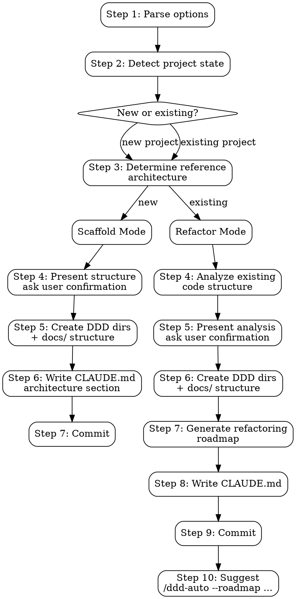

# ddd-init Skill Implementation Plan

> **For agentic workers:** REQUIRED SUB-SKILL: Use superpowers:subagent-driven-development (recommended) or superpowers:executing-plans to implement this plan task-by-task. Steps use checkbox (`- [ ]`) syntax for tracking.

**Goal:** Add a `ddd-init` skill that initializes new projects with DDD directory structure or generates refactoring roadmaps for existing projects, writing architecture constraints to CLAUDE.md.

**Architecture:** Pure Skill + Command. SKILL.md contains all logic (project detection, template definitions, structure generation, refactoring roadmap). No hooks or scripts. Built-in fastlayer template is inline in SKILL.md.

**Tech Stack:** Markdown (skill/command files only)

**Source:** Design spec: `docs/superpowers/specs/2026-04-12-ddd-init-design.md`

---

## File Structure

| File | Action | Responsibility |
|------|--------|----------------|
| `skills/ddd-init/SKILL.md` | Create | Main skill — project detection, scaffolding, refactor planning |
| `commands/ddd-init.md` | Create | `/ddd-init` slash command entry point |
| `package.json` | Modify | Bump version 1.6.0 → 1.7.0, add keywords |
| `.claude-plugin/plugin.json` | Modify | Bump version, update description, add keywords |
| `.claude-plugin/marketplace.json` | Modify | Bump version, update descriptions, add keywords |
| `README.md` | Modify | Add ddd-init documentation (English) |
| `README.zh-CN.md` | Modify | Add ddd-init documentation (Chinese) |

---

### Task 1: Create commands/ddd-init.md

**Files:**
- Create: `commands/ddd-init.md`

- [ ] **Step 1: Write the command file**

```markdown
---
description: "Initialize or refactor a project into DDD architecture"
argument-hint: "[--template <name>] [--ref <path>]"
---

# ddd-init

Invoke the ddd-init skill to initialize a new project with DDD architecture or generate a refactoring plan for an existing project.

**Usage:**
- `/ddd-init` — auto-detect project state, recommend template
- `/ddd-init --template fastlayer` — use built-in fastlayer template (TypeScript/Next.js)
- `/ddd-init --ref ~/path/to/reference-project` — use a custom reference architecture

**Options:**
- `--template <name>` — Built-in template. Currently: `fastlayer`
- `--ref <path>` — Path to a reference DDD project (scans its directory tree)

`--template` and `--ref` are mutually exclusive. `--ref` takes precedence if both are provided.

Use the ddd-init skill with these arguments: $ARGUMENTS
```

- [ ] **Step 2: Commit**

```bash
git add commands/ddd-init.md
git commit -m "feat: add /ddd-init slash command"
```

---

### Task 2: Create skills/ddd-init/SKILL.md

**Files:**
- Create: `skills/ddd-init/SKILL.md`

This is the main skill — contains all logic for project detection, scaffolding, and refactoring roadmap generation. The built-in fastlayer template is defined inline.

- [ ] **Step 1: Create the directory and write the SKILL.md**

```markdown
---
name: ddd-init
description: Use when initializing a project with DDD architecture or refactoring an existing project into DDD structure - triggers on "init DDD", "initialize project", "setup DDD", "ddd-init", "/ddd-init", "refactor to DDD", or "/ddd-init --template fastlayer". Creates DDD directory structure, standardized docs/, and writes architecture constraints to CLAUDE.md.
---

# DDD Init

Initialize a project with DDD architecture or generate a refactoring plan for an existing project. Creates the directory structure, standardized `docs/` layout, and writes architecture constraints to `CLAUDE.md` so downstream skills (`ddd-develop`, `ddd-audit`) enforce the established structure.

**Announce at start:** "Using ddd-init to [initialize/refactor] this project with DDD architecture."

## Input Modes

- `/ddd-init` — auto-detect project state, recommend template based on tech stack
- `/ddd-init --template fastlayer` — use built-in fastlayer template (TypeScript / Next.js)
- `/ddd-init --ref <path>` — use a custom reference project (scan its directory tree for DDD layer mapping)

`--template` and `--ref` are mutually exclusive. `--ref` takes precedence if both provided.

---

## Execution Flow



---

## Step 1: Parse Options

Parse arguments for:
- `--template <name>` — built-in template name (currently: `fastlayer`)
- `--ref <path>` — path to a reference DDD project

If `--ref` provided, verify the path exists. If it does not exist, report error and exit.

## Step 2: Detect Project State

Scan the current project to determine mode:

| Signal | Mode |
|--------|------|
| No source code directories (`src/`, `server/`, `app/`, `lib/`) or only scaffolding boilerplate (README, package.json, config files) | **Scaffold** — new project |
| Source code exists but no DDD layer directories (`domain/`, `modules/*/app/`, `repo/`, `bo/`) | **Refactor** — existing project |
| DDD layer directories already exist (`domain/`, `modules/*/app/`, `repo/`) | **Already DDD** — inform user, offer `/ddd-audit` instead |

### Tech Stack Detection

Detect from package manifest and file extensions:

| File | Stack |
|------|-------|
| `package.json` + `next.config.*` | TypeScript / Next.js → recommend `fastlayer` template |
| `package.json` + `express` or `fastify` dep | TypeScript / Node.js → recommend `fastlayer` template (adapted) |
| `go.mod` | Go |
| `Cargo.toml` | Rust |
| `pom.xml` / `build.gradle` | Java / Kotlin |
| `requirements.txt` / `pyproject.toml` | Python |

If tech stack matches a built-in template, recommend it. Otherwise, ask the user to provide `--ref` or proceed with a generic DDD structure.

## Step 3: Determine Reference Architecture

### If `--template fastlayer`:

Use the built-in fastlayer template defined below in the "Built-in Template: fastlayer" section.

### If `--ref <path>`:

1. Scan the directory tree of the reference project (exclude `node_modules/`, `.git/`, `dist/`, `build/`, `__pycache__/`, `.next/`)
2. Identify DDD layer directories by name patterns:
   - `domain/`, `model/`, `entity/`, `vo/` → Domain layer
   - `app/`, `service/`, `dto/` → Application layer
   - `repo/`, `dao/`, `repository/` → Repository layer
   - `acl/`, `adapter/`, `gateway/` → ACL layer
   - `handler/`, `controller/`, `api/`, `route/` → Presentation layer
   - `infra/`, `infras/`, `infrastructure/` → Infrastructure layer
3. Extract the directory tree structure as the target template
4. If the reference project has a `CLAUDE.md` with a `## DDD Architecture` section, extract its conventions
5. Present the extracted structure to the user for confirmation

### If no option provided:

Use tech stack detection to recommend a built-in template. If no match, ask the user:

```
No built-in template matches your tech stack ([detected stack]).

Options:
1. Provide a reference project: /ddd-init --ref <path>
2. Use generic DDD structure (domain/, app/, infra/ layers)
3. Use fastlayer template anyway (adapted for your stack)
```

---

## Scaffold Mode (New Project)

### Step 4: Present Proposed Structure

Show the user the directory structure that will be created:

```
ddd-init will create the following structure:

**Template**: [fastlayer / custom ref / generic]
**Tech stack**: [detected stack]

DDD directories:
  server/handler/
  server/infras/orm/schema/
  server/infras/auth/
  server/infras/utils/
  server/modules/

Docs directories:
  docs/roadmap/
  docs/audit/
  docs/architecture/
  docs/superpowers/specs/
  docs/superpowers/plans/

Architecture constraints will be written to CLAUDE.md.

Proceed?
```

Wait for user confirmation.

### Step 5: Create Directories

Create all directories with `.gitkeep` files. Use Bash:

```bash
mkdir -p server/handler server/infras/orm/schema server/infras/auth server/infras/utils server/modules
mkdir -p docs/roadmap docs/audit docs/architecture docs/superpowers/specs docs/superpowers/plans
touch server/handler/.gitkeep server/infras/orm/schema/.gitkeep server/infras/auth/.gitkeep server/infras/utils/.gitkeep server/modules/.gitkeep
touch docs/roadmap/.gitkeep docs/audit/.gitkeep docs/architecture/.gitkeep docs/superpowers/specs/.gitkeep docs/superpowers/plans/.gitkeep
```

Adapt directory paths based on the template/reference architecture used.

### Step 6: Write CLAUDE.md

If `CLAUDE.md` does not exist, create it. If it exists, check for an existing `## DDD Architecture` section:
- If found, replace the entire section (from `## DDD Architecture` to the next `## ` heading or end of file)
- If not found, append at the end

The content is adapted based on the template used. For fastlayer:

````markdown
## DDD Architecture

> Generated by ddd-init. Downstream skills (ddd-develop, ddd-audit) use this
> section to enforce architectural compliance.

### Layer Mapping

| Layer | Directory | Responsibility |
|-------|-----------|----------------|
| Presentation | `server/handler/` | Request handling, response formatting |
| Application | `server/modules/*/app/` | Service orchestration, DTO transformation |
| Domain | `server/modules/*/domain/` | Business logic, entities, value objects — pure, no IO |
| Repository | `server/modules/*/repo/` | Data access, PO ↔ Entity mapping |
| ACL | `server/modules/*/acl/` | External service adapters (anti-corruption layer) |
| Infrastructure | `server/infras/` | Shared infra (ORM, auth, email, etc.) |

### Module Template

New modules MUST follow this structure:

```
server/modules/<module>/
├── acl/                        # Anti-Corruption Layer
├── app/
│   ├── dto/                    # Data Transfer Objects
│   ├── service/                # Application services
│   │   └── __tests__/
│   └── internal/               # Cross-module interfaces
├── domain/
│   ├── bo/                     # Business Objects (logic + validation)
│   │   └── __tests__/
│   └── model/
│       ├── entity/             # Entities (identity-based)
│       ├── vo/                 # Value Objects (equality-based)
│       └── qo/                 # Query Objects
├── repo/
│   ├── dao/                    # Data Access Objects
│   │   └── __tests__/
│   └── po/                     # Persistent Objects
└── utils/                      # Module-scoped utilities
```

### Dependency Rules

```
Domain → (nothing)              # Pure layer, no IO, no framework deps
Application → Domain
Repository → Domain             # Interfaces in domain, impls in repo
ACL → Domain                    # Adapts external services to domain interfaces
Presentation → Application
Infrastructure ← ACL, Repository  # Shared infra consumed by outer layers
```

### Conventions

- Request flow: `Middleware → API Route → Handler → Service → BO → DAO → Database`
- Tuple return pattern: `[data, error]` for all async functions
- ServiceError objects for business errors (never `new Error()` for 4xx)
- Type separation: DTO (API) ↔ Entity (Domain) ↔ PO (Database)
- Cross-module communication: via `app/internal/` interfaces
- Tests: colocated in `__tests__/` within each layer
- Immutability: prefer immutable data structures in domain layer
````

### Step 7: Commit

```bash
git add -A
git commit -m "feat: initialize DDD architecture structure

- Created DDD layer directories ([template] template)
- Created standardized docs/ structure
- Added DDD Architecture section to CLAUDE.md"
```

---

## Refactor Mode (Existing Project)

### Step 4: Analyze Existing Code Structure

Scan all source directories and classify files into DDD layers using heuristics:

1. **Scan**: List all source files with their directories
2. **Classify** each directory/file:
   - Files with DB queries, ORM models, schema definitions → **Repository / Infrastructure**
   - Files with business logic, validation, domain rules → **Domain**
   - Files with HTTP handlers, controllers, route definitions → **Presentation**
   - Files with service orchestration, workflow coordination → **Application**
   - Files integrating external APIs (Stripe, auth providers, etc.) → **ACL**
   - Config files, utilities, shared types → **Cross-cutting / Infrastructure**
3. **Identify modules**: Group related files into potential bounded contexts

### Step 5: Present Analysis

Show the user the analysis and proposed migration:

```
Project analysis:

**Current structure:**
  src/services/userService.ts      → Application + Domain (mixed)
  src/services/billingService.ts   → Application + ACL (mixed)
  src/models/user.ts               → Domain (entity)
  src/models/invoice.ts            → Domain (entity)
  src/db/queries.ts                → Repository
  src/controllers/userController.ts → Presentation
  src/lib/stripe.ts                → ACL

**Identified modules:** user, billing

**Proposed target structure:**
  server/modules/user/domain/bo/
  server/modules/user/domain/model/entity/
  server/modules/user/app/service/
  server/modules/user/repo/dao/
  server/modules/billing/...

Proceed with this mapping?
```

Wait for user confirmation. User may adjust module boundaries or file classification.

### Step 6: Create Target DDD Directories

Same as scaffold mode — create all target directories with `.gitkeep`.

### Step 7: Generate Refactoring Roadmap

Output to `docs/roadmap/` in standard ddd-roadmap format (compatible with ddd-auto/ddd-develop):

```markdown
# P0: DDD Structure Migration

> **Timeline**: [estimated based on file count]
> **Goal**: Reorganize existing code into DDD layered architecture
> **Status**: Pending

## 0.1 Domain Layer Migration

### 0.1.1 Extract [Module] Domain Logic

Move business logic from mixed service files to domain layer.

- [ ] Move [specific logic] from `[source path]` to `[target path]`
- [ ] Extract [Entity] from `[source]` to `[target]`
- [ ] Update imports across affected files

## 0.2 Repository Layer Migration

### 0.2.1 Extract [Module] Data Access

- [ ] Move [specific queries] from `[source]` to `[target]`
- [ ] Create PO types in `[target]`

## 0.3 ACL Layer Migration
...

## 0.4 Presentation Layer Migration
...

## 0.5 Application Layer Migration
...
```

Each item MUST reference:
- Exact source file path (current location)
- Exact target file path (DDD location)
- What code changes are needed (not just "move file")

### Step 8: Write CLAUDE.md

Same as scaffold mode.

### Step 9: Commit

```bash
git add -A
git commit -m "feat: add DDD architecture structure and refactoring roadmap

- Created target DDD layer directories ([template] template)
- Created standardized docs/ structure
- Generated refactoring roadmap in docs/roadmap/
- Added DDD Architecture section to CLAUDE.md"
```

### Step 10: Suggest Next Step

```
DDD initialization complete.

To execute the refactoring roadmap:
  /ddd-auto --roadmap docs/roadmap/ P0

Or execute items one at a time:
  /ddd-develop
```

---

## Built-in Template: fastlayer

**Tech Stack:** TypeScript / Next.js
**Reference:** https://github.com/RealMatrix-PTE-LTD/fastlayer

### Directory Structure

```
server/
├── handler/                    # Presentation layer
│   └── <domain>/               # Grouped by domain
├── infras/                     # Shared infrastructure
│   ├── orm/
│   │   ├── schema/             # Database schemas (Drizzle)
│   │   └── data-preset/        # Seed data
│   ├── auth/                   # Auth infrastructure
│   ├── utils/                  # Shared utilities
│   └── shared/                 # Shared types/constants
└── modules/                    # Bounded contexts
    └── <module>/
        ├── acl/                # Anti-Corruption Layer
        │   └── <service>/      # One subdir per external service
        ├── app/
        │   ├── dto/            # Data Transfer Objects
        │   ├── service/        # Application services
        │   │   └── __tests__/
        │   └── internal/       # Cross-module interfaces
        ├── domain/
        │   ├── bo/             # Business Objects
        │   │   └── __tests__/
        │   └── model/
        │       ├── entity/     # Entities
        │       ├── vo/         # Value Objects
        │       └── qo/         # Query Objects
        ├── repo/
        │   ├── dao/            # Data Access Objects
        │   │   └── __tests__/
        │   └── po/             # Persistent Objects
        └── utils/
```

### Conventions

- Request flow: `Middleware → API Route → Handler → Service → BO → DAO → Database`
- Tuple return: `[data, error]` for all async functions
- Error handling: `ServiceError` objects, never `new Error()` for 4xx
- Type system: `DTO (API) ↔ Entity (Domain) ↔ PO (Database)`
- PO to Entity: `convertNullToUndefined<Entity>(po)`
- Entity to PO: `entity.field ?? null`
- Cross-module communication: via `app/internal/` interfaces
- Tests: colocated in `__tests__/` within each layer

### Standardized docs/ Structure

```
docs/
├── roadmap/                    # ddd-roadmap output
├── audit/                      # ddd-audit output
├── architecture/               # Architecture documentation
└── superpowers/
    ├── specs/                  # Design specifications
    └── plans/                  # Implementation plans
```

---

## Integration

**Pipeline position:** Entry point — runs before all other skills.

```
ddd-init → ddd-roadmap → ddd-develop/ddd-auto → ddd-audit
```

**Produces:**
- DDD directory structure (consumed by ddd-develop when creating new files)
- `docs/` structure (consumed by all skills for output)
- CLAUDE.md architecture section (consumed by ddd-develop for plan generation, ddd-audit for compliance checking)
- Refactoring roadmap in `docs/roadmap/` (consumed by ddd-develop/ddd-auto)

**Does NOT produce:** Any source code. Only directories, `.gitkeep` files, and documentation.
```

- [ ] **Step 2: Verify the skill frontmatter**

Run: `head -4 skills/ddd-init/SKILL.md`
Expected: `---`, `name: ddd-init`, `description: ...`, `---`

- [ ] **Step 3: Commit**

```bash
git add skills/ddd-init/SKILL.md
git commit -m "feat: add ddd-init skill for DDD project initialization"
```

---

### Task 3: Update version and metadata files

**Files:**
- Modify: `package.json`
- Modify: `.claude-plugin/plugin.json`
- Modify: `.claude-plugin/marketplace.json`

- [ ] **Step 1: Update package.json**

Change `"version": "1.6.0"` to `"version": "1.7.0"`.

Add `"init"` and `"scaffold"` to the keywords array (after `"loop"`).

- [ ] **Step 2: Update .claude-plugin/plugin.json**

Change `"version": "1.6.0"` to `"version": "1.7.0"`.

Change description to: `"DDD development skill suite: project initialization, roadmap generation, TDD implementation, 8-dimension architecture audit, and automated roadmap execution"`.

Add `"init"` and `"scaffold"` to the keywords array.

- [ ] **Step 3: Update .claude-plugin/marketplace.json**

Change `"version": "1.6.0"` to `"version": "1.7.0"` in the plugin entry.

Update both description fields to include "project initialization".

Add `"init"` and `"scaffold"` to the keywords array in the plugin entry.

- [ ] **Step 4: Verify version consistency**

Run: `grep '"version"' package.json .claude-plugin/plugin.json .claude-plugin/marketplace.json`
Expected: All show `"1.7.0"`

- [ ] **Step 5: Commit**

```bash
git add package.json .claude-plugin/plugin.json .claude-plugin/marketplace.json
git commit -m "chore: bump version to 1.7.0 and update metadata for ddd-init"
```

---

### Task 4: Update README.md (English)

**Files:**
- Modify: `README.md`

- [ ] **Step 1: Update skill count and intro**

Change: "Four composable skills that cover the full lifecycle: planning, implementing, auditing, and automated batch execution."
To: "Five composable skills that cover the full lifecycle: initialization, planning, implementing, auditing, and automated batch execution."

- [ ] **Step 2: Update pipeline diagram**

Change:
```
ddd-roadmap  →  ddd-develop  →  ddd-audit
 (plan)         (implement)      (audit)
                     ↑               ↑
                 ddd-auto ───────────┘
                (automate)
```

To:
```
ddd-init  →  ddd-roadmap  →  ddd-develop  →  ddd-audit
 (init)       (plan)          (implement)      (audit)
                                   ↑               ↑
                               ddd-auto ───────────┘
                              (automate)
```

- [ ] **Step 3: Add ddd-init intro paragraph**

Add BEFORE the ddd-roadmap paragraph:

```markdown
**ddd-init** initializes a new project with DDD architecture or generates a refactoring roadmap for existing projects. Creates the directory structure, standardized `docs/` layout, and writes architecture constraints to `CLAUDE.md`. Supports built-in templates (`/ddd-init --template fastlayer`) or custom reference architectures (`/ddd-init --ref <path>`).
```

- [ ] **Step 4: Add ddd-init to Skills table**

Add as the FIRST row (before ddd-roadmap):

```markdown
| **ddd-init** | Initialize or refactor project to DDD architecture | `/ddd-init`, `/ddd-init --template fastlayer`, `/ddd-init --ref <path>` |
```

- [ ] **Step 5: Add ddd-init section**

Add BEFORE the "### ddd-roadmap" section:

```markdown
### ddd-init

Initialize or refactor a project into DDD architecture. Automatically detects project state (new vs. existing) and tech stack.

Two modes:
- **Scaffold** (new project) — creates DDD directory structure + standardized `docs/` layout + CLAUDE.md architecture constraints
- **Refactor** (existing project) — creates target DDD structure + generates a migration roadmap compatible with `/ddd-auto`

Options:
- `--template <name>` — Built-in template. Currently: `fastlayer` (TypeScript/Next.js)
- `--ref <path>` — Use a custom reference project's directory structure

Output:
- DDD layer directories with `.gitkeep`
- Standardized `docs/` structure (roadmap, audit, architecture, specs, plans)
- `CLAUDE.md` architecture section (layer mapping, module template, dependency rules, conventions)
- Refactoring roadmap in `docs/roadmap/` (refactor mode only)
```

- [ ] **Step 6: Add usage example**

Add BEFORE the "### Generate a Development Roadmap" section:

```markdown
### Initialize DDD Architecture

New project with built-in template:

```
You: /ddd-init --template fastlayer

# The skill will:
# 1. Create DDD directory structure (server/handler, server/infras, server/modules)
# 2. Create standardized docs/ layout
# 3. Write architecture constraints to CLAUDE.md
```

Existing project refactoring:

```
You: /ddd-init

# The skill will:
# 1. Detect existing code and tech stack
# 2. Classify files into DDD layers
# 3. Create target DDD directories
# 4. Generate a refactoring roadmap in docs/roadmap/
# 5. Suggest: /ddd-auto --roadmap docs/roadmap/ P0
```

With a custom reference architecture:

```
You: /ddd-init --ref ~/my-other-ddd-project
```
```

- [ ] **Step 7: Update project structure tree**

Add `ddd-init/` to the skills section in the tree (before ddd-roadmap):

```
│   ├── ddd-init/
│   │   └── SKILL.md         # DDD project initialization
```

- [ ] **Step 8: Commit**

```bash
git add README.md
git commit -m "docs: add ddd-init documentation to README"
```

---

### Task 5: Update README.zh-CN.md (Chinese)

**Files:**
- Modify: `README.zh-CN.md`

Mirror all Task 4 changes in Chinese.

- [ ] **Step 1: Update skill count**

Change: "四个可组合的技能覆盖完整生命周期：规划、实现、审计和自动化批量执行。"
To: "五个可组合的技能覆盖完整生命周期：初始化、规划、实现、审计和自动化批量执行。"

- [ ] **Step 2: Update pipeline diagram**

Change:
```
ddd-roadmap  →  ddd-develop  →  ddd-audit
  (规划)          (实现)           (审计)
                      ↑               ↑
                  ddd-auto ───────────┘
                 (自动化)
```

To:
```
ddd-init  →  ddd-roadmap  →  ddd-develop  →  ddd-audit
 (初始化)      (规划)          (实现)           (审计)
                                    ↑               ↑
                                ddd-auto ───────────┘
                               (自动化)
```

- [ ] **Step 3: Add ddd-init intro paragraph**

Add BEFORE the ddd-roadmap paragraph:

```markdown
**ddd-init** 为新项目初始化 DDD 架构结构，或为现有项目生成重构路线图。创建目录结构、标准化 `docs/` 布局，并将架构约束写入 `CLAUDE.md`。支持内置模板（`/ddd-init --template fastlayer`）或自定义参考架构（`/ddd-init --ref <路径>`）。
```

- [ ] **Step 4: Add ddd-init to skills table**

Add as FIRST row (before ddd-roadmap):

```markdown
| **ddd-init** | 初始化或重构项目为 DDD 架构 | `/ddd-init`、`/ddd-init --template fastlayer`、`/ddd-init --ref <路径>` |
```

- [ ] **Step 5: Add ddd-init section**

Add BEFORE "### ddd-roadmap":

```markdown
### ddd-init

初始化项目为 DDD 架构或将现有项目重构为 DDD 结构。自动检测项目状态（新项目/现有项目）和技术栈。

两种模式：
- **Scaffold**（新项目）— 创建 DDD 目录结构 + 标准化 `docs/` 布局 + CLAUDE.md 架构约束
- **Refactor**（现有项目）— 创建目标 DDD 结构 + 生成与 `/ddd-auto` 兼容的迁移路线图

选项：
- `--template <名称>` — 内置模板。当前支持：`fastlayer`（TypeScript/Next.js）
- `--ref <路径>` — 使用自定义参考项目的目录结构

输出：
- DDD 分层目录（含 `.gitkeep`）
- 标准化 `docs/` 结构（roadmap、audit、architecture、specs、plans）
- `CLAUDE.md` 架构章节（层级映射、模块模板、依赖规则、编码约定）
- 重构路线图 `docs/roadmap/`（仅 Refactor 模式）
```

- [ ] **Step 6: Add usage example**

Add BEFORE "### 生成开发路线图":

```markdown
### 初始化 DDD 架构

新项目使用内置模板：

```
You: /ddd-init --template fastlayer

# 技能将会：
# 1. 创建 DDD 目录结构（server/handler、server/infras、server/modules）
# 2. 创建标准化 docs/ 布局
# 3. 将架构约束写入 CLAUDE.md
```

现有项目重构：

```
You: /ddd-init

# 技能将会：
# 1. 检测现有代码和技术栈
# 2. 将文件分类到 DDD 各层
# 3. 创建目标 DDD 目录
# 4. 在 docs/roadmap/ 生成重构路线图
# 5. 建议执行：/ddd-auto --roadmap docs/roadmap/ P0
```

使用自定义参考架构：

```
You: /ddd-init --ref ~/my-other-ddd-project
```
```

- [ ] **Step 7: Update project structure tree**

Add `ddd-init/` to skills section (before ddd-roadmap):

```
│   ├── ddd-init/
│   │   └── SKILL.md         # DDD 项目初始化
```

- [ ] **Step 8: Commit**

```bash
git add README.zh-CN.md
git commit -m "docs: add ddd-init documentation to README.zh-CN.md"
```

---

### Task 6: Final verification

**Files:** None (verification only)

- [ ] **Step 1: Verify new files exist**

Run: `ls -la skills/ddd-init/SKILL.md commands/ddd-init.md`
Expected: Both files listed.

- [ ] **Step 2: Verify version consistency**

Run: `grep '"version"' package.json .claude-plugin/plugin.json .claude-plugin/marketplace.json`
Expected: All show `"1.7.0"`

- [ ] **Step 3: Verify skill frontmatter**

Run: `head -4 skills/ddd-init/SKILL.md`
Expected: `---`, `name: ddd-init`, `description: ...`, `---`

- [ ] **Step 4: Verify pipeline diagram in README.md**

Run: `grep -A5 'ddd-init' README.md | head -6`
Expected: Shows `ddd-init` as the entry point in the pipeline.

- [ ] **Step 5: Check all commits**

Run: `git log --oneline -8`
Expected: Commits for command, SKILL.md, metadata, README, README.zh-CN.
