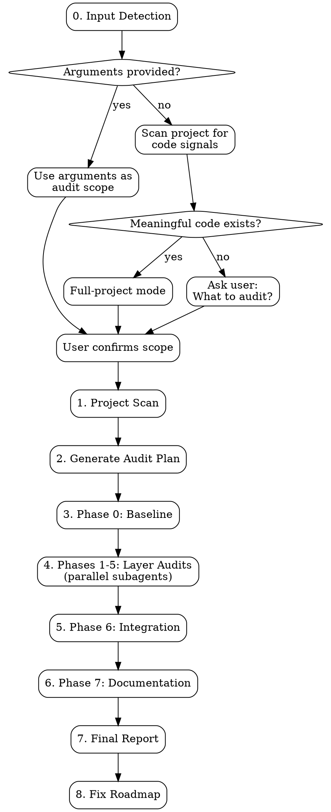

# DDD Audit

Full-pipeline DDD architecture audit. Scans project, generates audit plan, executes phase-by-phase review with subagents, produces final report and fix roadmap.

Supports three input modes:
1. **Scoped audit** — `/ddd-audit <scope>` audits only the specified module, layer, or file set
2. **Full-project audit** — `/ddd-audit` with no arguments audits the entire project
3. **Interactive** — if no arguments AND project scope is unclear (e.g., no meaningful code, ambiguous structure), asks the user what to audit

**Announce at start:**
- If arguments provided: "Using ddd-audit to audit: [user's scope description]."
- If full project: "Using ddd-audit to run a full project audit."
- If asking user: "Using ddd-audit — what scope would you like to audit?"

**All artifacts** are saved to `docs/audit/YYYY-MM-DD-NNN/` (NNN = zero-padded sequence within the same date).

## Tool Preferences

Prefer dedicated tools over Bash for file operations:

- **File discovery**: Use Glob tool (`**/*.ts`, `src/domain/**/*.py`) instead of `find`
- **Content search**: Use Grep tool instead of `grep` or `rg`
- **File reading**: Use Read tool instead of `cat`, `head`, `tail`
- **Line counting**: Use Bash `wc -l` only when counting across many files; for individual files, Read and count

Reserve Bash for commands that have no dedicated tool equivalent: `npm test`, `npx eslint`, `tsc --noEmit`, `wc -l`, `npm audit`, etc.

## 8-Dimension Audit Matrix

| # | Dimension | Focus |
|---|-----------|-------|
| D1 | **Design** | Functional completeness (cross-reference `docs/product-brief.md` Goals and Non-goals if present — check whether stated goals are implemented and out-of-scope items were not), optimal approach, interface clarity, over/under-engineering |
| D2 | **Architecture** | DDD layer compliance, dependency direction, single responsibility, bounded context |
| D3 | **Quality** | Dead code, duplication, complexity, function size (<50 LOC), file size (<800 LOC), naming, **consistency with sibling modules** (same error-handling shape, naming scheme, and test structure as the module's peers — flag modules that invented their own style) |
| D4 | **Security** | Vulnerabilities, edge cases, error handling, sensitive data, input validation |
| D5 | **Testing** | Unit/integration/E2E coverage, test quality, boundary testing, mock validity |
| D6 | **Integration** | Cross-module contracts, data flow, wiring correctness |
| D7 | **Performance** | N+1 queries, caching, memory leaks, algorithmic complexity, resource cleanup |
| D8 | **Observability** | Structured logging, metrics, tracing, alerting, health checks |

## Severity Levels

| Level | Definition | Action |
|-------|-----------|--------|
| **CRITICAL** | Security vulnerability, data loss, safety risk | **BLOCK** — must fix before release |
| **HIGH** | Bug, significant design flaw, missing tests | **WARN** — fix before deployment |
| **MEDIUM** | Maintainability, code smell, suboptimal implementation | **INFO** — schedule post-launch |
| **LOW** | Style, minor optimization | **NOTE** — optional |

## Execution Flow



---

## Step 0 — Input Detection

Determine the audit scope based on input mode.

### Mode A: Scoped Audit

The user provided arguments (e.g., `/ddd-audit src/domain/billing` or `/ddd-audit security review of auth module`).

1. Parse the user's description into a clear audit scope
2. Set `mode = "scoped"` — Steps 1-6 will focus only on the specified area
3. Present for confirmation:

```
Audit scope (user-defined):

**Scope**: [user's description, clarified if needed]
**Covers**: [which DDD layers/modules/files this maps to]
**Dimensions**: [which of D1-D8 are most relevant for this scope]

Proceed with scoped audit?
```

Wait for user confirmation. User may refine the scope.

### Mode B: Full-Project Audit

No arguments provided. Quickly check for code signals:
- Source code directories exist with meaningful files
- Package manifest exists
- Non-trivial LOC (not just boilerplate/scaffolding)

If meaningful code is detectable → set `mode = "full-project"`, proceed to Step 1.

### Mode C: Interactive

No arguments provided and no meaningful code to audit (empty project, only scaffolding, ambiguous structure).

```
No clear audit target detected. What would you like to audit?

Examples:
- "Audit the billing module for security issues"
- "Review the domain layer architecture"
- "Full audit of all code written so far"
- A file path or directory: "src/domain/"
```

Once the user provides a description, treat as **Mode A** (set `mode = "scoped"`) and confirm.

---

## Step 1 — Project Scan

Detect and document:

1. **Tech stack**: language, framework, build tool, test framework, linter
2. **DDD layers**: map directories to Domain / Infrastructure / Application / Presentation / Cross-Cutting
3. **Module inventory**: for each layer, list modules with file count and LOC
4. **Dependency graph**: verify direction (Domain ← App ← Infra, Domain ← App ← Presentation)

**Scoped mode (`mode = "scoped"`):** Still detect tech stack and DDD layer mapping for the full project (needed for context), but narrow module inventory and dependency graph analysis to the scoped area. If the scope targets a single layer, only inventory modules within that layer. If targeting specific files, map them to their DDD layer for dimension emphasis.

### Language Auto-Detection

Detect from file extensions + package manager files (package.json, pom.xml, go.mod, Cargo.toml, etc.).

Adapt checklist items to stack:
- **TypeScript**: strict mode, ESLint, `!`/`as`/`any` usage
- **Java/Kotlin**: Spring conventions, package structure, annotations
- **Go**: interface compliance, error handling, package boundaries
- **Rust**: ownership, unsafe blocks, trait implementations
- **Python**: type hints, ABC, dependency injection

### Output Language Auto-Detection

Detect from README, comments, commit messages. Output in detected language. If bilingual, use bilingual format.

---

## Step 2 — Generate Audit Plan

Create `audit-plan.md`:

```
# [Project Name] DDD Audit Plan

> **Project**: [name]
> **Date**: [YYYY-MM-DD]
> **Tech Stack**: [language, framework]
> **Scope**: [LOC, files, tests] — [Full project | Scoped: <description>]
> **Organization**: Layer × Module — [N] Phases

## Audit Methodology
[8-dimension matrix + severity levels]

## Phase 0 — Baseline
[lint, type check, test coverage, dead code, dependency audit]

## Phase [1-5] — [Layer Name]
### N.M [Module Name] — `path/to/module/`
**Files**: [list with LOC]
#### D[1-8] [Dimension]
- [ ] [specific, actionable checklist item referencing actual files/functions]

## Phase 6 — System Integration
[cross-layer contract checks]

## Phase 7 — Documentation & Compliance
[doc accuracy, API docs, architecture docs]
```

### Checklist Generation Rules

1. **Read each file** to understand purpose before writing checklist items
2. **Apply relevant dimensions** — not all 8 apply to every module
3. **Write specific items** — reference actual function names and patterns found
4. **Mark high-risk areas** with `[CRITICAL]` tag

**Dimension emphasis by layer:**

| Layer | Primary Dimensions |
|-------|--------------------|
| Domain | D1 (business correctness), D2 (purity / no IO), D5 (coverage) |
| Infrastructure | D4 (security), D7 (performance), D8 (observability) |
| Application | D1 (workflow completeness), D4 (error handling), D6 (integration) |
| Presentation | D4 (input validation / auth), D7 (response time), D8 (request logging) |
| Cross-Cutting | D6 (contracts), D7 (overhead), D8 (observability coverage) |

---

## Step 3-6 — Execute Audit

### Subagent Strategy

**Full-project mode:**
```
Phase 0 (baseline) — single agent
  ↓
Phase 1 (domain) ──┐
Phase 2 (infra) ───┤ parallel
Phase 3 (app) ─────┤
Phase 4 (present.) ┤
Phase 5 (crosscut) ┘
  ↓
Phase 6 (integration) — needs 1-5 results
Phase 7 (docs) — parallel with 6
```

**Scoped mode:** Skip phases for layers outside the scope. If scope targets a single layer (e.g., "audit the domain layer"), only run Phase 0 (baseline for scoped files) + that layer's phase + Phase 6 (integration, narrowed to the scope's cross-layer boundaries). If scope targets specific files within one module, a single-phase audit may suffice.

Each subagent receives: its phase section from the audit plan + dimension matrix + severity definitions.

### Phase 0 — Baseline Auto-Fix

Phase 0 collects baseline metrics (lint, type check, test coverage, dead code, dependency audit). After collecting initial results, **automatically fix mechanical issues** before proceeding to layer audits:

1. **Collect initial baseline** — Run lint, type check, test suite, record error counts
2. **Auto-fix mechanical issues** — Run language-appropriate auto-fix tools:
   - **TypeScript/JavaScript**: `npx eslint --fix .`, `npx prettier --write .` (if configured)
   - **Rust**: `cargo fmt`, `cargo clippy --fix --allow-dirty`
   - **Go**: `go fmt ./...`, `goimports -w .`
   - **Python**: `black .`, `isort .`, `ruff check --fix .` (if configured)
   - Only run tools that are already configured in the project (check config files first)
3. **Re-collect baseline** — Run lint/type check again to measure improvement
4. **Report delta** in `phase-0-baseline.md`:
   ```
   ## Auto-Fix Results
   - Lint errors: [before] → [after] ([N] auto-fixed)
   - Formatting issues: [before] → [after] ([N] auto-fixed)
   - Remaining (require manual fix): [N]
   ```
5. **Commit auto-fix changes** (if any files changed). Stage ONLY the files the auto-fix tools modified — never `git add -A` or `git add -u`, which can sweep in unrelated files (including ddd-auto's `.ddd-auto.local.md` state file when this audit runs inside a batch loop):
   ```bash
   git diff --name-only
   git add [paste the exact file list from the diff output above]
   git commit -m "fix: auto-fix lint and formatting issues (ddd-audit baseline)"
   ```

**Rules:**
- Only fix issues that tools handle automatically — never modify logic, architecture, or behavior
- Skip auto-fix if the project has no lint/format tooling configured
- If auto-fix introduces test failures, revert and report: `Auto-fix reverted: caused [N] test failures`

### Phase Report Format

Each `phase-N-[layer].md`:

```
# Phase N — [Layer] Audit Report

> **Scope**: [files]
> **Status**: COMPLETE

## Summary
| Module | CRIT | HIGH | MED | LOW | Total |

## Findings

### [MODULE-SEV-SEQ] — [Short Title]
- **Severity**: CRITICAL | HIGH | MEDIUM | LOW
- **Dimension**: D[N] [Name]
- **File**: `path/file.ext:line`
- **Description**: [2-5 sentences]
- **Impact**: [what breaks]
- **Fix**: [brief solution]
- **Effort**: S (<30min) | M (1-3hr) | L (4-8hr)
```

**Issue ID convention**: `[MODULE]-[CRIT|HIGH|MED|LOW]-[SEQ]`

---

## Step 7 — Final Report

Generate `audit-report.md`:

```
# [Project] DDD Audit Report — Final

> **Project / Date / Auditor / Scope**

## Executive Summary
[Category × status table]

## Issue Statistics
[Phase × severity matrix]
[Dimension × severity matrix]

## Top CRITICAL Issues
[Table: ID, file, issue]

## Systemic Patterns
[Recurring anti-patterns across modules]

## Strengths
[What the project does well]

## Verdict
[READY / NOT READY + conditions]
```

---

## Step 8 — Fix Roadmap

Generate fix roadmap as a **flat checkbox list grouped by severity**. ddd-auto consumes fix-roadmap items as a flat ordered list of checkboxes in document order — Wave/theme headings are for human readability and do not participate in scope hierarchy parsing.

**Save to:** `docs/audit/YYYY-MM-DD-NNN/fix-roadmap.md` (consumed by ddd-auto via `--roadmap docs/audit/YYYY-MM-DD-NNN/fix-roadmap.md`)

### Format

```markdown
# Fix Roadmap

> **Based on**: [audit report path]
> **Date**: [YYYY-MM-DD]
> **Findings**: [N] total ([N] CRITICAL, [N] HIGH, [N] MEDIUM, [N] LOW)

## 1 Wave 1 — CRITICAL

### 1.1 [Theme/Track Name]

[Context: what these fixes address, why they're critical, which modules are affected]

- [ ] [ID] Fix [description with enough context to implement] (`path/file.ext:line`) — Effort: S
- [ ] [ID] Fix [description] (`path/file.ext:line`) — Effort: M

### 1.2 [Theme/Track Name]

[Context]

- [ ] [ID] Fix [description] (`path/file.ext:line`) — Effort: S

## 2 Wave 2 — HIGH

### 2.1 [Theme]

[Context]

- [ ] [ID] Fix [description] (`path/file.ext:line`) — Effort: S

## 3 Wave 3 — MEDIUM

### 3.1 [Theme]
...

## 4 Wave 4 — LOW

### 4.1 [Theme]
...
```

### Item Writing Rules

Each checkbox item must be **self-contained** — ddd-develop will use it as the development target:

1. Include the finding ID for traceability (e.g., `AUTH-CRIT-001`)
2. Describe the fix action, not just the problem (e.g., "Add input sanitization to UserController.create" not "XSS vulnerability")
3. Include file path and line number when applicable
4. Include effort estimate (S = <30min, M = 1-3hr, L = 4-8hr)

### How ddd-auto Parses This File

ddd-auto treats fix-roadmap.md as a **flat ordered list of checkboxes** — each `- [ ]` item is one execution unit, dispatched individually to ddd-develop. Headings do not create a scope hierarchy:
- `## N Wave N — [SEVERITY]` — human readability, plus Wave filtering: numeric scope tokens (`/ddd-auto --roadmap <path> 1 - 2`) select which waves' checkboxes enter the scope
- `### N.M [Theme]` — human readability only
- `- [ ] item` — the actionable execution unit

### After Generation

Present to user:

```
Fix roadmap saved to docs/audit/YYYY-MM-DD-NNN/fix-roadmap.md

To auto-fix all findings:
  /ddd-auto --roadmap docs/audit/YYYY-MM-DD-NNN/fix-roadmap.md

To fix only CRITICAL and HIGH:
  /ddd-auto --roadmap docs/audit/YYYY-MM-DD-NNN/fix-roadmap.md 1 - 2
```

---

## DDD Architecture Checks

### Dependency Direction

```
✅ Domain ← Application ← Infrastructure
                        ← Presentation
✗  Domain → Infrastructure  (IO leak)
✗  Domain → Application     (circular)
✗  Presentation → Infrastructure  (layer bypass)
```

### Domain Layer Purity

- No IO (file, network, DB) in domain
- No framework dependencies in domain
- Domain events over direct cross-aggregate calls
- Value objects are immutable
- Entities have identity, value objects have equality by value

### Bounded Context Boundaries

- Each context has its own ubiquitous language
- Anti-corruption layers at context boundaries
- No shared mutable state between contexts

### Repository Pattern

- Interfaces in domain, implementations in infrastructure
- One repository per aggregate root
- No query logic leaking into domain

---

## Common DDD Anti-Patterns

| Anti-Pattern | Symptom | Default Severity |
|-------------|---------|-----------------|
| Anemic Domain | Entities with only getters/setters, all logic in services | HIGH |
| Smart UI | Business logic in controllers/handlers | HIGH |
| God Aggregate | Single aggregate handling too many concerns | MEDIUM |
| Leaky Abstraction | Infrastructure details in domain types | CRITICAL |
| Missing Bounded Context | Conflating different domain concepts | HIGH |
| Shared Kernel Abuse | Excessive sharing between contexts | MEDIUM |
| Repository as DAO | Repository with SQL-level query methods | MEDIUM |
| Event Sourcing Cargo Cult | ES without actual need for audit trail | LOW |

---

## Incremental Audit (Diff Mode)

When a previous audit exists, support diff mode that only reviews changed files since the last audit. Triggered by natural language — not a CLI flag.

### When to Use

- CI/CD pipeline integration — audit only the PR diff
- Follow-up audits after partial fixes
- Triggered by: "re-audit", "audit changes since last time", "incremental audit", "audit only changed files"

### How It Works

1. **Locate previous audit**: find latest `docs/audit/YYYY-MM-DD-NNN/audit-report.md`
2. **Determine change scope**: `git diff --name-only <last-audit-commit>..HEAD` (or use timestamp from previous report)
3. **Map changed files to phases**: group by DDD layer
4. **Re-run only affected phases**: skip unchanged layers entirely
5. **Carry forward unchanged findings**: copy previous findings for untouched modules
6. **Generate delta report**: show new / resolved / unchanged findings

### Delta Report Format

Add `audit-delta.md` to output:

```
# Audit Delta Report

> **Compared to**: [previous audit date/path]
> **Files changed**: [N]
> **Phases re-audited**: [list]

## New Findings
[findings not in previous audit]

## Resolved Findings
[previous findings no longer present]

## Unchanged Findings
[carried forward count by severity]

## Score Comparison
[dimension scores: previous → current]
```

---

## Audit Configuration

Projects can customize audit behavior via `.audit-config.yml` at project root. **If that file exists** (check during Step 1 Project Scan), **Read `references/audit-config.md`** in this skill's directory — it contains the full configuration schema (dimension weights and toggles, custom layer mappings, thresholds, exclude paths, output language) and the behavior rules for applying it. If no config exists, use defaults: all dimensions enabled, weight 1.0, auto-detect layers.

---

## Audit Scoring (optional)

Scores are **opt-in**, not part of the default report. The formula normalizes weighted finding counts by the number of checklist items generated for that run — a denominator that varies run to run — so absolute scores and cross-audit deltas are indicative at best. The severity-count summary in the final report carries the actionable signal.

Compute scores only when:
- the user explicitly asks for scores, or
- `.audit-config.yml` sets dimension weights (implies the project tracks scores), or
- a previous audit report with a score table exists (continuity)

In those cases, **Read `references/audit-scoring.md`** in this skill's directory for the formula, score table format, history table, and interpretation bands.
---

## CI/CD Integration

The fix roadmap can generate trackable artifacts (GitHub issues, milestones, PR comments). **Only when the user asks for issue generation or the audit runs in a CI/PR context, Read `references/ci-cd-integration.md`** in this skill's directory — it contains the two-step `gh issue create` procedure (avoids heredocs/pipes that trigger permission prompts), issue-generation rules by severity, and the PR-context workflow.

---

## Output File Inventory

| File | Generated In | Content |
|------|-------------|---------|
| `audit-plan.md` | Step 2 | Full audit methodology + per-module checklists |
| `phase-0-baseline.md` | Step 3 | Automated tool results + baseline metrics |
| `phase-1-domain.md` | Step 3-6 | Domain layer findings |
| `phase-2-infra.md` | Step 3-6 | Infrastructure layer findings |
| `phase-3-app.md` | Step 3-6 | Application layer findings |
| `phase-4-presentation.md` | Step 3-6 | Presentation layer findings |
| `phase-5-crosscut.md` | Step 3-6 | Cross-cutting concerns findings |
| `phase-6-integration.md` | Step 3-6 | System integration findings |
| `phase-7-docs.md` | Step 3-6 | Documentation & compliance findings |
| `audit-report.md` | Step 7 | Executive summary + statistics + score |
| `fix-roadmap.md` | Step 8 | Prioritized remediation plan |
| `audit-delta.md` | Diff mode | Delta comparison with previous audit |

---

## Integration

**Pipeline position:** Quality gate — invoked after development or as a standalone assessment.

```
ddd-develop → ddd-audit (Phase 4, incremental)
ddd-auto → ddd-audit (Step 8, scoped to completed items)
ddd-audit → fix-roadmap.md → ddd-auto --roadmap (remediation loop)
```

**Consumes:**
- Project source code
- `.audit-config.yml` (optional, for dimension weights and custom layer mappings)
- Previous audit reports (for incremental/diff mode)

**Produces artifacts consumed by:**
- **ddd-auto** — `fix-roadmap.md` serves as input via `--roadmap docs/audit/YYYY-MM-DD-NNN/fix-roadmap.md`
- **ddd-develop** — fix-roadmap items are dispatched as development targets with `--roadmap` flag

**Invoked by:**
- **ddd-develop** — Phase 4 (incremental audit of changed files)
- **ddd-auto** — Step 8 (scoped audit of all files touched during the batch run)
