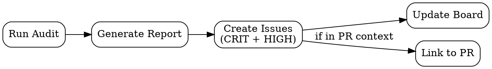

## CI/CD Integration

The fix roadmap can generate trackable artifacts for project management systems.

### GitHub Issues Generation

After generating `fix-roadmap.md`, optionally create GitHub issues:

**Two-step approach** (avoids heredoc/subshell which triggers permission prompts):

1. Use the **Write tool** to create a temp body file (`/tmp/audit-issue-body.md`):
```markdown
**Severity**: [LEVEL]
**Dimension**: D[N] [Name]
**File**: `path/file.ext:line`

## Description
[from finding]

## Impact
[from finding]

## Suggested Fix
[from finding]

## Effort
[S/M/L]

---
_Generated from DDD audit on [date]_
```

2. Then run a **single** `gh` command (no pipes, no subshells):
```bash
gh issue create --title "[AUDIT] [ID] — [Short Title]" --body-file /tmp/audit-issue-body.md --label "audit,[severity]" --milestone "[Wave N]"
```

### Issue Generation Rules

| Severity | Auto-create Issue? | Label | Milestone |
|----------|-------------------|-------|-----------|
| CRITICAL | Yes | `audit,critical,blocker` | Wave 1 |
| HIGH | Yes | `audit,high` | Wave 2 |
| MEDIUM | Optional (ask user) | `audit,medium` | Wave 3 |
| LOW | No (tracked in roadmap only) | — | — |

### Tracking Board

Optionally generate a GitHub Project board or milestone summary:

```
## Tracking Summary

- **Wave 1 milestone**: [N] issues, [link]
- **Wave 2 milestone**: [N] issues, [link]
- **Dashboard**: [project board link]
```

### Workflow Integration



When running in PR context:
1. Run incremental audit (diff mode) against base branch
2. Post summary comment on the PR
3. Create issues only for new findings
4. Block merge if CRITICAL findings exist (via CI check)
