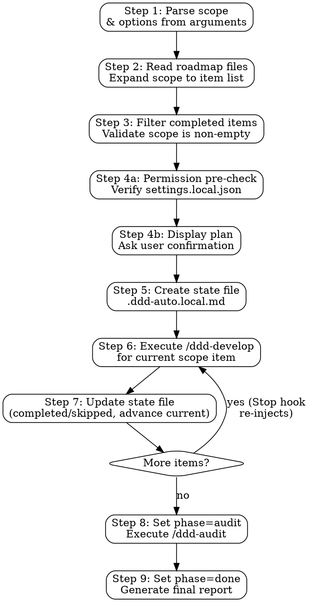

# DDD Auto

Automated roadmap execution: loop through `ddd-develop` for each item in a user-specified scope, then run a full-project `ddd-audit`. Uses a Stop hook to guarantee the loop continues even if Claude tries to exit.

**Announce at start:** "Using ddd-auto to execute roadmap items [scope description]."

## Input Modes

1. **Scoped** — `/ddd-auto P0.1.1 - P1.3.1, P2.1.1` executes specific items
2. **Phase-level** — `/ddd-auto P0` or `/ddd-auto P0 - P1` executes entire phases
3. **All** — `/ddd-auto` with no scope executes all incomplete roadmap items
4. **Custom roadmap path** — `/ddd-auto --roadmap path/to/roadmap/` or `/ddd-auto --roadmap my-roadmap.md P0.1.1 - P1.3.1`

**Options (parsed from arguments):**
- `--roadmap <path>` — Path to a roadmap directory or single roadmap file. Overrides the default `docs/roadmap/` location. Accepts a directory (reads all `P[0-3]-*.md` files inside) or a single `.md` file.
- `--policy <text|preset>` — Decision policy for autonomous choices (default: `pragmatic`)
- `--max-iterations <N>` — Safety cap to prevent infinite loops (default: 50)
- `--yes` — Skip the execution plan confirmation and start immediately

## Preset Decision Policies

| Preset | Bias |
|--------|------|
| `pragmatic` (default) | Practical first. Reuse existing patterns. Choose simplest viable approach. Avoid over-engineering. |
| `strict-ddd` | Strict DDD layer compliance even if it means more code. Domain purity over convenience. |
| `fast` | Minimum viable implementation. Skip non-essential optimization. Deliver first, refine later. |

## Execution Flow



**The Stop hook guarantees the loop.** After Claude completes each ddd-develop cycle and tries to exit, the Stop hook reads the state file and:
- If `phase=develop` → blocks exit, re-injects prompt to continue with next item
- If `phase=audit` → blocks exit, re-injects prompt to run ddd-audit
- If `phase=done` → allows exit (loop complete)

---

## Step 1: Parse Scope & Options

Parse the user's arguments to extract:

1. **Scope identifiers**: `P0`, `P0.1`, `P0.1.1`, ranges (`P0.1.1 - P1.3.1`), mixed (`P0.1.1 - P1.3.1, P2.1.1`)
2. **--roadmap**: Path to a roadmap directory or single file. Default: `docs/roadmap/`
3. **--policy**: Free text or preset name (`pragmatic`, `strict-ddd`, `fast`). Default: `pragmatic`. If the value matches a preset name exactly, set `policy_preset`; otherwise set `policy` (free text)
4. **--max-iterations**: Integer, default 50
5. **--yes**: Boolean flag, default false. Skip execution plan confirmation

**Parsing rules:**
- Scope tokens are `P` followed by digits and dots: `P[0-3]`, `P[0-3].[1-9]`, `P[0-3].[1-9].[1-9]`
- Ranges use ` - ` (space-hyphen-space) between two scope tokens
- Commas or spaces separate enumerated items
- `--roadmap` consumes the next token as a file or directory path
- `--policy` consumes the next token (quoted string or single word)
- `--max-iterations` consumes the next integer token

**If no scope provided:** scope = all phases (P0 through P3).

**If no --roadmap provided:** use the default discovery path `docs/roadmap/`.

## Step 2: Read Roadmap & Expand Scope

1. Determine roadmap source:
   - If `--roadmap` points to a **directory**: read all `P[0-3]-*.md` files inside that directory
   - If `--roadmap` points to a **single file**: read that file only (treat it as a single-phase roadmap)
   - If `--roadmap` not provided: read `docs/roadmap/P[0-3]-*.md` (default)
2. For each file, extract the phase/feature-area/sub-feature hierarchy by parsing markdown headings:
   - `# P[N]: ...` → phase
   - `## [N].M ...` → feature area
   - `### [N].M.K ...` → sub-feature (this is the item level)
3. Expand scope identifiers to concrete sub-feature IDs:
   - `P0` → all sub-features in P0 (e.g., P0.1.1, P0.1.2, P0.2.1, ...)
   - `P0.1` → all sub-features under feature area 0.1 (e.g., P0.1.1, P0.1.2, ...)
   - `P0.1.1` → specific sub-feature
   - `P0.1.1 - P1.3.1` → all sub-features from P0.1.1 to P1.3.1 in roadmap order
4. Maintain natural roadmap order (phase → feature area → sub-feature)

## Step 3: Filter & Validate

1. For each sub-feature in the expanded scope, check if it has any unchecked items (`- [ ]`)
2. Remove sub-features where all items are already `- [x]` or `✅`
3. If no incomplete items remain, inform the user: "All items in scope [scope] are already complete." and exit
4. Build the final ordered list of sub-feature IDs to execute

## Step 4: Permission Pre-Check & Display Plan

### 4a: Permission Auto-Configuration

> **Primary permissions come from `allowed-tools` in this skill's frontmatter** — most tools and Bash commands are pre-approved when this skill is invoked. The settings.local.json injection below is a **defense-in-depth fallback** for edge cases (e.g., dynamically-generated commands that don't match frontmatter patterns).

Read `.claude/settings.local.json` (if it exists) and check whether `permissions.allow` includes the required Bash patterns.

**Required permissions** (fallback set — complements frontmatter):

```json
[
  "Write",
  "Edit",
  "WebSearch",
  "WebFetch",
  "Bash(mkdir:*)",
  "Bash(cp:*)",
  "Bash(mv:*)",
  "Bash(rm:*)",
  "Bash(chmod:*)",
  "Bash(ls:*)",
  "Bash(cat:*)",
  "Bash(echo:*)",
  "Bash(find:*)",
  "Bash(sed:*)",
  "Bash(touch:*)",
  "Bash(bash:*)",
  "Bash(npm:*)",
  "Bash(npx:*)",
  "Bash(pnpm:*)",
  "Bash(bun:*)",
  "Bash(yarn:*)",
  "Bash(node:*)",
  "Bash(python3:*)",
  "Bash(git:*)",
  "Bash(jq:*)",
  "Bash(test:*)"
]
```

**Auto-injection logic:**

1. If `.claude/settings.local.json` does not exist → create it with `{ "permissions": { "allow": [...] } }` containing the full required list
2. If the file exists → read it, compute which required permissions are missing from `permissions.allow`, and **merge** only the missing ones (append to the existing array, preserve everything already there)
3. If all required permissions are already present → do nothing

**After injection (if any permissions were added)**, display a summary:

```
✅ Permission auto-configured (.claude/settings.local.json)
   Added [N] missing permissions for unattended execution.
```

If no changes were needed:

```
✅ Permissions adequate
```

**Toolchain detection (optional enhancement):** If the project contains `Cargo.toml`, also add `Bash(cargo:*)`. If it contains `go.mod`, add `Bash(go:*)`. If it contains `Makefile`, add `Bash(make:*)`.

**Note:** `.claude/settings.local.json` is gitignored by convention (local to the developer's machine).

### 4b: Display Plan & Confirm

Present the execution plan to the user:

```
ddd-auto execution plan:

**Scope**: [original scope expression]
**Policy**: [policy text or preset name]
**Max iterations**: [N]
**Items to execute** ([count] items):

1. P0.1.1 — [sub-feature title from roadmap]
2. P0.1.2 — [sub-feature title from roadmap]
3. P0.2.1 — [sub-feature title from roadmap]
...

Each item will be developed via /ddd-develop (with TDD, audit, and verification).
After all items complete, a full-project /ddd-audit will run.

Proceed?
```

**If `--yes` was passed**, skip the confirmation and proceed directly to Step 5.

**Otherwise**, wait for user confirmation. If the user says no or wants changes, adjust scope and re-present.

## Step 5: Create State File

After user confirms, create `.ddd-auto.local.md`:

```markdown
---
active: true
session_id: ""
iteration: 1
max_iterations: [N from --max-iterations or 50]
started_at: "[current UTC timestamp in ISO 8601]"
roadmap_path: "[--roadmap value, or 'docs/roadmap/' if not specified]"
scope:
  - "P0.1.1"
  - "P0.1.2"
  - "P0.2.1"
completed: []
skipped: []
current: "[first item in scope list]"
phase: "develop"
policy: "[free text policy if provided, otherwise empty]"
policy_preset: "[preset name if provided, otherwise empty]"
---

## Original Command

/ddd-auto [original arguments]

## Progress Log

```

**session_id:** Leave empty (`""`). The `$CLAUDE_CODE_SESSION_ID` environment variable is not accessible from Bash subprocesses, so do NOT run any Bash command to read it. The Stop hook's session isolation check gracefully skips when session_id is empty — this is safe because the state file (`.ddd-auto.local.md`) is inherently single-session: only one ddd-auto loop can be active at a time, and `/ddd-auto-cleanup` clears it.

To create this file, use the Write tool to write the complete content to `.ddd-auto.local.md`.

## Step 6: Execute /ddd-develop for Current Item

Look at the `current` field in the state file. This is the sub-feature ID (e.g., `P0.1.1`) to develop next.

Invoke ddd-develop with the specific item as an ad-hoc requirement. Frame it as:

```
/ddd-develop Implement roadmap item [current]: [sub-feature title and description from roadmap]. This is part of an automated ddd-auto run.
```

**Decision policy injection:** If a policy is set, prepend to the ddd-develop invocation:

```
Decision policy for this implementation: [policy text]. When encountering design choices, apply this policy to choose autonomously without asking the user. Log key decisions in your commit messages.
```

**ddd-develop will execute its full 6-phase cycle** (LOCATE → PLAN → IMPLEMENT → AUDIT → VERIFY → COMPLETE) for this single item. Do not interfere with its workflow.

## Step 7: Update State File After Each Item

After ddd-develop completes (or reports BLOCKED):

### If DONE:
1. Add the current item to `completed` list in frontmatter
2. Append to Progress Log: `- [YYYY-MM-DD HH:MM] [item ID] — DONE (commit: [short SHA])`
3. Record any key decisions: `  - Decision: [what was decided] (policy: [rationale])`

### If BLOCKED/SKIPPED:
1. Add the current item to `skipped` list in frontmatter
2. Append to Progress Log: `- [YYYY-MM-DD HH:MM] [item ID] — SKIPPED (BLOCKED: [reason])`

### Advance to Next Item:
1. Find the next item in `scope` that is NOT in `completed` and NOT in `skipped`
2. Update `current` to that item's ID
3. If no items remain → set `phase` to `"audit"` (the Stop hook will inject the audit prompt on next exit)

**Use the Edit tool** to update the state file. Edit the YAML frontmatter fields and append to the Progress Log section.

## Step 8: Scoped Audit

When phase transitions to `audit`, the Stop hook will inject a prompt to run `/ddd-audit`.

Execute `/ddd-audit` scoped to the **completed items only** — not the entire project. Each ddd-develop cycle already audits its own item; this final audit focuses on **cross-module integration** between the items developed in this run.

Construct the audit scope from the `completed` list in the state file. For example, if completed items are `P1.2.1, P1.2.2, P1.3.1`, invoke:

```
/ddd-audit Audit the code changed by roadmap items [completed list]. Focus on cross-module integration, shared dependencies, and consistency between these items. Skip areas not touched by this run.
```

Let ddd-audit run its pipeline on the scoped area:
1. Scan files changed by the completed items (use `git diff` against the pre-run baseline)
2. Generate scoped audit plan
3. Execute phases (baseline → layers → integration → docs) for affected code only
4. Generate final report with scores
5. Generate fix roadmap

**Do NOT fix findings in this audit** — this is a final assessment, not the incremental audit-fix loop that ddd-develop does internally. The purpose is to verify integration quality across the items developed in this run.

## Step 9: Generate Final Report & Set Phase to Done

After ddd-audit completes, generate the ddd-auto execution report and update the state file.

### Update State File:
Set `phase` to `"done"` in the YAML frontmatter. On the next exit attempt, the Stop hook will detect `phase=done`, delete the state file, and allow exit.

### Generate Report:

Read the state file's Progress Log and the audit report to compile:

```markdown
## ddd-auto Execution Report

**Scope**: [original scope expression]
**Iterations**: [final iteration count]
**Duration**: [started_at] → [current time]
**Policy**: [policy description]

### Completed ([N] items)

| # | Item | Description | Commit |
|---|------|-------------|--------|
| 1 | P0.1.1 | [sub-feature title] | [short SHA] |
| 2 | P0.2.1 | [sub-feature title] | [short SHA] |

### Skipped ([N] items)

| # | Item | Reason |
|---|------|--------|
| 1 | P0.1.2 | BLOCKED: [reason] |

### Key Decisions

| Item | Decision | Rationale |
|------|----------|-----------|
| P0.1.1 | [what was decided] | [policy rationale] |

### Audit Results

- **Score**: [overall score]%
- **Verdict**: [READY / NOT READY]
- **Findings**: CRITICAL: [N], HIGH: [N], MEDIUM: [N], LOW: [N]
- **Full report**: [path to audit-report.md]
- **Fix roadmap**: [path to fix-roadmap.md]
```

Present this report to the user. The loop will end naturally — the Stop hook sees `phase=done` and allows exit.

---

## BLOCKED Handling

When ddd-develop reports BLOCKED for a scope item:

1. **Do NOT stop the loop.** Skip the item and continue.
2. Update state file: add to `skipped`, advance `current`, log the reason.
3. If ALL remaining scope items are BLOCKED (nothing left to develop), transition to `phase=audit` early.

## Cancellation

The user can run `/ddd-auto-cleanup` after pressing Escape to:
1. Delete `.ddd-auto.local.md`
2. The Stop hook finds no state file and allows the next exit

## Safety Mechanisms

| Mechanism | Purpose |
|-----------|---------|
| `max_iterations` (default 50) | Prevent infinite loops |
| Session ID isolation | Only the originating session is trapped |
| `/ddd-auto-cleanup` | Manual cleanup after interruption |
| State file cleanup on `phase=done` | Stop hook deletes `.ddd-auto.local.md` on exit |
| Scope confirmation before start | User reviews expanded items before committing |
| Decision logging in Progress Log | All autonomous choices are auditable |

## Integration

**Requires:**
- Stop hook registered in `hooks/hooks.json`
- `jq` available on system (for hook JSON handling)

**Invokes:**
- **ddd-develop** (per-item, ad-hoc mode with specific roadmap item reference)
- **ddd-audit** (full-project mode, after all develop items complete)

**Consumes:**
- Roadmap files from `docs/roadmap/P[0-3]-*.md` (generated by ddd-roadmap)

**Produces:**
- Updated roadmap with completed items (`- [x]`)
- State file with full execution log (`.ddd-auto.local.md`, cleaned up on completion)
- Final execution report (displayed to user)
- Audit report and fix roadmap (in `docs/audit/`)
