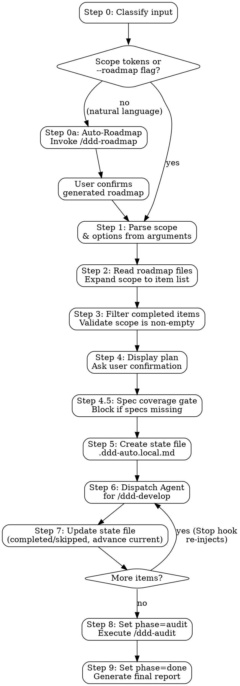

# DDD Auto

Automated roadmap execution: loop through `ddd-develop` for each item in a user-specified scope, then run a full-project `ddd-audit`. Uses a Stop hook to guarantee the loop continues even if Claude tries to exit.

**Announce at start:** "Using ddd-auto to execute roadmap items [scope description]."

## Input Modes

1. **Scoped** — `/ddd-auto P0.1.1 - P1.3.1, P2.1.1` executes specific items
2. **Phase-level** — `/ddd-auto P0` or `/ddd-auto P0 - P1` executes entire phases
3. **All** — `/ddd-auto` with no scope executes all incomplete roadmap items
4. **Custom roadmap path** — `/ddd-auto --roadmap path/to/roadmap/` or `/ddd-auto --roadmap my-roadmap.md P0.1.1 - P1.3.1`

**Options (parsed from arguments):**
- `--roadmap <path>` — Path to a roadmap directory or single roadmap file. Overrides the default `docs/roadmap/` location. Accepts a directory (reads all `P[0-9]*-*.md` files inside) or a single `.md` file.
- `--policy <text|preset>` — Decision policy for autonomous choices (default: `pragmatic`)
- `--max-iterations <N>` — Safety cap to prevent infinite loops (default: 50)
- `--skip-spec` — Skip spec generation gate. Spec-less items proceed without behavior contracts. Use only for quick fixes or refactoring.
- `--yes` — Skip the execution plan confirmation and start immediately

## Preset Decision Policies

| Preset | Bias |
|--------|------|
| `pragmatic` (default) | Practical first. Reuse existing patterns. Choose simplest viable approach. Avoid over-engineering. |
| `strict-ddd` | Strict DDD layer compliance even if it means more code. Domain purity over convenience. |
| `fast` | Minimum viable implementation. Skip non-essential optimization. Deliver first, refine later. |

## Execution Flow



**The Stop hook guarantees the loop.** After Claude completes each ddd-develop cycle and tries to exit, the Stop hook reads the state file and:
- If `phase=develop` → blocks exit, re-injects prompt to continue with next item
- If `phase=audit` → blocks exit, re-injects prompt to run ddd-audit
- If `phase=done` → allows exit (loop complete)

---

## Step 0: Classify Input

Before parsing scope, determine whether the input is a roadmap reference or an unplanned requirement.

**Classification logic** (check in order):

1. **Scope tokens present?** — Arguments contain `P\d+` patterns (e.g., `P0`, `P1.2`, `P0.1.1`) or `--roadmap` flag → **skip to Step 1** (existing flow)
2. **Roadmap file path?** — Arguments are a `.md` file path AND the file contains `- [ ]` checkboxes → treat as `--roadmap <path>`, **skip to Step 1**
3. **Natural language requirement** — Arguments don't match above patterns → **Step 0a: Auto-Roadmap**

### Step 0a: Auto-Roadmap

The input is an unplanned requirement that needs a roadmap before batch execution.

**Announce:**

```
Detected: unplanned requirement (no existing roadmap).
Generating development roadmap before execution...
```

**Execute:**

1. Invoke `/ddd-roadmap <user's requirement>` to generate a structured roadmap
2. After roadmap generation completes, present the result to the user:
   ```
   Roadmap generated at docs/roadmap/. [N] items across [M] phases.

   Review the roadmap and confirm to begin auto-execution?
   ```
3. **Wait for user confirmation** — this is the one pause point before batch execution begins. **With `--yes`**, skip this confirmation and proceed directly.
4. After confirmation (or immediately, under `--yes`), set `--roadmap` to the generated roadmap path and continue to **Step 1**

If the user requests changes to the roadmap, re-run `/ddd-roadmap` with adjusted input before proceeding.

---

## Step 1: Parse Scope & Options

Parse the user's arguments to extract:

1. **Scope identifiers**: `P0`, `P0.1`, `P0.1.1`, ranges (`P0.1.1 - P1.3.1`), mixed (`P0.1.1 - P1.3.1, P2.1.1`)
2. **--roadmap**: Path to a roadmap directory or single file. Default: `docs/roadmap/`
3. **--policy**: Free text or preset name (`pragmatic`, `strict-ddd`, `fast`). Default: `pragmatic`. If the value matches a preset name exactly, set `policy_preset`; otherwise set `policy` (free text)
4. **--max-iterations**: Integer, default 50, minimum 1. If 0 or negative, warn and fall back to the default — the Stop hook treats `max_iterations: 0` as "no cap", which must never be set unintentionally
5. **--skip-spec**: Boolean flag, default false. Skip spec generation and proceed without behavior contracts
6. **--yes**: Boolean flag, default false. Skip execution plan confirmation

**Parsing rules:**
- Scope tokens are `P` followed by digits and dots: `P[0-9]+`, `P[0-9]+.[0-9]+`, `P[0-9]+.[0-9]+.[0-9]+` (phases beyond P3 and two-digit area/sub-feature numbers like `P0.10` are valid)
- Plain integer tokens (`1`, `1 - 2`) are valid only when `--roadmap` points to a `fix-roadmap.md` — they select audit Waves (see Step 2 Wave filtering). With a standard roadmap, report them as invalid scope
- Ranges use ` - ` (space-hyphen-space) between two scope tokens
- Commas or spaces separate enumerated items
- `--roadmap` consumes the next token as a file or directory path
- `--policy` consumes the next token (quoted string or single word)
- `--max-iterations` consumes the next integer token

**If no scope provided:** scope = all phases present in the roadmap.

**If no --roadmap provided:** use the default discovery path `docs/roadmap/`.

## Step 2: Read Roadmap & Expand Scope

1. Determine roadmap source:
   - If `--roadmap` points to a **directory**: read all `P[0-9]*-*.md` files inside that directory
   - If `--roadmap` points to a **single file**: read that file only (treat it as a single-phase roadmap)
   - **Fix-roadmap special case**: if the roadmap source is a file named `fix-roadmap.md` (from ddd-audit), read items as a flat ordered list of checkboxes in document order. `## N Wave` headings do not create a feature-area hierarchy — iterate `- [ ]` checkboxes sequentially. Store each unchecked item's full checkbox text (the content after `- [ ] `, trimmed) as its identifier in the `scope` list. Example: `"AUTH-CRIT-001 Fix input sanitization in UserController.create (\`src/auth/UserController.ts:45\`) — Effort: M"`.
   - **Wave filtering (fix-roadmap only)**: plain integer scope tokens (`1`) and integer ranges (`1 - 2`) select Wave sections by their `## N Wave ...` headings — only checkboxes under the selected waves enter the scope, still flat and in document order. With no numeric tokens, all waves are in scope. Example: `/ddd-auto --roadmap docs/audit/2026-07-10-001/fix-roadmap.md 1 - 2` executes only CRITICAL and HIGH findings.
   - If `--roadmap` not provided: read `docs/roadmap/P[0-9]*-*.md` (default)
2. For each file, extract the phase/feature-area/sub-feature hierarchy by parsing markdown headings:
   - `# P[N]: ...` → phase
   - `## [N].M ...` → feature area
   - `### [N].M.K ...` → sub-feature (this is the item level)
3. Expand scope identifiers to concrete sub-feature IDs:
   - `P0` → all sub-features in P0 (e.g., P0.1.1, P0.1.2, P0.2.1, ...)
   - `P0.1` → all sub-features under feature area 0.1 (e.g., P0.1.1, P0.1.2, ...)
   - `P0.1.1` → specific sub-feature
   - `P0.1.1 - P1.3.1` → all sub-features from P0.1.1 to P1.3.1 in roadmap order
4. Maintain natural roadmap order (phase → feature area → sub-feature)

## Step 3: Filter & Validate

1. For each sub-feature in the expanded scope, check if it has any unchecked items (`- [ ]`)
2. Remove sub-features where all items are already `- [x]` or `✅`
3. If no incomplete items remain, inform the user: "All items in scope [scope] are already complete." and exit
4. Build the final ordered list of sub-feature IDs to execute

## Step 4: Display Plan & Confirm

Primary permissions come from this skill's `allowed-tools` frontmatter — no persistent settings mutation is required. If a specific command is denied by the user's environment during the run, surface the error rather than auto-editing `settings.local.json`.

Present the execution plan to the user:

```
ddd-auto execution plan:

**Scope**: [original scope expression]
**Policy**: [policy text or preset name]
**Max iterations**: [N]
**Items to execute** ([count] items):

1. P0.1.1 — [sub-feature title from roadmap]
2. P0.1.2 — [sub-feature title from roadmap]
3. P0.2.1 — [sub-feature title from roadmap]
...

Each item will be developed via /ddd-develop (with TDD, audit, and verification).
After all items complete, a scoped /ddd-audit will run over the files touched by this batch.

Proceed?
```

**If `--yes` was passed**, skip the confirmation and proceed directly to Step 5.

**Otherwise**, wait for user confirmation. If the user says no or wants changes, adjust scope and re-present.

## Step 4.5: Spec Coverage Gate

Before creating the state file and entering the execution loop, verify two things: the product brief exists, and approved specs exist for all feature areas in scope. **This is a hard gate** — missing artifacts block execution. The user must generate them manually. The only bypass is `--skip-spec`.

### Gate Logic

1. **Check for `--skip-spec` flag** — if present, log `spec_coverage: skipped` in the state file and proceed to Step 5. This is the only bypass.

2. **Fix-roadmap special case**: if the roadmap source is `fix-roadmap.md`, spec coverage is not applicable — set `spec_coverage: skipped` and proceed to Step 5.

3. **Check `docs/product-brief.md`** — if the file does not exist, stop immediately:

```
BLOCKED: docs/product-brief.md not found.

Specs cannot be generated without a product brief — specs anchored only to
the roadmap drift from the original product intent.

Run /ddd-brief first to generate the product brief, then re-run ddd-auto.
Use --skip-spec to bypass spec checks entirely (not recommended).
```

4. **Extract unique feature areas** from the expanded scope list:
   - `P0.1.1, P0.1.2, P0.2.1` → unique feature areas: `P0.1, P0.2`

5. **For each feature area**, check `docs/specs/P{phase}.{area}-*.md`:
   - File exists with `status: approved` → covered
   - File exists with `status: draft` → not covered (draft doesn't count)
   - File not found → not covered

6. **If all covered** → proceed to Step 5

7. **If any not covered** → **block and report**:

```
BLOCKED: Spec coverage gate — missing approved specs:

✓ P0.1 — docs/specs/P0.1-user-authentication.md (approved)
✗ P0.2 — no spec found
✗ P1.1 — docs/specs/P1.1-billing.md (draft, not approved)

Run /ddd-spec P0.2, P1.1 to generate and approve specs, then re-run ddd-auto.
Use --skip-spec to bypass spec checks entirely (not recommended).
```

Do not proceed past this point. Do not generate specs automatically. The user must run `/ddd-spec` for the uncovered areas and approve them before re-running ddd-auto.

## Step 5: Create State File

After user confirms, create `.ddd-auto.local.md`:

```markdown
---
active: true
session_id: ""
iteration: 1
max_iterations: [N from --max-iterations or 50]
started_at: "[current UTC timestamp in ISO 8601]"
baseline_sha: "[output of `git rev-parse HEAD` at this moment, or empty string if not a git repo]"
roadmap_path: "[--roadmap value, or 'docs/roadmap/' if not specified]"
scope:
  - "P0.1.1"
  - "P0.1.2"
  - "P0.2.1"
completed: []
skipped: []
current: "[first item in scope list]"
phase: "develop"
policy: "[free text policy if provided, otherwise empty]"
policy_preset: "[preset name if provided, otherwise empty]"
spec_coverage: "[full|partial|skipped]"
---

## Original Command

/ddd-auto [original arguments]

## Progress Log

```

**session_id:** always write as `""`. The Stop hook claims ownership atomically on its first fire — it writes the real session ID into the state file so that concurrent sessions are excluded. Do not try to set this from the skill; the hook handles it.

**.gitignore:** after creating the state file, ensure the project's `.gitignore` contains the line `.ddd-auto.local.md*` (covers the state file and the hook's `.lock` directory). Append it if missing. This prevents commits made during the loop (ddd-develop cycles, audit auto-fixes) from accidentally committing loop state.

## Step 6: Dispatch Agent for /ddd-develop

Look at the `current` field in the state file. This is the sub-feature ID (e.g., `P0.1.1`) to develop next.

**Use the Agent tool** to dispatch a subagent. Each ddd-develop cycle (30-80K tokens) stays inside the subagent and only a ~200 token summary returns to the main session, which keeps the main ddd-auto loop lean enough to reliably run 10+ items without context or cache-hit pressure.

### Agent Dispatch

Call the Agent tool with this prompt (fill in `[current]`, `[roadmap_path]`, `[sub-feature title]`, and policy if set):

```
You are executing a single ddd-develop cycle as part of a ddd-auto batch run.

[If policy set:] Decision policy for this implementation: [policy text]. When encountering design choices, apply this policy to choose autonomously without asking the user. Log key decisions in your commit messages.

[If fix-roadmap (roadmap_path ends with fix-roadmap.md):] Invoke the ddd-develop skill with args: `--roadmap [roadmap_path] [current]`. The --roadmap flag tells ddd-develop this is a roadmap-driven run with the checkbox item text as the target, so it classifies correctly and flips the checkbox in Phase 6.1. ddd-develop skips its spec gate automatically for --roadmap (fix-roadmap) items.

[If standard roadmap:] Invoke the ddd-develop skill with args: `[current]` (roadmap scope token — this MUST be the first argument so ddd-develop classifies the run as Mode B / roadmap-driven and executes Phase 6.1 to flip the checkbox).

[If the state file has `spec_coverage: skipped` (from --skip-spec or fix-roadmap):] Append ` --skip-spec` to the ddd-develop args. Without this, ddd-develop's own Phase 1.5 spec gate will block on the missing spec and stall the batch — ddd-auto's gate bypass MUST be forwarded to every dispatched cycle.

Context (do NOT include in the skill args — this is for your situational awareness only):
- Roadmap file: [roadmap_path]
- Sub-feature title: [sub-feature title from roadmap]
- This is part of an automated ddd-auto run: ddd-develop's Batch (Non-Interactive) Mode applies — skip all confirmations, never push, report BLOCKED instead of waiting on any gate.

After ddd-develop completes (all 6 phases), report back with EXACTLY this format:

STATUS: [DONE or BLOCKED]
ITEM: [item ID, e.g. P0.1.1]
COMMIT: [short SHA of final commit, or "none"]
DECISIONS: [key decisions made, one per line, or "none"]
BLOCKED_REASON: [reason if BLOCKED, or "none"]
```

**Do not interfere with the subagent's ddd-develop workflow.** It will execute the full 6-phase cycle (LOCATE → PLAN → IMPLEMENT → AUDIT → VERIFY → COMPLETE) independently.

## Step 7: Update State File After Each Item

After the Agent returns its report (STATUS: DONE or BLOCKED), parse the structured fields (ITEM, COMMIT, DECISIONS, BLOCKED_REASON) and update the state file:

### If DONE:

1. Add the current item to `completed` list in frontmatter
2. Append to Progress Log: `- [YYYY-MM-DD HH:MM] [item ID] — DONE (commit: [short SHA])`
3. Record any key decisions: `  - Decision: [what was decided] (policy: [rationale])`
4. **Sync the roadmap checkbox** (mandatory, see procedure below) — ddd-auto owns this, since the subagent's Phase 6.1 only runs when it classified as roadmap mode and cannot be relied on.

**Roadmap sync procedure:**

- *Standard roadmap* (item IDs match `P[N].M.K`): find the sub-feature heading `### N.M.K ...` in the roadmap file recorded during Step 2 (heading regex: `^### N\.M\.K(\s|$)` — the `P` prefix is dropped in headings). Flip every `- [ ]` to `- [x]` between that heading and the next `### ` (or EOF). Already-checked lines are left alone. If the heading is not found, append a warning to the Progress Log (`WARN roadmap sync skipped (heading not found)`) and continue — do not fail the loop.
- *fix-roadmap.md* (flat checkbox list from ddd-audit): ddd-develop's Phase 6.1 (with `--roadmap` flag, per Step 6) is the primary mechanism — it flips the checkbox during its COMPLETE phase. This Step 7 sync is a secondary backup. Use the **Edit tool** to flip `- [ ]` to `- [x]` on the line that matches the `current` item's stored identifier text. Read the fix-roadmap.md at `roadmap_path`, find the line whose content matches `- [ ] [current item text]` exactly (the identifier stored in `scope` in Step 2). If the line is already `- [x]` (flipped by ddd-develop), skip. If no matching line is found, append a warning to the Progress Log (`WARN fix-roadmap sync skipped — line not found: [current]`) and continue.
- Idempotent: safe to re-run. Phase-level status lines are not updated here.

### If BLOCKED/SKIPPED:

1. Add the current item to `skipped` list in frontmatter
2. Append to Progress Log: `- [YYYY-MM-DD HH:MM] [item ID] — SKIPPED (BLOCKED: [reason])`

### Advance to Next Item:

1. Find the next item in `scope` that is NOT in `completed` and NOT in `skipped`
2. Update `current` to that item's ID
3. If no items remain → set `phase` to `"audit"` (the Stop hook will inject the audit prompt on next exit)

## Step 8: Scoped Audit

When phase transitions to `audit`, the Stop hook will inject a prompt to run `/ddd-audit`.

Execute `/ddd-audit` scoped to the **completed items only** — not the entire project. Each ddd-develop cycle already audits its own item; this final audit focuses on **cross-module integration** between the items developed in this run.

Construct the audit scope from the files changed since the pre-run baseline (`baseline_sha` in the state file). Compute the file list with:

```bash
git diff --name-only <baseline_sha>..HEAD
```

Then invoke ddd-audit with that concrete file list plus the completed item IDs for context:

```
/ddd-audit Audit only the files listed below. Focus on cross-module integration, shared dependencies, and consistency between roadmap items [completed list].

Files:
[paste the `git diff --name-only` output]
```

If `baseline_sha` is empty (non-git repo), fall back to auditing by completed item IDs: `/ddd-audit P0.1.1, P0.1.2, P0.2.1`.

Let ddd-audit run its pipeline on the scoped area:
1. Generate scoped audit plan from the provided file list
2. Execute phases (layers → integration → docs) for affected code only
3. Generate final report with scores
4. Generate fix roadmap

**Do NOT fix findings in this audit** — this is a final assessment, not the incremental audit-fix loop that ddd-develop does internally. The purpose is to verify integration quality across the items developed in this run.

## Step 9: Generate Final Report & Set Phase to Done

After ddd-audit completes, generate the ddd-auto execution report and update the state file.

### Update State File:
Set `phase` to `"done"` in the YAML frontmatter. On the next exit attempt, the Stop hook will detect `phase=done`, delete the state file, and allow exit.

### Generate Report:

Read the state file's Progress Log and the audit report to compile:

```markdown
## ddd-auto Execution Report

**Scope**: [original scope expression]
**Iterations**: [final iteration count]
**Duration**: [started_at] → [current time]
**Policy**: [policy description]

### Completed ([N] items)

| # | Item | Description | Commit |
|---|------|-------------|--------|
| 1 | P0.1.1 | [sub-feature title] | [short SHA] |
| 2 | P0.2.1 | [sub-feature title] | [short SHA] |

### Skipped ([N] items)

| # | Item | Reason |
|---|------|--------|
| 1 | P0.1.2 | BLOCKED: [reason] |

### Key Decisions

| Item | Decision | Rationale |
|------|----------|-----------|
| P0.1.1 | [what was decided] | [policy rationale] |

### Audit Results

- **Score**: [overall score]%
- **Verdict**: [READY / NOT READY]
- **Findings**: CRITICAL: [N], HIGH: [N], MEDIUM: [N], LOW: [N]
- **Full report**: [path to audit-report.md]
- **Fix roadmap**: [path to fix-roadmap.md]
```

Present this report to the user. The loop will end naturally — the Stop hook sees `phase=done` and allows exit.

---

## Cancellation

The user can run `/ddd-auto-cleanup` after pressing Escape to:
1. Delete `.ddd-auto.local.md`
2. The Stop hook finds no state file and allows the next exit

> **Escape pauses, it does not stop.** As long as `.ddd-auto.local.md` exists, the Stop hook re-injects the loop prompt at the end of the session's next response — even if that response answered an unrelated question. If the user interrupts and then asks something unrelated, answer it, remind them the loop will resume, and suggest `/ddd-auto-cleanup` if they intend to stop.

## Safety Mechanisms

| Mechanism | Purpose |
|-----------|---------|
| `max_iterations` (default 50) | Prevent infinite loops. Enforced by the Stop hook, which increments `iteration` on each loop and exits+cleans up when `iteration >= max_iterations`. ddd-auto itself does not check this field. |
| Session ID isolation | Hook atomically claims the state file on first fire using `mkdir` lock; concurrent sessions see a mismatched session_id and exit cleanly |
| `/ddd-auto-cleanup` | Manual cleanup after interruption |
| State file cleanup on `phase=done` | Stop hook deletes `.ddd-auto.local.md` on exit |
| Scope confirmation before start | User reviews expanded items before committing |
| Spec coverage gate (Step 4.5) | Blocks if product-brief.md or approved specs are missing; user must generate manually; `--skip-spec` to bypass |
| Decision logging in Progress Log | All autonomous choices are auditable |

## Integration

**Requires:**
- Stop hook registered in `hooks/hooks.json`
- `jq` available on system (for hook JSON handling)

**Invokes:**
- **ddd-develop** (per-item, roadmap mode — dispatched via Agent with the scope token as its sole arg; see Step 6)
- **ddd-audit** (scoped to files touched by the `completed` list, after all develop items complete; see Step 8)

**Consumes (required before execution):**
- `docs/product-brief.md` (generated by ddd-brief) — blocks at Step 4.5 if missing
- Approved specs in `docs/specs/` (generated by ddd-spec) — blocks at Step 4.5 if any feature area is uncovered
- Roadmap files from `docs/roadmap/P[0-9]*-*.md` (generated by ddd-roadmap)

**Produces:**
- Updated roadmap with completed items (`- [x]`)
- State file with full execution log (`.ddd-auto.local.md`, cleaned up on completion)
- Final execution report (displayed to user)
- Audit report and fix roadmap (in `docs/audit/`)
