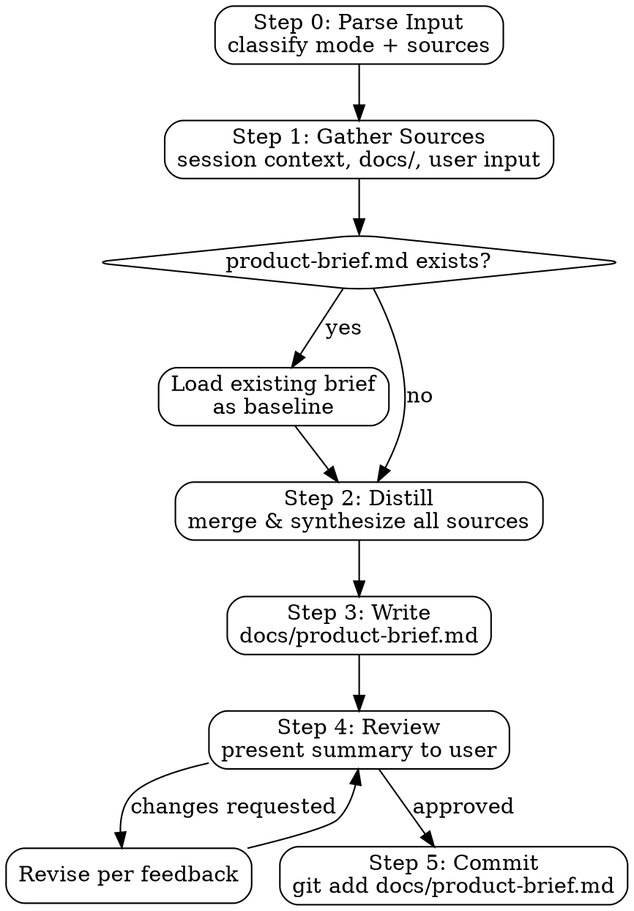

# DDD Brief Generator

Distills product intent from multiple sources into `docs/product-brief.md` — the canonical anchor file for `ddd-roadmap`, `ddd-spec`, `ddd-develop`, and `ddd-audit`. Without this file, specs are generated by expanding a low-information-density roadmap, causing drift from the original product vision.

## Pipeline Position

**Run ddd-brief BEFORE ddd-roadmap.** ddd-roadmap reads product-brief.md as its highest-priority source and skips redundant Q&A when the brief is present.

```
ddd-init → ddd-brief → ddd-roadmap → ddd-spec → ddd-develop/ddd-auto → ddd-audit
```

**After ddd-roadmap Goal Alignment:** If the roadmap session produces new decisions, constraints, or non-goals not already captured in product-brief.md, re-run `/ddd-brief` to merge them in. The brief must stay current — stale briefs are worse than no briefs because they silently mislead downstream specs.

Signs that product-brief.md needs an update:
- User corrected the vision or target users during roadmap alignment
- New constraints emerged (performance, compliance, integration limits)
- Non-goals were explicitly stated for the first time
- Architecture decisions were made during roadmap planning

**Announce at start:** "Using ddd-brief to generate docs/product-brief.md from [sources]."

## Input Modes

| Invocation | Behavior |
|-----------|----------|
| `/ddd-brief` | Extract from session context + auto-scan `docs/` |
| `/ddd-brief <description>` | Use provided text as primary input, also scan `docs/` |
| `/ddd-brief <file-path>` | Use specified file as primary PRD, also scan `docs/` |
| `/ddd-brief <file1> <file2>` | Merge multiple files + session context |

All modes also auto-scan `docs/` for supplementary documents. Session context is always included when available.

---

## Execution Flow



---

## Step 0 -- Parse Input

Determine input mode and sources:

1. **No arguments**: mode = `context-only`
2. **Arguments that look like file paths** (start with `/`, `./`, `../`, or end with `.md`/`.txt`): mode = `file`, verify files exist
3. **Arguments that are plain text**: mode = `description`
4. **Mixed** (files + text): mode = `mixed`

If a specified file does not exist, report the error and ask the user to correct it before continuing.

---

## Step 1 -- Gather Sources

Collect all available product information. Relevance ranking (highest to lowest):

### 1. User-provided input (highest priority)
- Inline description text from the command invocation
- Explicitly specified file paths

### 2. Session context
Extract from the current conversation:
- Product goals and user personas discussed
- Feature decisions and their rationale
- Explicit constraints ("must support X", "cannot do Y")
- Non-goals stated ("out of scope for now")
- Architecture decisions made during design

### 3. Auto-scanned docs/ (supporting context)
Scan the project's `docs/` directory. Read files that appear to be product documentation:

**Priority order within docs/:**
1. `docs/prd*.md`, `docs/PRD*.md`, `docs/product*.md`
2. `docs/requirements*.md`, `docs/spec*.md` (non-generated specs)
3. `docs/superpowers/specs/*.md` (brainstorming outputs)
4. `docs/overview*.md`, `docs/README.md`
5. Root `README.md` (lowest priority, often generic)

**Skip these files:**
- `docs/roadmap/` (roadmap is a downstream artifact, not a source)
- `docs/specs/` (generated specs, not source of truth)
- Files with frontmatter `status: draft` or `status: approved` in `docs/specs/`
- Any file that is clearly generated (contains "generated by ddd-" in content)

### 4. Existing product-brief.md (if updating)
If `docs/product-brief.md` already exists, load it as the baseline and merge new information into it rather than replacing wholesale.

---

## Step 2 -- Distill

Synthesize all gathered sources into a coherent product brief. Rules:

- **Resolve conflicts**: when sources disagree, prefer the highest-priority source. Note the conflict in the brief.
- **No invention**: only include decisions and constraints that are stated or clearly implied in sources. Do not infer goals or constraints that aren't grounded in source material.
- **Preserve rationale**: when sources explain WHY a decision was made, capture that — it's the most valuable information for downstream specs.
- **Flag gaps**: if critical sections (e.g., target users, non-goals) have no source material, write `[NOT SPECIFIED — confirm with user]` rather than inventing content.

---

## Step 3 -- Write docs/product-brief.md

### File Format

```markdown
---
generated: [YYYY-MM-DD]
sources: [list of files read, or "session-context"]
---

# Product Brief: [Project Name]

## Vision
[1-3 sentences: what are we building, for whom, and the core value it delivers]

## Target Users
[Who uses this product. Concrete personas if known, otherwise user categories]

## Goals
[Bulleted list of measurable outcomes or capabilities. Each goal should be falsifiable]
- [Goal 1]
- [Goal 2]

## Non-Goals
[Explicit scope exclusions — equally important as goals. Prevents spec drift]
- [Not doing X in this phase]
- [Y is out of scope because Z]

## Key Design Decisions
[Decisions that constrain how the system must be built. Each entry: decision + rationale]

| Decision | Rationale |
|----------|-----------|
| [What was decided] | [Why — the constraint or tradeoff that drove it] |

## Constraints
[Hard limits that specs and implementation must respect]
- **Performance**: [e.g., p95 < 200ms for API responses]
- **Compliance**: [e.g., GDPR, SOC2 requirements]
- **Integration**: [e.g., must work with existing auth system]
- **Technology**: [e.g., must use PostgreSQL, no new infrastructure]

## Open Questions
[Unresolved decisions that ddd-spec will need to make explicit assumptions about]
- [Question 1: what we need to decide]
- [Question 2]
```

### Write Rules

- Create `docs/` directory if it does not exist
- If `docs/product-brief.md` already exists, overwrite it (the file is always regenerable)
- Keep the file concise — this is a distillation, not a comprehensive PRD. Target: under 300 lines

---

## Step 4 -- Review

Present a summary to the user:

```
## Product Brief Generated

**File**: docs/product-brief.md
**Sources used**: [list]
**Key sections**:
- Vision: [first sentence]
- Goals: [count] goals defined
- Non-goals: [count] explicit exclusions
- Design decisions: [count] decisions captured
- Open questions: [count] — these will need resolution during spec generation

Please review docs/product-brief.md.
Options:
1. Approve — commit and use as anchor for ddd-spec
2. Edit — specify what to change
3. Add source — provide additional file or description to merge in
```

### Revision Loop

If user requests changes:
1. Apply changes to `docs/product-brief.md`
2. Re-present summary
3. Wait for approval

---

## Step 5 -- Commit

After approval:

```bash
git add docs/product-brief.md
git commit -m "docs: add product brief"
# or if updating:
git commit -m "docs: update product brief"
```

---

## Integration

**Produces artifact consumed by:**
- **ddd-spec** — reads product-brief.md as highest-priority context source; blocks if file is missing
- **ddd-develop** — reads product-brief.md to validate implementation decisions against product intent
- **ddd-audit** — reads product-brief.md to check whether built features match stated goals and non-goals

**Pipeline position:**
```
ddd-init → ddd-brief → ddd-roadmap → ddd-spec → ddd-develop/ddd-auto → ddd-audit
```

Run ddd-brief before ddd-roadmap for maximum benefit. It can also be re-run after ddd-roadmap Goal Alignment to capture new decisions made during session. The brief is the source of truth for product intent; the roadmap is an execution plan derived from it.
