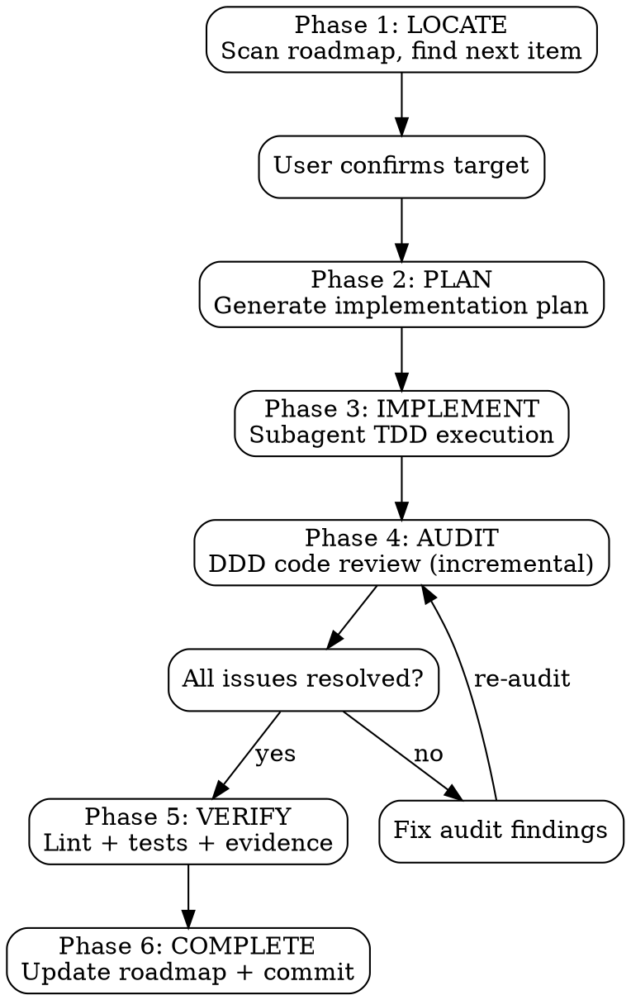
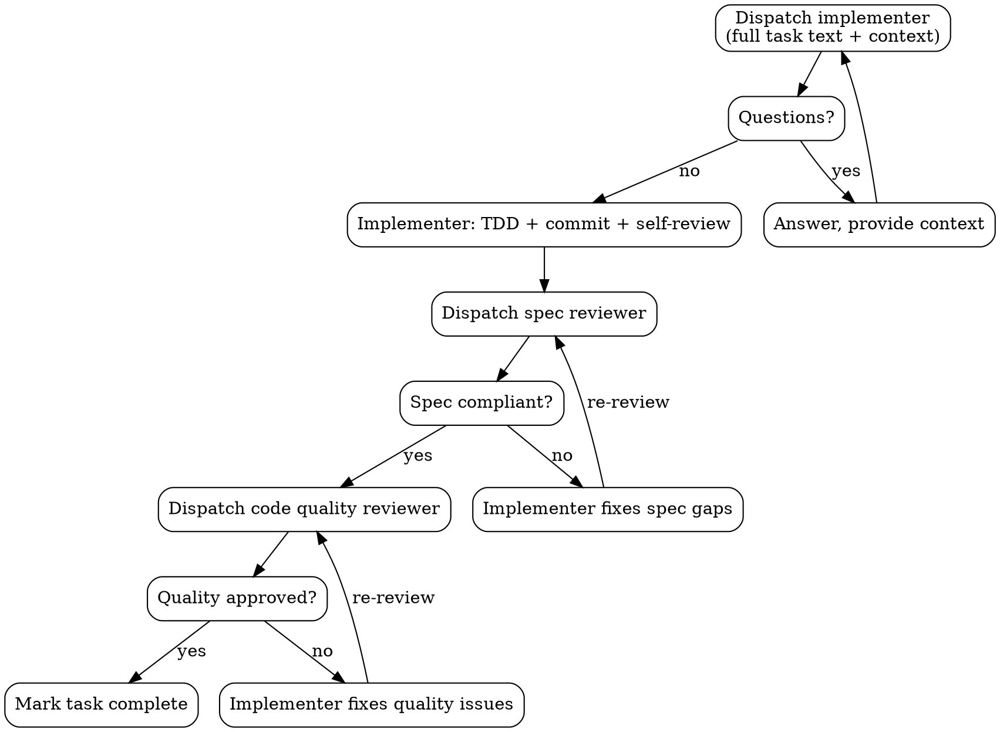
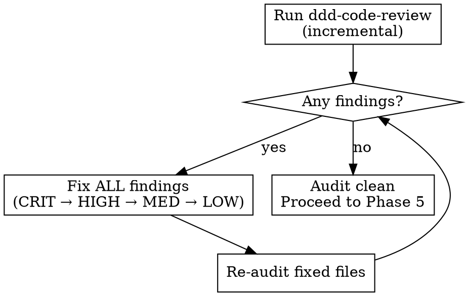

# DDD Develop

Self-contained development workflow: locate next roadmap item, plan, implement with TDD via subagents, audit, verify, and commit. No external skill dependencies.

**Announce at start:** "Using ddd-develop to implement the next roadmap feature."

## Execution Flow



---

## Phase 1: LOCATE

Scan roadmap to find the next development target.

### Roadmap Scanning

1. Look for roadmap files in order: `docs/roadmap/`, `docs/`, project root
2. Read phase documents in order (P0 → P1 → P2 → P3, or v0.x ascending)
3. Find the first unchecked item: `- [ ]`
4. Extract the feature context: which phase, feature area, sub-feature, and the specific item

### Present to User

```
Next roadmap item:

**Phase**: P0 Foundation
**Feature**: 0.1.3 Page Templates
**Item**: Create reusable page layouts: single-column, two-column, dashboard grid

Proceed with this item?
```

Wait for user confirmation. User may redirect to a different item.

---

## Phase 2: PLAN

Generate a detailed implementation plan for the confirmed roadmap item.

### Planning Process

1. **Read project context**: CLAUDE.md, existing code in relevant modules, test patterns, DDD layer structure
2. **Map file structure**: which files to create/modify, one responsibility per file
3. **Decompose into bite-sized tasks**: each task = one TDD cycle (2-5 minutes)
4. **Write complete plan**: exact file paths, full code blocks, test commands with expected output

### Plan Document

Save to `docs/superpowers/plans/YYYY-MM-DD-<feature-name>.md`:

```markdown
# [Feature Name] Implementation Plan

**Goal:** [One sentence]
**Architecture:** [2-3 sentences about approach]
**Tech Stack:** [Key technologies]
**Roadmap Item:** [Phase / Feature Area / Item reference]

---

## File Structure

| File | Action | Responsibility |
|------|--------|----------------|
| `exact/path/to/file.ts` | Create | [purpose] |
| `exact/path/to/existing.ts` | Modify | [what changes] |
| `tests/path/to/test.ts` | Create | [what it tests] |

---

### Task 1: [Component Name]

**Files:**
- Create: `exact/path/to/file.ts`
- Test: `tests/exact/path/to/test.ts`

- [ ] **Step 1: Write the failing test**
[complete test code block]

- [ ] **Step 2: Run test to verify it fails**
Run: `[exact command]`
Expected: FAIL with "[expected message]"

- [ ] **Step 3: Write minimal implementation**
[complete implementation code block]

- [ ] **Step 4: Run test to verify it passes**
Run: `[exact command]`
Expected: PASS

- [ ] **Step 5: Commit**
`git commit -m "feat: [description]"`
```

### Plan Quality Rules

- **No placeholders**: Every step has actual code, actual commands, actual expected output
- **No "TBD"**: If you don't know, research first
- **No "similar to Task N"**: Repeat the code — tasks may execute out of context
- **No vague steps**: "Add error handling" is not a step; show the error handling code
- **Exact file paths always**
- **DRY, YAGNI, TDD, frequent commits**

### Plan Self-Review

After writing, check:
1. **Spec coverage**: Does every requirement from the roadmap item have a task?
2. **Placeholder scan**: Any "TBD", "TODO", "fill in", vague steps?
3. **Type consistency**: Do names in later tasks match definitions in earlier tasks?

Fix issues inline. Then present plan to user for approval.

---

## Phase 3: IMPLEMENT

Execute the plan using subagents with TDD discipline.

### TDD Iron Law

```
NO PRODUCTION CODE WITHOUT A FAILING TEST FIRST
```

Every subagent follows RED-GREEN-REFACTOR:

1. **RED** — Write one minimal failing test
2. **Verify RED** — Run test, confirm it fails for the right reason
3. **GREEN** — Write minimal code to pass
4. **Verify GREEN** — Run test, confirm all pass
5. **REFACTOR** — Clean up, keep tests green
6. **Commit** — Small, focused commit

Write code before test? Delete it. No exceptions.

### Subagent Execution Model

Dispatch one fresh subagent per task. Each subagent gets isolated context.



### Implementer Prompt Template

```
You are implementing Task N: [task name]

## Task Description
[FULL TEXT of task from plan — never make subagent read plan file]

## Context
[Where this fits in the project, dependencies, DDD layer, architectural context]

## Before You Begin
If you have questions about requirements, approach, dependencies, or anything unclear — ask now.

## Your Job
1. Follow TDD: write test first (RED), verify it fails, implement minimal code (GREEN), verify it passes, refactor
2. Each test must fail for the RIGHT reason (feature missing, not typo)
3. Write minimal code — no YAGNI, no over-engineering
4. Commit after each TDD cycle
5. Self-review before reporting

## Code Organization
- Follow the file structure defined in the plan
- Each file: one clear responsibility, well-defined interface
- Follow existing codebase patterns
- If a file grows beyond plan's intent, report as DONE_WITH_CONCERNS

## Escalation
It is OK to stop and say "this is too hard for me."

STOP and escalate when:
- Task requires architectural decisions with multiple valid approaches
- You need to understand code beyond what was provided
- You feel uncertain about correctness
- Task involves restructuring code the plan didn't anticipate

Report: BLOCKED or NEEDS_CONTEXT with specifics.

## Self-Review Before Reporting
- Did I fully implement everything in the spec?
- Did I miss any requirements or edge cases?
- Are names clear? Is code clean?
- Did I avoid overbuilding (YAGNI)?
- Do tests verify behavior (not mock behavior)?
- Did I follow TDD? (RED → GREEN → REFACTOR)

## Report Format
- **Status:** DONE | DONE_WITH_CONCERNS | BLOCKED | NEEDS_CONTEXT
- What you implemented
- What you tested and results
- Files changed
- Self-review findings
- Issues or concerns
```

### Spec Reviewer Prompt Template

```
You are reviewing whether an implementation matches its specification.

## What Was Requested
[FULL TEXT of task requirements]

## What Implementer Claims They Built
[From implementer's report]

## CRITICAL: Do Not Trust the Report
Read the actual code. Compare to requirements line by line.

DO NOT take their word for completeness.
DO verify by reading code, not by trusting report.

Check:
- **Missing requirements**: Everything requested implemented?
- **Extra/unneeded work**: Anything built that wasn't requested?
- **Misunderstandings**: Requirements interpreted incorrectly?

Report:
- Spec compliant — all requirements met, nothing extra
- Issues found: [list specifically what's missing or extra, with file:line references]
```

### Code Quality Reviewer Prompt Template

**Only dispatch after spec compliance passes.**

```
You are reviewing code quality for Task N.

## What Was Implemented
[From implementer's report]

## Changes to Review
Files changed in commits [BASE_SHA..HEAD_SHA]

## Review Checklist
- [ ] Code is readable and well-named
- [ ] Functions are focused (<50 lines)
- [ ] Files are cohesive (<800 lines)
- [ ] No deep nesting (>4 levels)
- [ ] Errors handled explicitly
- [ ] No hardcoded secrets or credentials
- [ ] No console.log or debug statements
- [ ] Tests exist for new functionality
- [ ] Tests verify behavior, not mock behavior
- [ ] Each file has one clear responsibility
- [ ] Implementation follows DDD layer conventions
- [ ] No mutation (immutable patterns used)
- [ ] New files aren't already large

Report:
- **Strengths**: What's done well
- **Issues**: Critical / Important / Minor with file:line references
- **Assessment**: Approved / Changes Needed
```

### Handling Implementer Status

| Status | Action |
|--------|--------|
| **DONE** | Proceed to spec review |
| **DONE_WITH_CONCERNS** | Read concerns first. If correctness/scope related, address before review. If observational, note and proceed. |
| **NEEDS_CONTEXT** | Provide missing context, re-dispatch |
| **BLOCKED** | Assess: context problem → provide more; task too hard → use more capable model; task too large → split; plan wrong → escalate to user |

### Model Selection

- Mechanical tasks (1-2 files, clear spec): fast/cheap model
- Integration tasks (multi-file, pattern matching): standard model
- Architecture, design, review: most capable model

### Red Flags During Implementation

**Never:**
- Start on main/master without user consent
- Skip reviews (spec OR quality)
- Proceed with unfixed issues
- Dispatch multiple implementers in parallel (conflicts)
- Make subagent read plan file (provide full text)
- Accept "close enough" on spec compliance
- Start quality review before spec compliance passes

---

## Phase 4: AUDIT

After all plan tasks complete, run a full incremental audit.

### Invoke ddd-code-review

Run ddd-code-review in **incremental/diff mode**:
- Scope: only files changed since Phase 3 started
- Use `git diff` to determine change set
- Apply the 8-dimension audit matrix against changed files

### Audit-Fix Loop

**ALL severity levels trigger fixes** — CRITICAL, HIGH, MEDIUM, and LOW:



Fix order: CRITICAL first, then HIGH, MEDIUM, LOW. Re-audit after each fix round until zero findings.

---

## Phase 5: VERIFY

Final verification before completion. **Evidence before claims.**

### Verification Gate

```
BEFORE claiming anything is done:

1. IDENTIFY — What command proves this claim?
2. RUN — Execute the command (fresh, complete)
3. READ — Full output, check exit code
4. VERIFY — Does output confirm the claim?
   - YES → State claim WITH evidence
   - NO → State actual status with evidence
5. ONLY THEN — Make the claim
```

### Required Verifications

Run ALL of these and show output:

```bash
# 1. Lint
[project lint command, e.g., npm run lint:fix / yarn lint:fix]

# 2. Type check (if applicable)
[project type check command, e.g., npx tsc --noEmit]

# 3. Full test suite
[project test command, e.g., npm test / yarn test]

# 4. Build (if applicable)
[project build command]
```

**Every verification must show actual command output.** "Should pass" is not evidence.

### Red Flags — STOP

- Using "should", "probably", "seems to"
- Expressing satisfaction before verification ("Great!", "Done!")
- About to commit without verification evidence
- Thinking "just this once"

---

## Phase 6: COMPLETE

### 6.1 Update Roadmap

1. Read the roadmap phase document
2. Change the completed item from `- [ ]` to `- [x]`
3. If the sub-feature is fully complete, note it in the phase status
4. If all items in a phase are complete, update phase status to "Complete"

### 6.2 Update Related Documents (if necessary)

Only update other documents when the implemented feature directly affects them:
- README: if public API or user-facing behavior changed
- CLAUDE.md: if architectural patterns or conventions changed
- Architecture docs: if DDD layer structure changed

**Do not update documents speculatively.** Only update what the change actually impacts.

### 6.3 Commit

```bash
# Stage all changes
git add [specific files]

# Commit with conventional format
git commit -m "feat: [description of what was implemented]

- [summary of changes]
- [test coverage note]
- Roadmap: [phase/feature reference] marked complete"
```

### 6.4 Push (User Confirmation Required)

```
All changes committed. Ready to push to remote?

Branch: [current branch]
Commits: [N new commits]
```

**Wait for user confirmation before pushing.** Never auto-push.

---

## Roadmap Format Compatibility

This skill supports two roadmap formats:

### Checkbox Format (primary, generated by ddd-roadmap)
```markdown
- [ ] Uncompleted item
- [x] Completed item
```

### Emoji Format (legacy)
```markdown
- **Feature name** — description     # uncompleted (no emoji)
- **Feature name** — description ✅  # completed
```

When scanning, check for `- [ ]` first, fall back to lines without ✅ in emoji-style roadmaps.

---

## Quick Reference

| Phase | What | Key Output |
|-------|------|------------|
| 1. LOCATE | Find next roadmap item | Confirmed development target |
| 2. PLAN | Generate implementation plan | Plan doc with TDD tasks |
| 3. IMPLEMENT | Subagent TDD execution | Working code + tests + commits |
| 4. AUDIT | ddd-code-review (incremental) | Zero findings |
| 5. VERIFY | Lint + tests + build | Evidence of all passing |
| 6. COMPLETE | Update roadmap + commit + push | Updated roadmap, clean commit |

## Integration

**Consumes:**
- Roadmap files generated by **ddd-roadmap**

**Invokes:**
- **ddd-code-review** in Phase 4 (incremental audit mode)

**Produces:**
- Implementation code with tests
- Updated roadmap with completed items
- Audit-clean commits
