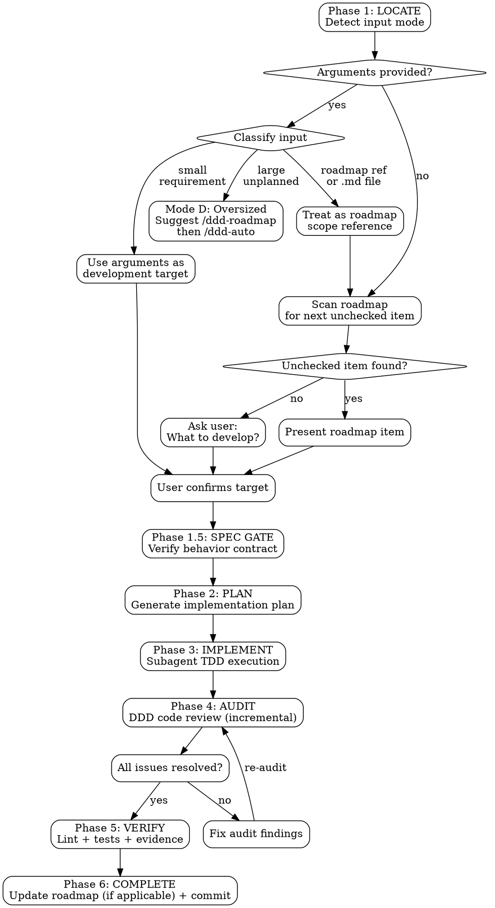
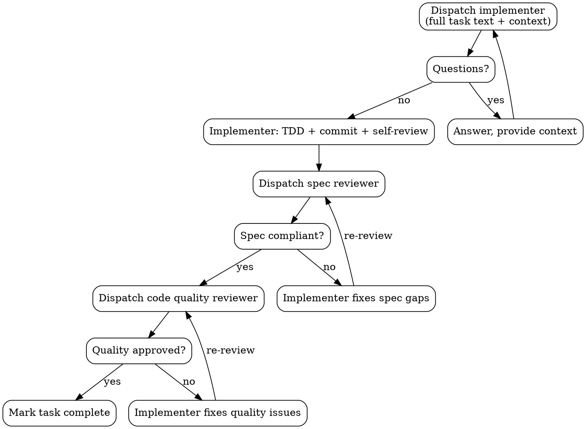
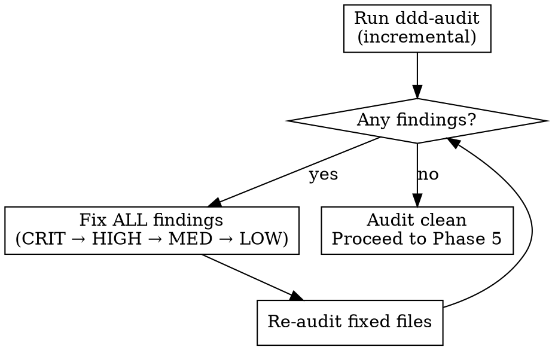

# DDD Develop

Self-contained development workflow: locate development target, plan, implement with TDD via subagents, audit, verify, and commit. No external skill dependencies.

Supports three input modes:
1. **Explicit requirement** — `/ddd-develop <description>` runs the full workflow on the given requirement
2. **Roadmap-driven** — `/ddd-develop` with no arguments scans the roadmap for the next unchecked item
3. **Interactive** — if no arguments AND no unchecked roadmap items (or no roadmap exists), asks the user what to develop

**Announce at start:**
- If arguments provided: "Using ddd-develop to implement: [user's description]."
- If roadmap item found: "Using ddd-develop to implement the next roadmap feature."
- If asking user: "Using ddd-develop — no pending roadmap items found. What would you like to develop?"

## Execution Flow



---

## Phase 1: LOCATE

Determine the development target based on input mode.

### Step 1: Detect Input Mode

Check whether the user provided arguments after the command:

- **Arguments provided** → Go to **Step 1a: Classify Input**
- **No arguments** → Go to **Mode B: Roadmap Scan**

### Step 1a: Classify Input

When arguments are provided, classify them before proceeding:

1. **Roadmap reference?** — Check in this order:
   - Arguments contain `--roadmap <path>` — extract the path as `roadmap_override` and the remaining text as the item identifier. Set `source = "roadmap"`. Proceed to **Mode A: Explicit Requirement** using the item text as the development target, but carry `roadmap_override` through to Phase 6.1 for checkbox flipping. (This is the path for fix-roadmap items dispatched by ddd-auto.)
   - Arguments match `P\d+` patterns (e.g., `P0`, `P1.2`, `P0.1.1`) → treat as roadmap scope reference, switch to **Mode B: Roadmap Scan** with that scope filter
   - Arguments are a `.md` file path AND the file contains `- [ ]` checkboxes → treat as roadmap file, switch to **Mode B: Roadmap Scan** using that file as the roadmap source
   - If matched → set `source = "roadmap"`

2. **Scope assessment** (for natural language input that didn't match above):
   - **Small requirement** — single feature, single module, ≤3 sentences → Go to **Mode A: Explicit Requirement**
   - **Large requirement** — any of: multiple modules/subsystems, >3 distinct features, >5 sentences of description → Go to **Mode D: Oversized Requirement**

### Mode A: Explicit Requirement

The user specified a single, scoped feature to develop. Use their description as the development target directly.

1. Parse the user's description into a clear feature requirement
2. Read project context (CLAUDE.md, existing code, DDD layer structure) to understand how this requirement fits
3. If `roadmap_override` is NOT set: Set `source = "ad-hoc"` (used in Phase 6 to skip roadmap updates). If `roadmap_override` IS set (from `--roadmap` flag in Phase 1a): `source` is already `"roadmap"` — do NOT overwrite it.

**Present to User:**

[If `roadmap_override` is set, display:]

```
Development target (roadmap — fix-roadmap item):

**Requirement**: [item text from --roadmap args]
**Roadmap file**: [roadmap_override path]

Proceed with this requirement?
```

[Otherwise (ad-hoc):]

```
Development target (ad-hoc):

**Requirement**: [user's description, clarified if needed]
**Fits in**: [which DDD layer/module this likely belongs to, based on project context]

Proceed with this requirement?
```

Wait for user confirmation. User may refine the requirement.

### Mode D: Oversized Requirement

The input describes a large, multi-feature requirement that exceeds ddd-develop's single-item scope. Guide the user to the correct workflow.

**Present to User:**

```
This requirement involves multiple features/modules. ddd-develop executes one item at a time.

Recommended workflow:
1. /ddd-roadmap <your requirement> — generate a structured development roadmap
2. /ddd-auto — auto-execute all roadmap items in sequence

Alternatively, you can narrow the scope to a single feature and re-run /ddd-develop.
```

Wait for user response. Do NOT attempt to execute the oversized requirement directly.

### Mode B: Roadmap Scan

No arguments provided — scan roadmap for the next unchecked item.

#### Roadmap Scanning

1. Look for roadmap files in order: `docs/roadmap/`, `docs/`, project root
2. Read phase documents in order (P0 → P1 → P2 → P3, or v0.x ascending)
3. Find the first unchecked item: `- [ ]`
4. Extract the feature context: which phase, feature area, sub-feature, and the specific item

**If no roadmap exists or all items are checked** → Go to **Mode C: Interactive**

#### Completion Detection

Before presenting the item to the user, check whether it has **already been implemented** despite its checkbox being unchecked. This catches cases where a previous run was interrupted before updating the roadmap.

**Check in order (stop at first conclusive signal):**

1. **Plan file exists?** — Search `docs/plans/` (and `docs/superpowers/plans/` for legacy compatibility) for a plan matching this item
   - If found, read the plan and check task checkboxes:
     - All tasks `- [x]` → likely complete
     - Mix of `- [x]` and `- [ ]` → partially complete
     - All `- [ ]` → not started (but still check git)
2. **Iterative plan with frozen targets?** — If the plan contains a "Frozen Targets" section with a completion condition command:
   - Run the completion condition using the **Grep tool** (`output_mode: "count"`) — NEVER use bash grep/wc/find
   - If count == 0: migration complete → mark item done
   - If count > 0 AND count < original: **resume mode** — report remaining count and continue from the first unchecked target in the frozen list
   - If count == original: not started, proceed normally
   
   This check is authoritative for iterative migrations — it uses grep on the actual codebase, not task checkboxes which may be stale.
3. **Git history** — Search recent commits for keywords from the item description:
   - `git log --oneline --grep="<feature keyword>" --since="30 days ago"`
   - Commits exist with matching feat/fix messages → likely implemented
4. **Code exists** — If the plan lists files to create, check whether those files already exist with non-trivial content

**If evidence shows the item is already complete:**

```
Roadmap item appears already implemented:

**Phase**: P0 Foundation
**Feature**: Subscription Credit Grant + Schema Cleanup
**Item**: Grant subscription credits on invoice.paid webhook...

**Evidence:**
- Plan: docs/plans/2026-04-07-subscription-credit-grant.md (6/6 tasks checked)
- Commits: abc1234 "feat: implement subscription credit grant" (2026-04-07)
- Files: src/billing/grantCredits.ts exists

**Recommended action:** Mark this item as complete and move to the next unchecked item.

Options:
1. Mark complete and skip to next item (recommended)
2. Re-implement anyway
3. Choose a different item
```

**If partially complete:** Report which tasks are done and which remain, then ask the user whether to resume from the incomplete task or start over.

**If all roadmap items are already complete after scanning** → Go to **Mode C: Interactive**

**If no evidence of completion:** Proceed normally with `source = "roadmap"`.

#### Present to User (Roadmap Mode)

```
Next roadmap item:

**Phase**: P0 Foundation
**Feature**: 0.1.3 Page Templates
**Item**: Create reusable page layouts: single-column, two-column, dashboard grid

Proceed with this item?
```

Wait for user confirmation. User may redirect to a different item.

### Mode C: Interactive

No arguments provided and no unchecked roadmap items found (or no roadmap exists). Ask the user what to develop.

```
No pending roadmap items found. What would you like to develop?

You can describe a feature, bug fix, refactoring task, or any other development work.
```

Once the user provides a description, treat it the same as **Mode A** (set `source = "ad-hoc"`) and present for confirmation.

---

## Phase 1.5: SPEC GATE

Before generating a plan, verify that a behavior contract (spec) exists for this feature area. The spec anchors the plan to explicit acceptance criteria, preventing direction drift.

**Skip this gate if:**
- `source = "ad-hoc"` AND user passed `--skip-spec` flag
- The development target is a bug fix or refactoring task (not a feature)

### Gate Logic

1. **Determine feature area** — Extract `P{phase}.{area}` from the development target:
   - Roadmap item `P0.1.2` → feature area `P0.1`
   - Roadmap item `P0.2.1` → feature area `P0.2`
   - Ad-hoc requirement → attempt to match against existing roadmap feature areas; if no match, skip gate

2. **Find spec file** — Search for `docs/specs/P{phase}.{area}-*.md` using Glob

3. **Check spec status:**
   - **File not found** → BLOCK:
     ```
     Spec not found for feature area P0.1.
     
     A behavior contract is required before development to prevent direction drift.
     Run: /ddd-spec P0.1
     Or pass --skip-spec to bypass this gate for ad-hoc work.
     ```
     Wait for user response. Do NOT proceed without spec or explicit bypass.
   
   - **File found, status: draft** → BLOCK:
     ```
     Spec for P0.1 exists but is still in draft status.
     
     File: docs/specs/P0.1-user-authentication.md
     Please review and approve the spec before development.
     ```
     Wait for user response.
   
   - **File found, status: approved** → PASS. Read the spec file and pass its content to Phase 2.

### Spec Context for Phase 2

When the gate passes, extract and carry forward:
- **Acceptance criteria** — match the current item's checkbox text against the "Roadmap Item" column in the spec's Coverage table; carry forward the AC IDs listed in that row (e.g., item "Build user registration endpoint" → row maps to AC-1, AC-2, AC-3)
- **Data model definitions** (all models in the spec — shared across items)
- **API contracts** relevant to the current item
- **Boundary conditions** relevant to the current item

---

## Phase 2: PLAN

Generate a detailed implementation plan for the confirmed development target (roadmap item or ad-hoc requirement).

### Planning Process

1. **Read project context**: CLAUDE.md, existing code in relevant modules, test patterns, DDD layer structure
2. **Map file structure**: which files to create/modify, one responsibility per file
3. **Scope & iteration analysis** (see below)
4. **Decompose into bite-sized tasks**: each task = one TDD cycle (2-5 minutes)
5. **Write complete plan**: exact file paths, full code blocks, test commands with expected output

### Scope & Iteration Analysis

Before decomposing tasks, check for two risks that change the plan structure.

#### A. Blast Radius Assessment

If the plan changes a shared function signature, interface, or type that other files depend on:

1. Count dependents: use the **Grep tool** with `output_mode: "count"`, pattern `functionName(`, path `src/`
2. If count > 5, note the blast radius but **proceed with direct refactoring by default**

**Default approach: Direct Refactoring.** Do NOT use patch-style updates (parallel functions, adapter shims) or gradual migration. Refactor all callers in the same plan. Batch callers into tasks grouped by module or pattern similarity (3-10 files per task).

```
⚠ Blast radius: [function] is called in [N] files.

Proceeding with direct refactoring — all [N] callers will be updated
in batched tasks within this plan.
```

Inform the user of the blast radius but do not ask for approach selection — proceed directly with the refactoring plan.

#### B. Iteration-over-N Detection

If the plan applies the same transformation to multiple discrete targets (call sites, files, endpoints, test cases):

1. **Count**: use the **Grep tool** (`output_mode: "count"`) and record the exact count
2. **If count > 5**, this is an **iterative migration** — handle it specially:

   a. **Enumerate all targets** — use the **Grep tool** (`output_mode: "files_with_matches"`) and paste its output into the plan as a frozen checklist:
   ```markdown
   ## Frozen Targets
   
   **Discovery:** Grep tool — pattern `oldFunction(`, path `src/`, exclude `__tests__`
   **Count:** 36 files
   **Completion condition:** same Grep count equals 0
   
   - [ ] src/strategies/strategy1.ts
   - [ ] src/strategies/strategy2.ts
   ...
   ```

   b. **Batch targets** — group into batches of 3-10 similar files per task/commit, not one-file-per-commit and not all-files-in-one-task. Group by module or pattern similarity.

   c. **Define mechanical completion condition** — a single shell command that returns 0 when the migration is done. This goes at the top of the plan, not buried in task checkboxes.

   d. **Per-file checkboxes** — each file gets its own checkbox in the frozen list. A session that dies mid-batch can be resumed by checking which files are already migrated (re-run the discovery command).

   e. **No "apply the equivalent transformation"** — each batch task must contain the exact code or a formalized codemod command. A fresh session with zero context must be able to execute any batch without inferring the pattern from a different task.

### Plan Document

Save to `docs/plans/YYYY-MM-DD-<feature-name>.md`:

```markdown
# [Feature Name] Implementation Plan

**Goal:** [One sentence]
**Architecture:** [2-3 sentences about approach]
**Tech Stack:** [Key technologies]
**Source:** [Roadmap: Phase / Feature Area / Item reference] or [Ad-hoc: user requirement summary]
**Spec Source:** [docs/specs/P{x}.{y}-{slug}.md] or [N/A — ad-hoc with --skip-spec]
**Acceptance Criteria:** [AC-1, AC-2, AC-3 — from spec Coverage table for this item]

---

## File Structure

| File | Action | Responsibility |
|------|--------|----------------|
| `exact/path/to/file.ts` | Create | [purpose] |
| `exact/path/to/existing.ts` | Modify | [what changes] |
| `tests/path/to/test.ts` | Create | [what it tests] |

---

## Frozen Targets (if iterative migration)

**Discovery command:** `[exact grep/glob command]`
**Count:** [N] files
**Completion condition:** `[command]` equals 0

- [ ] `path/to/target1.ts`
- [ ] `path/to/target2.ts`
...

---

### Task 1: [Component Name] [AC-1, AC-3]

**Files:**
- Create: `exact/path/to/file.ts`
- Test: `tests/exact/path/to/test.ts`

- [ ] **Step 1: Write the failing test**
[complete test code block]

- [ ] **Step 2: Run test to verify it fails**
Run: `[exact command]`
Expected: FAIL with "[expected message]"

- [ ] **Step 3: Write minimal implementation**
[complete implementation code block]

- [ ] **Step 4: Run test to verify it passes**
Run: `[exact command]`
Expected: PASS

- [ ] **Step 5: Commit**
`git commit -m "feat: [description]"`
```

**AC Reference Rule:** When a spec is available, every task heading must list which acceptance criteria it implements in square brackets (e.g., `[AC-1, AC-3]`). The union of all task AC references must cover all ACs mapped to this roadmap item in the spec's Coverage table.

### Plan Quality Rules

- **No placeholders**: Every step has actual code, actual commands, actual expected output
- **No "TBD"**: If you don't know, research first
- **No "similar to Task N"**: Repeat the code — tasks may execute out of context
- **No vague steps**: "Add error handling" is not a step; show the error handling code
- **Exact file paths always**
- **No brace expansion or globs in shell commands**: `mkdir -p a/b a/c` not `mkdir -p a/{b,c}`. Claude Code blocks brace expansion and `[...]` patterns in write operations. For paths containing brackets (e.g. Next.js `[slug]`, `[...all]`), use the Write tool to create files directly instead of mkdir.
- **DRY, YAGNI, TDD, frequent commits**

### Plan Self-Review

After writing, check:
1. **Spec coverage**: Does every AC mapped to this item (from the spec's Coverage table) have at least one task? List any gaps.
2. **Placeholder scan**: Any "TBD", "TODO", "fill in", vague steps?
3. **Type consistency**: Do names in later tasks match definitions in earlier tasks? Do data model field names match the spec's Data Models section?
4. **AC completeness**: Is the union of all task AC references equal to the set of ACs mapped to this item? No missing, no extra.

Fix issues inline. Then present plan to user for approval.

---

## Phase 3: IMPLEMENT

Execute the plan using subagents with TDD discipline.

### TDD Iron Law

```
NO PRODUCTION CODE WITHOUT A FAILING TEST FIRST
```

Every subagent follows RED-GREEN-REFACTOR:

1. **RED** — Write one minimal failing test
2. **Verify RED** — Run test, confirm it fails for the right reason
3. **GREEN** — Write minimal code to pass
4. **Verify GREEN** — Run test, confirm all pass
5. **REFACTOR** — Clean up, keep tests green
6. **Commit** — Small, focused commit

Write code before test? Delete it. No exceptions.

### Subagent Execution Model

Dispatch one fresh subagent per task. Each subagent gets isolated context.



### Implementer Prompt Template

```
You are implementing Task N: [task name]

## Task Description
[FULL TEXT of task from plan — never make subagent read plan file]

## Context
[Where this fits in the project, dependencies, DDD layer, architectural context]

## Before You Begin
If you have questions about requirements, approach, dependencies, or anything unclear — ask now.

## Your Job
1. Follow TDD: write test first (RED), verify it fails, implement minimal code (GREEN), verify it passes, refactor
2. Each test must fail for the RIGHT reason (feature missing, not typo)
3. Write minimal code — no YAGNI, no over-engineering
4. Commit after each TDD cycle
5. Self-review before reporting

## Shell Safety — Avoiding Permission Prompts

Claude Code's permission system triggers prompts on shell operators (`&&`, `||`, `|`, `;`), which split compound commands into subcommands that are each independently checked. Even if each subcommand has an allow rule, the compound command itself gets blocked. Subagents (Agent tool) do NOT inherit `.claude/settings.json` permissions (known Bug #37730), so the only reliable strategy is to **never generate compound commands**.

Rules:
- **Each Bash call = one simple command, no shell operators whatsoever**
- NEVER use `&&`, `||`, `|`, `;` — chain logic in the skill orchestrator, not in shell
- NEVER use redirections (`>`, `>>`, `<`, `2>/dev/null`, `2>&1`) — while not command separators, they can cause unpredictable matching
- NEVER use `for`/`while` loops, subshells `$(...)`, or backticks in Bash commands
- NEVER use brace expansion `{a,b,c}` or glob patterns `[...]`
- NEVER use `source` to activate virtualenvs — invoke the venv binary directly: `.venv/bin/python -c "..."` (ensure `Bash(.venv/*)` is in the project's `.claude/settings.json`)
- NEVER put `#` comments inside `python -c "..."` strings — newline + `#` triggers Claude Code's "hide arguments from path validation" security prompt, blocking subagents. Either: (a) strip all comments from inline Python, or (b) write the script to a temp file with the Write tool then run `.venv/bin/python /tmp/verify.py`
- NEVER use bash `grep`, `find`, `cat`, `wc` — use the **Grep**, **Glob**, **Read** tools instead
- Create directories with separate Bash calls: `mkdir -p path1` then `mkdir -p path2`
- For Next.js catch-all routes like `[...all]`, use Write tool directly
- If a command needs to check whether a file/binary exists before acting, use the **Glob** or **Bash(ls:*)** tool to check first, then run the command in a separate Bash call

## Code Organization
- Follow the file structure defined in the plan
- Each file: one clear responsibility, well-defined interface
- Follow existing codebase patterns
- If a file grows beyond plan's intent, report as DONE_WITH_CONCERNS

## Escalation
It is OK to stop and say "this is too hard for me."

STOP and escalate when:
- Task requires architectural decisions with multiple valid approaches
- You need to understand code beyond what was provided
- You feel uncertain about correctness
- Task involves restructuring code the plan didn't anticipate

Report: BLOCKED or NEEDS_CONTEXT with specifics.

## Self-Review Before Reporting
- Did I fully implement everything in the spec?
- Did I miss any requirements or edge cases?
- Are names clear? Is code clean?
- Did I avoid overbuilding (YAGNI)?
- Do tests verify behavior (not mock behavior)?
- Did I follow TDD? (RED → GREEN → REFACTOR)

## Report Format
- **Status:** DONE | DONE_WITH_CONCERNS | BLOCKED | NEEDS_CONTEXT
- What you implemented
- What you tested and results
- Files changed
- Self-review findings
- Issues or concerns
```

### Spec Reviewer Prompt Template

```
You are reviewing whether an implementation matches its specification.

## What Was Requested
[FULL TEXT of task requirements]

## What Implementer Claims They Built
[From implementer's report]

## CRITICAL: Do Not Trust the Report
Read the actual code. Compare to requirements line by line.

DO NOT take their word for completeness.
DO verify by reading code, not by trusting report.

Check:
- **Missing requirements**: Everything requested implemented?
- **Extra/unneeded work**: Anything built that wasn't requested?
- **Misunderstandings**: Requirements interpreted incorrectly?

Report:
- Spec compliant — all requirements met, nothing extra
- Issues found: [list specifically what's missing or extra, with file:line references]
```

### Code Quality Reviewer Prompt Template

**Only dispatch after spec compliance passes.**

```
You are reviewing code quality for Task N.

## What Was Implemented
[From implementer's report]

## Changes to Review
Files changed in commits [BASE_SHA..HEAD_SHA]

## Review Checklist
- [ ] Code is readable and well-named
- [ ] Functions are focused (<50 lines)
- [ ] Files are cohesive (<800 lines)
- [ ] No deep nesting (>4 levels)
- [ ] Errors handled explicitly
- [ ] No hardcoded secrets or credentials
- [ ] No console.log or debug statements
- [ ] Tests exist for new functionality
- [ ] Tests verify behavior, not mock behavior
- [ ] Each file has one clear responsibility
- [ ] Implementation follows DDD layer conventions
- [ ] No mutation (immutable patterns used)
- [ ] New files aren't already large

Report:
- **Strengths**: What's done well
- **Issues**: Critical / Important / Minor with file:line references
- **Assessment**: Approved / Changes Needed
```

### Handling Implementer Status

| Status | Action |
|--------|--------|
| **DONE** | Proceed to spec review |
| **DONE_WITH_CONCERNS** | Read concerns first. If correctness/scope related, address before review. If observational, note and proceed. |
| **NEEDS_CONTEXT** | Provide missing context, re-dispatch |
| **BLOCKED** | Assess: context problem → provide more; task too hard → use more capable model; task too large → split; plan wrong → escalate to user |

### Model Selection

- Mechanical tasks (1-2 files, clear spec): fast/cheap model
- Integration tasks (multi-file, pattern matching): standard model
- Architecture, design, review: most capable model

### Red Flags During Implementation

**Never:**
- Start on main/master without user consent
- Skip reviews (spec OR quality)
- Proceed with unfixed issues
- Dispatch multiple implementers in parallel (conflicts)
- Make subagent read plan file (provide full text)
- Accept "close enough" on spec compliance
- Start quality review before spec compliance passes

---

## Phase 4: AUDIT

After all plan tasks complete, run a full incremental audit.

### Invoke ddd-audit

Run ddd-audit in **incremental/diff mode**:
- Scope: only files changed since Phase 3 started
- Use `git diff` to determine change set
- Apply the 8-dimension audit matrix (see ddd-audit skill: D1-Design, D2-Architecture, D3-Quality, D4-Security, D5-Testing, D6-Integration, D7-Performance, D8-Observability) against changed files

### Audit-Fix Loop

**ALL severity levels trigger fixes** — CRITICAL, HIGH, MEDIUM, and LOW:



Fix order: CRITICAL first, then HIGH, MEDIUM, LOW. Re-audit after each fix round until zero findings.

---

## Phase 5: VERIFY

Final verification before completion. **Evidence before claims.**

### Verification Gate

```
BEFORE claiming anything is done:

1. IDENTIFY — What command proves this claim?
2. RUN — Execute the command (fresh, complete)
3. READ — Full output, check exit code
4. VERIFY — Does output confirm the claim?
   - YES → State claim WITH evidence
   - NO → State actual status with evidence
5. ONLY THEN — Make the claim
```

### Required Verifications

Run ALL of these and show output:

```bash
# 1. Lint
[project lint command, e.g., npm run lint:fix / yarn lint:fix]

# 2. Type check (if applicable)
[project type check command, e.g., npx tsc --noEmit]

# 3. Full test suite
[project test command, e.g., npm test / yarn test]

# 4. Build (if applicable)
[project build command]
```

**Every verification must show actual command output.** "Should pass" is not evidence.

### Spec Compliance Check (when spec is available)

After all technical verifications pass, check implementation against the spec:

1. **Read the spec's Coverage table** — find the row whose "Roadmap Item" column matches the current item's checkbox text. The matched row's "Acceptance Criteria" column lists the AC IDs to verify.
2. **For each mapped AC**, verify the implementation covers the Given/When/Then:
   - Check that the "Given" precondition is set up in tests
   - Check that the "When" action is implemented in production code
   - Check that the "Then" outcome is asserted in tests
3. **Report compliance:**
   ```
   Spec Compliance: docs/specs/P0.1-user-authentication.md
   
   - AC-1: User Registration ✓ — test_user_registration covers Given/When/Then
   - AC-2: Duplicate Email Rejection ✓ — test_duplicate_email covers Given/When/Then
   - AC-3: Password Strength ✗ — no test for passwords < 8 chars
   
   Result: 2/3 ACs covered. FAIL — AC-3 missing.
   ```
4. **If any AC is missing** → Do NOT mark the item complete. Implement the missing AC (return to Phase 3 for a focused TDD cycle on the missing criteria).
5. **If all ACs covered** → Proceed to Phase 6.

**Skip this check if** `source = "ad-hoc"` with `--skip-spec`, or no spec exists for the feature area.

### Red Flags — STOP

- Using "should", "probably", "seems to"
- Expressing satisfaction before verification ("Great!", "Done!")
- About to commit without verification evidence
- Thinking "just this once"

---

## Phase 6: COMPLETE

### 6.1 Update Roadmap (roadmap source only)

**Skip this step if `source = "ad-hoc"`.** Ad-hoc requirements have no roadmap entry to update.

**If `roadmap_override` is set:** The development was driven by an explicit roadmap file (e.g., fix-roadmap.md from ddd-audit, dispatched by ddd-auto).

1. Read the file at `roadmap_override`
2. If it is a **fix-roadmap** (flat checkbox list, items have IDs like `AREA-SEV-NNN`): find the line whose text after `- [ ] ` matches the item identifier passed after `--roadmap <path>`. Use the **Edit tool** to flip `- [ ]` to `- [x]` on that line.
3. If it is a **standard roadmap** (hierarchical with `### N.M.K` headings): navigate to the sub-feature heading matching the item identifier and flip checkboxes under it.
4. If the line is already `- [x]`, skip. If no matching line is found, log a warning and continue.
5. After updating, skip the rest of Phase 6.1 (Iterative Migration Gate and Standard Completion do not apply) and proceed to Phase 6.2.

#### Iterative Migration Gate

**If the plan has a Frozen Targets section**, run the completion condition command before flipping the roadmap item:

- **Count == 0** → migration complete. Flip roadmap item to `- [x]`, proceed normally.
- **Count > 0** → migration incomplete. Do NOT flip the roadmap item. Instead:
  1. Update the frozen targets checklist — check off files completed this session
  2. Write a progress note under the roadmap item: `(Progress: X/N migrated — see plan: docs/plans/...)`
  3. Commit the progress and exit cleanly

This is a hard gate: **an iterative migration cannot be marked complete while the completion condition command returns > 0.** This prevents half-finished migrations from being lost.

> **See also:** Phase 1 — Completion Detection (Iterative plan with frozen targets) describes the three detection states for this same mechanism: count == 0 (complete), count > 0 but < original (resume), count == original (not started).

#### Standard Completion

For non-iterative items (or when the iterative gate passes):
1. Read the roadmap phase document
2. Change the completed item from `- [ ]` to `- [x]`
3. If the sub-feature is fully complete, note it in the phase status
4. If all items in a phase are complete, update phase status to "Complete"

### 6.2 Update Related Documents (if necessary)

Only update other documents when the implemented feature directly affects them:
- README: if public API or user-facing behavior changed
- CLAUDE.md: if architectural patterns or conventions changed
- Architecture docs: if DDD layer structure changed

**Do not update documents speculatively.** Only update what the change actually impacts.

### 6.3 Commit

```bash
# Stage all changes
git add [specific files]

# Commit with conventional format
# For roadmap items:
git commit -m "feat: [description of what was implemented]

- [summary of changes]
- [test coverage note]
- Roadmap: [phase/feature reference] marked complete"

# For ad-hoc requirements:
git commit -m "feat: [description of what was implemented]

- [summary of changes]
- [test coverage note]"
```

### 6.4 Push (User Confirmation Required)

```
All changes committed. Ready to push to remote?

Branch: [current branch]
Commits: [N new commits]
```

**Wait for user confirmation before pushing.** Never auto-push.

---

## Roadmap Format Compatibility

This skill supports two roadmap formats:

### Checkbox Format (primary, generated by ddd-roadmap)
```markdown
- [ ] Uncompleted item
- [x] Completed item
```

### Emoji Format (legacy)
```markdown
- **Feature name** — description     # uncompleted (no emoji)
- **Feature name** — description ✅  # completed
```

When scanning, check for `- [ ]` first, fall back to lines without ✅ in emoji-style roadmaps.

---

## Quick Reference

| Phase | What | Key Output |
|-------|------|------------|
| 1. LOCATE | Find development target (args / roadmap / ask user); resume iterative migrations via frozen targets | Confirmed development target + source type |
| 1.5. SPEC GATE | Verify approved spec exists for feature area; block if missing | Spec context (ACs, data models, API contracts) for Phase 2 |
| 2. PLAN | Scope analysis (blast radius + iteration detection) → implementation plan | Plan doc with TDD tasks; frozen targets + completion condition if iterative |
| 3. IMPLEMENT | Subagent TDD execution | Working code + tests + commits |
| 4. AUDIT | ddd-audit (incremental) | Zero findings |
| 5. VERIFY | Lint + tests + build + spec compliance | Evidence of all passing + all ACs covered |
| 6. COMPLETE | Update roadmap (if applicable) + commit + push | Updated roadmap (roadmap source) or clean commit (ad-hoc) |

## Integration

**Consumes:**
- Roadmap files generated by **ddd-roadmap** (when in roadmap mode)
- User-provided feature descriptions (when in ad-hoc mode)

**Invokes:**
- **ddd-audit** in Phase 4 (incremental audit mode)

**Produces:**
- Implementation code with tests
- Updated roadmap with completed items (roadmap mode only)
- Audit-clean commits
