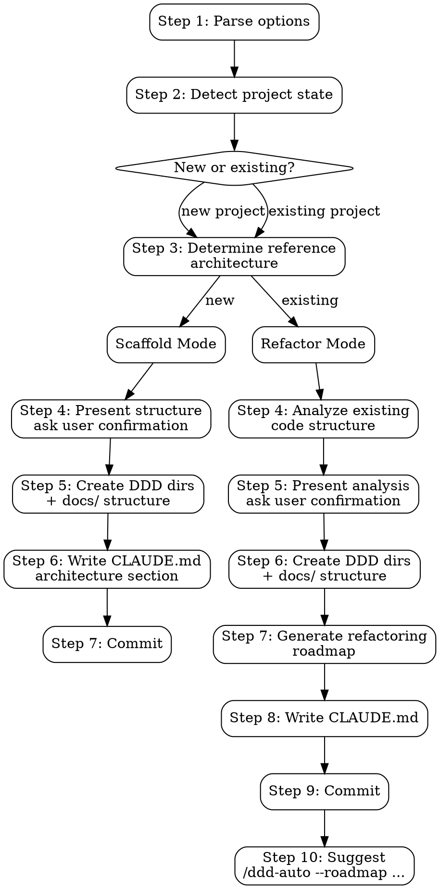

# DDD Init

Initialize a project with DDD architecture or generate a refactoring plan for an existing project. Creates the directory structure, standardized `docs/` layout, and writes architecture constraints to `CLAUDE.md` so downstream skills (`ddd-develop`, `ddd-audit`) enforce the established structure.

**Announce at start:** "Using ddd-init to [initialize/refactor] this project with DDD architecture."

## Input Modes

- `/ddd-init` — auto-detect project state, recommend template based on tech stack
- `/ddd-init --template fastlayer` — use built-in fastlayer template (TypeScript / Next.js)
- `/ddd-init --ref <path>` — use a custom reference project (scan its directory tree for DDD layer mapping)

If both `--template` and `--ref` are provided, `--ref` takes precedence.

---

## Execution Flow



---

## Step 1: Parse Options

Parse arguments for:
- `--template <name>` — built-in template name (currently: `fastlayer`)
- `--ref <path>` — path to a reference DDD project

If `--ref` provided, verify the path exists. If it does not exist, report error and exit.

## Step 2: Detect Project State

Scan the current project to determine mode:

| Signal | Mode |
|--------|------|
| No source code directories (`src/`, `server/`, `lib/`) and no framework app directory (e.g., Next.js `app/`) — or only scaffolding boilerplate (README, package.json, config files) | **Scaffold** — new project |
| Source code exists but no DDD layer directories (`domain/`, `modules/*/app/`, `repo/`, `bo/`) | **Refactor** — existing project |
| DDD layer directories already exist (`domain/`, `modules/*/app/`, `repo/`) | **Already DDD** — inform user, offer `/ddd-audit` instead |

### Tech Stack Detection

Detect from package manifest and file extensions:

| File | Stack |
|------|-------|
| `package.json` + `next.config.*` | TypeScript / Next.js → recommend `fastlayer` template |
| `package.json` + `express` or `fastify` dep | TypeScript / Node.js → recommend `fastlayer` template (adapted) |
| `go.mod` | Go |
| `Cargo.toml` | Rust |
| `pom.xml` / `build.gradle` | Java / Kotlin |
| `requirements.txt` / `pyproject.toml` | Python |

If tech stack matches a built-in template, recommend it. Otherwise, ask the user to provide `--ref` or proceed with a generic DDD structure.

## Step 3: Determine Reference Architecture

### If `--template fastlayer`:

Use the built-in fastlayer template defined below in the "Built-in Template: fastlayer" section.

### If `--ref <path>`:

1. Scan the directory tree of the reference project (exclude `node_modules/`, `.git/`, `dist/`, `build/`, `__pycache__/`, `.next/`)
2. Identify DDD layer directories by name patterns:
   - `domain/`, `model/`, `entity/`, `vo/` → Domain layer
   - `app/`, `service/`, `dto/` → Application layer
   - `repo/`, `dao/`, `repository/` → Repository layer
   - `acl/`, `adapter/`, `gateway/` → ACL layer
   - `handler/`, `controller/`, `api/`, `route/` → Presentation layer
   - `infra/`, `infras/`, `infrastructure/` → Infrastructure layer
3. Extract the directory tree structure as the target template
4. If the reference project has a `CLAUDE.md` with a `## DDD Architecture` section, extract its conventions
5. Present the extracted structure to the user for confirmation

### If no option provided:

Use tech stack detection to recommend a built-in template. If no match, ask the user:

```
No built-in template matches your tech stack ([detected stack]).

Options:
1. Provide a reference project: /ddd-init --ref <path>
2. Use generic DDD structure (domain/, app/, infra/ layers)
3. Use fastlayer template anyway (adapted for your stack)
```

---

## Scaffold Mode (New Project)

### Step 4: Present Proposed Structure

Show the user the directory structure that will be created:

```
ddd-init will create the following structure:

**Template**: [fastlayer / custom ref / generic]
**Tech stack**: [detected stack]

DDD directories:
  server/handler/
  server/infras/orm/schema/
  server/infras/auth/
  server/infras/utils/
  server/modules/

Docs directories:
  docs/roadmap/
  docs/audit/
  docs/architecture/
  docs/plans/

Architecture constraints will be written to CLAUDE.md.

Proceed?
```

Wait for user confirmation.

### Step 5: Create Directories

Create all directories with `.gitkeep` files. Use Bash:

```bash
mkdir -p server/handler server/infras/orm/schema server/infras/auth server/infras/utils server/modules
mkdir -p docs/roadmap docs/audit docs/architecture docs/plans
touch server/handler/.gitkeep server/infras/orm/schema/.gitkeep server/infras/auth/.gitkeep server/infras/utils/.gitkeep server/modules/.gitkeep
touch docs/roadmap/.gitkeep docs/audit/.gitkeep docs/architecture/.gitkeep docs/plans/.gitkeep
```

Adapt directory paths based on the template/reference architecture used.

### Step 6: Write CLAUDE.md

If `CLAUDE.md` does not exist, create it. If it exists, check for an existing `## DDD Architecture` section:
- If found, replace the entire section (from `## DDD Architecture` to the next `## ` heading or end of file)
- If not found, append at the end

The content is adapted based on the template used. For fastlayer:

````markdown
## DDD Architecture

> Generated by ddd-init. Downstream skills (ddd-develop, ddd-audit) use this
> section to enforce architectural compliance.

### Layer Mapping

| Layer | Directory | Responsibility |
|-------|-----------|----------------|
| Presentation | `server/handler/` | Request handling, response formatting |
| Application | `server/modules/*/app/` | Service orchestration, DTO transformation |
| Domain | `server/modules/*/domain/` | Business logic, entities, value objects — pure, no IO |
| Repository | `server/modules/*/repo/` | Data access, PO ↔ Entity mapping |
| ACL | `server/modules/*/acl/` | External service adapters (anti-corruption layer) |
| Infrastructure | `server/infras/` | Shared infra (ORM, auth, email, etc.) |

### Module Template

New modules MUST follow this structure:

```
server/modules/<module>/
├── acl/                        # Anti-Corruption Layer
├── app/
│   ├── dto/                    # Data Transfer Objects
│   ├── service/                # Application services
│   │   └── __tests__/
│   └── internal/               # Cross-module interfaces
├── domain/
│   ├── bo/                     # Business Objects (logic + validation)
│   │   └── __tests__/
│   └── model/
│       ├── entity/             # Entities (identity-based)
│       ├── vo/                 # Value Objects (equality-based)
│       └── qo/                 # Query Objects
├── repo/
│   ├── dao/                    # Data Access Objects
│   │   └── __tests__/
│   └── po/                     # Persistent Objects
└── utils/                      # Module-scoped utilities
```

### Dependency Rules

```
Domain → (nothing)              # Pure layer, no IO, no framework deps
Application → Domain
Repository → Domain             # Interfaces in domain, impls in repo
ACL → Domain                    # Adapts external services to domain interfaces
Presentation → Application
Infrastructure ← ACL, Repository  # Shared infra consumed by outer layers
```

### Conventions

- Request flow: `Middleware → API Route → Handler → Service → BO → DAO → Database`
- Tuple return pattern: `[data, error]` for all async functions
- ServiceError objects for business errors (never `new Error()` for 4xx)
- Type separation: DTO (API) ↔ Entity (Domain) ↔ PO (Database)
- Cross-module communication: via `app/internal/` interfaces
- Tests: colocated in `__tests__/` within each layer
- Immutability: prefer immutable data structures in domain layer
````

### Step 7: Commit

```bash
git add [list all created directories, .gitkeep files, and CLAUDE.md explicitly]
git commit -m "feat: initialize DDD architecture structure

- Created DDD layer directories ([template] template)
- Created standardized docs/ structure
- Added DDD Architecture section to CLAUDE.md"
```

---

## Refactor Mode (Existing Project)

### Step 4: Analyze Existing Code Structure

Scan all source directories and classify files into DDD layers using heuristics:

1. **Scan**: List all source files with their directories
2. **Classify** each directory/file:
   - Files with DB queries, ORM models, schema definitions → **Repository / Infrastructure**
   - Files with business logic, validation, domain rules → **Domain**
   - Files with HTTP handlers, controllers, route definitions → **Presentation**
   - Files with service orchestration, workflow coordination → **Application**
   - Files integrating external APIs (Stripe, auth providers, etc.) → **ACL**
   - Config files, utilities, shared types → **Cross-cutting / Infrastructure**
3. **Identify modules**: Group related files into potential bounded contexts

### Step 5: Present Analysis

Show the user the analysis and proposed migration:

```
Project analysis:

**Current structure:**
  src/services/userService.ts      → Application + Domain (mixed)
  src/services/billingService.ts   → Application + ACL (mixed)
  src/models/user.ts               → Domain (entity)
  src/models/invoice.ts            → Domain (entity)
  src/db/queries.ts                → Repository
  src/controllers/userController.ts → Presentation
  src/lib/stripe.ts                → ACL

**Identified modules:** user, billing

**Proposed target structure:**
  server/modules/user/domain/bo/
  server/modules/user/domain/model/entity/
  server/modules/user/app/service/
  server/modules/user/repo/dao/
  server/modules/billing/...

Proceed with this mapping?
```

Wait for user confirmation. User may adjust module boundaries or file classification.

### Step 6: Create Target DDD Directories

Same as scaffold mode — create all target directories with `.gitkeep`.

### Step 7: Generate Refactoring Roadmap

Output to `docs/roadmap/` in standard ddd-roadmap format (compatible with ddd-auto/ddd-develop):

```markdown
# P0: DDD Structure Migration

> **Timeline**: [estimated based on file count]
> **Goal**: Reorganize existing code into DDD layered architecture
> **Status**: Pending

## 0.1 Domain Layer Migration

### 0.1.1 Extract [Module] Domain Logic

Move business logic from mixed service files to domain layer.

- [ ] Move [specific logic] from `[source path]` to `[target path]`
- [ ] Extract [Entity] from `[source]` to `[target]`
- [ ] Update imports across affected files

## 0.2 Repository Layer Migration

### 0.2.1 Extract [Module] Data Access

- [ ] Move [specific queries] from `[source]` to `[target]`
- [ ] Create PO types in `[target]`

## 0.3 ACL Layer Migration
...

## 0.4 Presentation Layer Migration
...

## 0.5 Application Layer Migration
...
```

Each item MUST reference:
- Exact source file path (current location)
- Exact target file path (DDD location)
- What code changes are needed (not just "move file")

### Step 8: Write CLAUDE.md

Same as scaffold mode.

### Step 9: Commit

```bash
git add [list all created directories, .gitkeep files, CLAUDE.md, and docs/roadmap/ explicitly]
git commit -m "feat: add DDD architecture structure and refactoring roadmap

- Created target DDD layer directories ([template] template)
- Created standardized docs/ structure
- Generated refactoring roadmap in docs/roadmap/
- Added DDD Architecture section to CLAUDE.md"
```

### Step 10: Suggest Next Step

```
DDD initialization complete.

To execute the refactoring roadmap:
  /ddd-auto --roadmap docs/roadmap/ P0

Or execute items one at a time:
  /ddd-develop
```

---

## Built-in Template: fastlayer

**Tech Stack:** TypeScript / Next.js
**Reference:** https://github.com/RealMatrix-PTE-LTD/fastlayer

### Directory Structure

```
server/
├── handler/                    # Presentation layer
│   └── <domain>/               # Grouped by domain
├── infras/                     # Shared infrastructure
│   ├── orm/
│   │   ├── schema/             # Database schemas (Drizzle)
│   │   └── data-preset/        # Seed data
│   ├── auth/                   # Auth infrastructure
│   ├── utils/                  # Shared utilities
│   └── shared/                 # Shared types/constants
└── modules/                    # Bounded contexts
    └── <module>/
        ├── acl/                # Anti-Corruption Layer
        │   └── <service>/      # One subdir per external service
        ├── app/
        │   ├── dto/            # Data Transfer Objects
        │   ├── service/        # Application services
        │   │   └── __tests__/
        │   └── internal/       # Cross-module interfaces
        ├── domain/
        │   ├── bo/             # Business Objects
        │   │   └── __tests__/
        │   └── model/
        │       ├── entity/     # Entities
        │       ├── vo/         # Value Objects
        │       └── qo/         # Query Objects
        ├── repo/
        │   ├── dao/            # Data Access Objects
        │   │   └── __tests__/
        │   └── po/             # Persistent Objects
        └── utils/
```

### Conventions

- Request flow: `Middleware → API Route → Handler → Service → BO → DAO → Database`
- Tuple return: `[data, error]` for all async functions
- Error handling: `ServiceError` objects, never `new Error()` for 4xx
- Type system: `DTO (API) ↔ Entity (Domain) ↔ PO (Database)`
- PO to Entity: `convertNullToUndefined<Entity>(po)`
- Entity to PO: `entity.field ?? null`
- Cross-module communication: via `app/internal/` interfaces
- Tests: colocated in `__tests__/` within each layer

### Standardized docs/ Structure

```
docs/
├── roadmap/                    # ddd-roadmap output
├── audit/                      # ddd-audit output
├── architecture/               # Architecture documentation
└── plans/                      # Implementation plans
```

---

## Integration

**Pipeline position:** Entry point — runs before all other skills.

```
ddd-init → ddd-roadmap → ddd-develop/ddd-auto → ddd-audit
```

**Produces:**
- DDD directory structure (consumed by ddd-develop when creating new files)
- `docs/` structure (consumed by all skills for output)
- CLAUDE.md architecture section (consumed by ddd-develop for plan generation, ddd-audit for compliance checking)
- Refactoring roadmap in `docs/roadmap/` (consumed by ddd-develop/ddd-auto)

**Does NOT produce:** Any source code. Only directories, `.gitkeep` files, and documentation.
