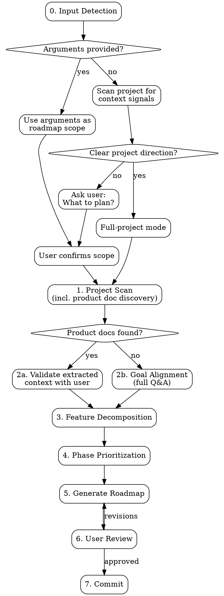

# DDD Roadmap Generator

Analyze a DDD project, align on product goals, and generate a structured, phased roadmap. Output format is standardized for ddd-develop skill consumption.

Supports three input modes:
1. **Scoped roadmap** — `/ddd-roadmap <scope>` generates a roadmap focused on the given feature area or requirement
2. **Full-project roadmap** — `/ddd-roadmap` with no arguments scans the full project and plans all features
3. **Interactive** — if no arguments AND project scope is unclear (e.g., empty project, no README, no clear product direction), asks the user what to plan

**Announce at start:**
- If arguments provided: "Using ddd-roadmap to plan: [user's scope description]."
- If full project: "Using ddd-roadmap to generate a full project roadmap."
- If asking user: "Using ddd-roadmap — what scope would you like to plan?"

## Execution Flow



---

## Step 0 — Input Detection

Determine the roadmap scope based on input mode.

### Mode A: Scoped Roadmap

The user provided arguments (e.g., `/ddd-roadmap billing system with Stripe integration`).

1. Parse the user's description into a clear scope definition
2. Set `mode = "scoped"` — Steps 1-5 will focus only on this scope
3. Present for confirmation:

```
Roadmap scope (user-defined):

**Scope**: [user's description, clarified if needed]
**Focus area**: [which DDD layers/modules this likely involves]

Generate a phased roadmap for this scope?
```

Wait for user confirmation. User may refine the scope.

### Mode B: Full-Project Roadmap

No arguments provided. Quickly check for project context signals:
- README or CLAUDE.md exists with product description
- Product documentation exists (PRD, specs, requirements — see Step 1 discovery rules)
- Source code directories exist with meaningful structure
- Package manifest (package.json, go.mod, Cargo.toml, etc.) exists

If clear project direction is detectable → set `mode = "full-project"`, proceed to Step 1.

### Mode C: Interactive

No arguments provided and project scope is unclear (empty project, no README, no clear product direction).

```
No clear project scope detected. What would you like to plan?

Examples:
- "A SaaS billing platform with subscription management"
- "Add a notification system to the existing project"
- "Plan the full project based on the existing code"
```

Once the user provides a description, treat as **Mode A** (set `mode = "scoped"`) and confirm.

---

## Step 1 — Project Scan

Detect and document:

1. **Tech stack**: language, framework, build tool, test framework, linter, package manager
2. **DDD layers**: map directories to Domain / Infrastructure / Application / Presentation / Cross-Cutting
3. **Module inventory**: for each layer, list modules with file count and LOC
4. **Existing state**: what's already built, what's partially complete, what's missing
5. **Existing docs**: README, CLAUDE.md, architecture docs, any prior roadmap
6. **Product documentation**: scan for product docs that inform roadmap planning (see below)

### Product Documentation Discovery

Scan the project for product-related documents that provide requirements, vision, or specifications. These docs significantly improve roadmap quality by grounding plans in documented requirements rather than relying solely on conversational clarification.

**Scan locations** (in priority order):
1. Project root: `PRD.md`, `PRODUCT.md`, `REQUIREMENTS.md`, `SPEC.md`
2. `docs/` directory: `docs/prd*`, `docs/product*`, `docs/requirements*`, `docs/spec*`, `docs/design*`
3. `docs/specs/`, `docs/requirements/`, `docs/design/` subdirectories
4. Any `.md` or `.txt` file whose name or H1 heading contains: PRD, product requirement, product spec, functional spec, user story, acceptance criteria, use case

**What to extract from product docs:**
- **Product vision & goals** — target users, value proposition, success metrics
- **Functional requirements** — features, user stories, use cases
- **Non-functional requirements** — performance, security, compliance, scalability
- **Acceptance criteria** — definition of done for features
- **Constraints & assumptions** — technical, business, or regulatory boundaries
- **Priority signals** — any MoSCoW, P0/P1/P2, or explicit priority markers

**Output:** List discovered product docs with a one-line summary of what each contains. If no product docs are found, note this — Step 2 will compensate with more detailed questions.

**Scoped mode (`mode = "scoped"`):** Focus scan on modules and layers relevant to the given scope. Still detect tech stack and DDD structure for the full project, but module inventory and existing state analysis can be narrowed to the scope area.

### Language & Output Detection

- Detect project language from file extensions + package manager files
- Detect output language from README, comments, commit messages
- Write roadmap in detected language (or bilingual if project is bilingual)

---

## Step 2 — Goal Alignment

### When product documentation was found (Step 1)

If product docs were discovered, **use them as the primary source of truth** rather than asking from scratch:

1. **Summarize extracted context** — Present a brief summary of what the product docs tell us about vision, requirements, constraints, and priorities
2. **Validate rather than ask** — Instead of open-ended questions, present the extracted understanding for user confirmation:
   ```
   Based on [doc name], I understand:
   - **Product vision**: [extracted vision]
   - **Target users**: [extracted users]
   - **Key requirements**: [top 3-5 extracted requirements]
   - **Constraints**: [extracted constraints]

   Is this accurate? Anything to add, correct, or reprioritize?
   ```
3. **Fill gaps only** — Ask clarifying questions only for information NOT covered by the product docs. Common gaps:
   - Timeline and team size (rarely in PRDs)
   - DDD-specific architecture preferences
   - Priority adjustments since the doc was written
4. **Cross-reference with code** — Compare product doc requirements against Step 1's existing state analysis to identify what's already built vs. what's missing

### When no product documentation was found

Ask clarifying questions **one at a time** to understand:

1. **Product vision** — What is the end product? Who are the users?
2. **Current state** — What works today? What's the most critical gap?
3. **Constraints** — Timeline, team size, budget, technical constraints
4. **Priority** — What must ship first? What can wait?
5. **Architecture goals** — Any DDD patterns to enforce or adopt? (Bounded contexts, event sourcing, CQRS, etc.)

### Mode-specific behavior

**Scoped mode (`mode = "scoped"`):** The user has already provided scope context. Skip questions that are already answered by the scope description or product docs. Focus on clarifying ambiguities within the scope rather than broad product vision. If the scope is specific enough (e.g., "add Stripe billing with subscription management"), you may need fewer or no clarifying questions.

Prefer multiple-choice questions when possible.

---

## Step 3 — Feature Decomposition

Break the product (or scoped feature area) into feature areas, then decompose each into actionable items:

```
Product
├── Feature Area 1 (e.g., Authentication)
│   ├── Sub-feature 1.1 (e.g., Email/Password Auth)
│   │   ├── Item: User registration endpoint
│   │   ├── Item: Login with JWT
│   │   └── Item: Password reset flow
│   └── Sub-feature 1.2 (e.g., OAuth)
│       ├── Item: Google OAuth integration
│       └── Item: GitHub OAuth integration
└── Feature Area 2 (e.g., Billing)
    └── ...
```

### Decomposition Rules

1. Each item must be **independently implementable and testable**
2. Each item maps to a clear DDD layer or cross-cutting concern
3. Items should take **1-4 hours** to implement (not days)
4. Dependencies between items must be noted
5. Each item includes enough context for ddd-develop to generate a plan

---

## Step 4 — Phase Prioritization

Organize items into phases by priority:

| Phase | Purpose | Criteria |
|-------|---------|----------|
| **P0 — Foundation** | MVP, critical path | Must-have for product to function |
| **P1 — Core Features** | Key differentiators | Important but not blocking launch |
| **P2 — Growth** | Scale & reach | Nice-to-have, enables growth |
| **P3 — Enterprise** | Advanced, niche | Long-term, enterprise requirements |

### Ordering Rules

1. **Dependencies first** — If B depends on A, A goes in an earlier phase
2. **Domain layer first** — Domain models and business rules before infrastructure
3. **Backend before frontend** — API before UI (unless UI is the product)
4. **Happy path first** — Core flow before edge cases and error handling
5. **Cross-cutting last** — Logging, monitoring, i18n after features work

---

## Step 5 — Generate Roadmap

### Output Location

Save to `docs/roadmap/` directory:

**Full-project mode:**
```
docs/roadmap/
├── README.md              # Overview + phase table + current state + architecture decisions
├── P0-foundation.md       # Phase 0 details
├── P1-core-features.md    # Phase 1 details
├── P2-growth.md           # Phase 2 details
└── P3-enterprise.md       # Phase 3 details
```

**Scoped mode:** If a roadmap already exists, **merge** the new scoped items into existing phase documents rather than overwriting. If no roadmap exists, generate the same structure but scoped to the feature area. Use fewer phases if the scope is small (e.g., a single feature may only need P0 and P1).

User preferences for location override this default.

### README.md Format

```markdown
# [Project Name] Roadmap

## Roadmap Overview

| Priority | Phase | Timeline | Goal | Status |
|----------|-------|----------|------|--------|
| **P0** | [Foundation (MVP)](./P0-foundation.md) | Weeks 1-4 | [goal] | Pending |
| **P1** | [Core Features](./P1-core-features.md) | Weeks 5-8 | [goal] | Pending |
| **P2** | [Growth](./P2-growth.md) | Weeks 9-14 | [goal] | Pending |
| **P3** | [Enterprise](./P3-enterprise.md) | Weeks 15+ | [goal] | Pending |

## Current State

### Complete
- [list of completed features]

### In Progress
- [list of in-progress features]

### Not Started
- [list of planned features]

## Key Architecture Decisions

### 1. [Decision Title]
**Decision**: [what was decided]
**Why**: [rationale]
```

### Phase Document Format (CRITICAL — ddd-develop depends on this)

```markdown
# P[N]: [Phase Name]

> **Timeline**: [estimated]
> **Goal**: [one-line goal]
> **Status**: [Pending | In Progress | Complete]

## [N].1 [Feature Area Name]

### [N].1.1 [Sub-feature Name]

[Brief description of what this sub-feature accomplishes and why it matters]

- [ ] [Actionable item with enough context to implement]
- [ ] [Another actionable item]
- [x] [Completed item]

### [N].1.2 [Sub-feature Name]

[Description]

- [ ] [Item]

---

## [N].2 [Feature Area Name]

### [N].2.1 [Sub-feature Name]
...
```

### Item Writing Rules

Each checkbox item must be:

1. **Self-contained** — Understandable without reading other items
2. **Actionable** — Starts with a verb (Build, Add, Create, Implement, Configure, Write)
3. **Scoped** — Clear boundaries on what's included and excluded
4. **Testable** — Clear success criteria implied by the description
5. **DDD-aware** — References which layer or module it belongs to when not obvious

**Good items:**
```markdown
- [ ] Build user registration endpoint with email validation (Application layer, UserService)
- [ ] Add Stripe webhook handler for `invoice.paid` events (Infrastructure, BillingAdapter)
- [ ] Create CreditBalance value object with FIFO deduction logic (Domain, Credits module)
```

**Bad items:**
```markdown
- [ ] Auth system                     # Too vague
- [ ] Handle edge cases               # Not specific
- [ ] Improve error handling          # No clear scope
- [ ] Set up infrastructure           # Too broad
```

---

## Step 6 — User Review

Present the generated roadmap and ask for review:

> "Roadmap generated and saved to `docs/roadmap/`. Please review the phase documents. Any items to add, remove, reorder, or rephrase?"

Wait for user feedback. Iterate until approved.

---

## Step 7 — Commit

After approval, commit the roadmap files:

```bash
git add docs/roadmap/

# Full-project mode:
git commit -m "docs: add project roadmap (P0-P3)"

# Scoped mode (new roadmap):
git commit -m "docs: add [scope] roadmap (P0-P[N])"

# Scoped mode (merged into existing):
git commit -m "docs: add [scope] items to project roadmap"
```

---

## Incremental Updates

When a roadmap already exists and user asks to update:

1. Read existing roadmap files
2. Identify what's changed (completed items, new requirements, scope changes)
3. Update phase documents — mark completed items with `[x]`, add new items, adjust phases
4. Present diff to user for review
5. Commit changes

---

## Design Documents

When features require deeper analysis before roadmap placement, generate companion design docs:

```
docs/roadmap/
├── README.md
├── P0-foundation.md
├── [feature]-strategy.md       # Architecture/strategy analysis
└── [feature]-recommendation.md # Technology evaluation
```

Link design docs from the roadmap README and relevant phase documents.

---

## Integration

**Consumes:**
- DDD directory structure and CLAUDE.md produced by **ddd-init**

**Produces artifacts consumed by:**
- **ddd-develop** — Scans phase docs for `- [ ]` items to locate next development target
- **ddd-auto** — Reads phase docs to expand scope and execute items in batch
- **ddd-audit** — References roadmap for functional completeness verification
