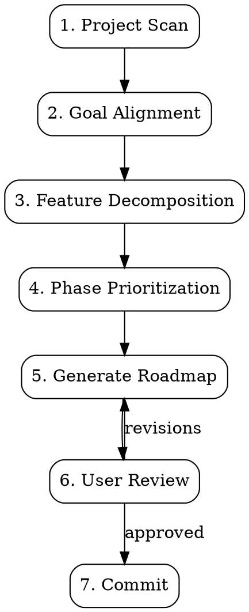

# DDD Roadmap Generator

Analyze a DDD project, align on product goals, and generate a structured, phased roadmap. Output format is standardized for ddd-develop skill consumption.

## Execution Flow



---

## Step 1 — Project Scan

Detect and document:

1. **Tech stack**: language, framework, build tool, test framework, linter, package manager
2. **DDD layers**: map directories to Domain / Infrastructure / Application / Presentation / Cross-Cutting
3. **Module inventory**: for each layer, list modules with file count and LOC
4. **Existing state**: what's already built, what's partially complete, what's missing
5. **Existing docs**: README, CLAUDE.md, architecture docs, any prior roadmap

### Language & Output Detection

- Detect project language from file extensions + package manager files
- Detect output language from README, comments, commit messages
- Write roadmap in detected language (or bilingual if project is bilingual)

---

## Step 2 — Goal Alignment

Ask clarifying questions **one at a time** to understand:

1. **Product vision** — What is the end product? Who are the users?
2. **Current state** — What works today? What's the most critical gap?
3. **Constraints** — Timeline, team size, budget, technical constraints
4. **Priority** — What must ship first? What can wait?
5. **Architecture goals** — Any DDD patterns to enforce or adopt? (Bounded contexts, event sourcing, CQRS, etc.)

Prefer multiple-choice questions when possible.

---

## Step 3 — Feature Decomposition

Break the product into feature areas, then decompose each into actionable items:

```
Product
├── Feature Area 1 (e.g., Authentication)
│   ├── Sub-feature 1.1 (e.g., Email/Password Auth)
│   │   ├── Item: User registration endpoint
│   │   ├── Item: Login with JWT
│   │   └── Item: Password reset flow
│   └── Sub-feature 1.2 (e.g., OAuth)
│       ├── Item: Google OAuth integration
│       └── Item: GitHub OAuth integration
└── Feature Area 2 (e.g., Billing)
    └── ...
```

### Decomposition Rules

1. Each item must be **independently implementable and testable**
2. Each item maps to a clear DDD layer or cross-cutting concern
3. Items should take **1-4 hours** to implement (not days)
4. Dependencies between items must be noted
5. Each item includes enough context for ddd-develop to generate a plan

---

## Step 4 — Phase Prioritization

Organize items into phases by priority:

| Phase | Purpose | Criteria |
|-------|---------|----------|
| **P0 — Foundation** | MVP, critical path | Must-have for product to function |
| **P1 — Core Features** | Key differentiators | Important but not blocking launch |
| **P2 — Growth** | Scale & reach | Nice-to-have, enables growth |
| **P3 — Enterprise** | Advanced, niche | Long-term, enterprise requirements |

### Ordering Rules

1. **Dependencies first** — If B depends on A, A goes in an earlier phase
2. **Domain layer first** — Domain models and business rules before infrastructure
3. **Backend before frontend** — API before UI (unless UI is the product)
4. **Happy path first** — Core flow before edge cases and error handling
5. **Cross-cutting last** — Logging, monitoring, i18n after features work

---

## Step 5 — Generate Roadmap

### Output Location

Save to `docs/roadmap/` directory:

```
docs/roadmap/
├── README.md              # Overview + phase table + current state + architecture decisions
├── P0-foundation.md       # Phase 0 details
├── P1-core-features.md    # Phase 1 details
├── P2-growth.md           # Phase 2 details
└── P3-enterprise.md       # Phase 3 details
```

User preferences for location override this default.

### README.md Format

```markdown
# [Project Name] Roadmap

## Roadmap Overview

| Priority | Phase | Timeline | Goal | Status |
|----------|-------|----------|------|--------|
| **P0** | [Foundation (MVP)](./P0-foundation.md) | Weeks 1-4 | [goal] | Pending |
| **P1** | [Core Features](./P1-core-features.md) | Weeks 5-8 | [goal] | Pending |
| **P2** | [Growth](./P2-growth.md) | Weeks 9-14 | [goal] | Pending |
| **P3** | [Enterprise](./P3-enterprise.md) | Weeks 15+ | [goal] | Pending |

## Current State

### Complete
- [list of completed features]

### In Progress
- [list of in-progress features]

### Not Started
- [list of planned features]

## Key Architecture Decisions

### 1. [Decision Title]
**Decision**: [what was decided]
**Why**: [rationale]
```

### Phase Document Format (CRITICAL — ddd-develop depends on this)

```markdown
# P[N]: [Phase Name]

> **Timeline**: [estimated]
> **Goal**: [one-line goal]
> **Status**: [Pending | In Progress | Complete]

## [N].1 [Feature Area Name]

### [N].1.1 [Sub-feature Name]

[Brief description of what this sub-feature accomplishes and why it matters]

- [ ] [Actionable item with enough context to implement]
- [ ] [Another actionable item]
- [x] [Completed item]

### [N].1.2 [Sub-feature Name]

[Description]

- [ ] [Item]

---

## [N].2 [Feature Area Name]

### [N].2.1 [Sub-feature Name]
...
```

### Item Writing Rules

Each checkbox item must be:

1. **Self-contained** — Understandable without reading other items
2. **Actionable** — Starts with a verb (Build, Add, Create, Implement, Configure, Write)
3. **Scoped** — Clear boundaries on what's included and excluded
4. **Testable** — Clear success criteria implied by the description
5. **DDD-aware** — References which layer or module it belongs to when not obvious

**Good items:**
```markdown
- [ ] Build user registration endpoint with email validation (Application layer, UserService)
- [ ] Add Stripe webhook handler for `invoice.paid` events (Infrastructure, BillingAdapter)
- [ ] Create CreditBalance value object with FIFO deduction logic (Domain, Credits module)
```

**Bad items:**
```markdown
- [ ] Auth system                     # Too vague
- [ ] Handle edge cases               # Not specific
- [ ] Improve error handling          # No clear scope
- [ ] Set up infrastructure           # Too broad
```

---

## Step 6 — User Review

Present the generated roadmap and ask for review:

> "Roadmap generated and saved to `docs/roadmap/`. Please review the phase documents. Any items to add, remove, reorder, or rephrase?"

Wait for user feedback. Iterate until approved.

---

## Step 7 — Commit

After approval, commit the roadmap files:

```bash
git add docs/roadmap/
git commit -m "docs: add project roadmap (P0-P3)"
```

---

## Incremental Updates

When a roadmap already exists and user asks to update:

1. Read existing roadmap files
2. Identify what's changed (completed items, new requirements, scope changes)
3. Update phase documents — mark completed items with `[x]`, add new items, adjust phases
4. Present diff to user for review
5. Commit changes

---

## Design Documents

When features require deeper analysis before roadmap placement, generate companion design docs:

```
docs/roadmap/
├── README.md
├── P0-foundation.md
├── [feature]-strategy.md       # Architecture/strategy analysis
└── [feature]-recommendation.md # Technology evaluation
```

Link design docs from the roadmap README and relevant phase documents.

---

## Integration

**Produces artifacts consumed by:**
- **ddd-develop** — Scans phase docs for `- [ ]` items to locate next development target
- **ddd-code-review** — References roadmap for functional completeness verification

**Complementary skills:**
- **ddd-develop** — Implements roadmap items one by one
- **ddd-code-review** — Audits implementation quality
