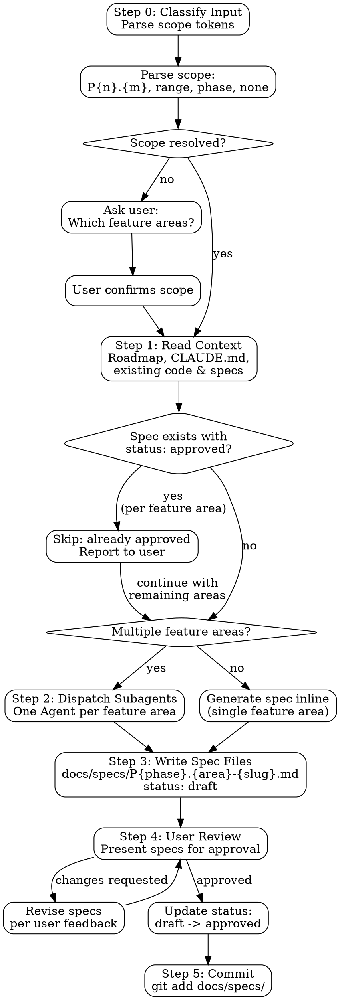

# DDD Spec Generator

Analyze roadmap feature areas and generate structured behavior contracts (specs) with numbered acceptance criteria, data models, API contracts, and boundary conditions. Output format is standardized for ddd-develop consumption.

Supports four input modes:
1. **Single feature area** -- `/ddd-spec P0.1` generates a spec for one feature area
2. **Range of feature areas** -- `/ddd-spec P0.1 - P0.3` generates specs for a contiguous range
3. **Full phase** -- `/ddd-spec P0` generates specs for all feature areas in a phase
4. **Interactive** -- `/ddd-spec` with no arguments asks the user which feature areas to spec

**Announce at start:**
- If scope provided: "Using ddd-spec to generate behavior contracts for: [scope tokens]."
- If asking user: "Using ddd-spec -- which feature areas would you like to generate specs for?"

## Execution Flow



---

## Step 0 -- Classify Input

Parse the user's input into a resolved set of feature area references.

### Token Patterns

| Pattern | Example | Meaning |
|---------|---------|---------|
| `P{n}.{m}` | `P0.1` | Single feature area: phase n, area m |
| `P{n}.{m} - P{n}.{k}` | `P0.1 - P0.3` | Range within a phase: areas m through k |
| `P{n}` | `P0` | Entire phase: all feature areas in phase n |
| No arguments | `/ddd-spec` | Interactive: ask the user |

### Resolution Rules

1. **Single token** (`P0.1`): resolve to the matching `## N.1 [Feature Area Name]` heading in the phase document
2. **Range** (`P0.1 - P0.3`): expand to `[P0.1, P0.2, P0.3]` and resolve each
3. **Phase** (`P0`): read the phase document, extract all `## N.{m}` headings, resolve each
4. **No arguments**: list available phases and feature areas from the roadmap, ask the user to select

### Validation

- Verify each token resolves to an actual feature area heading in the roadmap
- If a token does not resolve, report: `Feature area [token] not found in roadmap. Available areas: [list]`
- If roadmap files do not exist, report: `No roadmap found. Run /ddd-roadmap first to generate a development roadmap.`

---

## Step 1 -- Read Context

Gather all information needed to generate accurate specs.

### Sources to Read

1. **Roadmap files**: `docs/roadmap/P{n}-*.md` for each phase in scope. Extract:
   - Feature area name and description
   - Sub-feature names and descriptions
   - All checkbox items (these become the basis for acceptance criteria)
   - Dependencies between items

2. **CLAUDE.md**: project conventions, DDD layer structure, naming patterns, tech stack

3. **Existing code**: scan `src/` (or equivalent) for modules related to the feature area. Extract:
   - Existing domain models, value objects, entities
   - Existing API endpoints and their signatures
   - Existing test patterns and conventions
   - Database schema or migration files

4. **Existing specs**: check `docs/specs/` for specs that already cover the feature areas in scope

5. **Design documents (PRD)**: check `docs/superpowers/specs/` for design specs generated by superpowers brainstorming. These contain product vision, architecture decisions, and design rationale — use them as PRD-level input to inform acceptance criteria and data model design

### Skip Rule

If a spec file already exists for a feature area AND its frontmatter contains `status: approved`:
- Skip generation for that feature area
- Report: `Spec for [feature area] already exists with status: approved. Skipping. Delete the file or change its status to draft to trigger regeneration on next run.`

If the existing spec has `status: draft`, regenerate and overwrite it.

---

## Step 2 -- Dispatch Subagents

When multiple feature areas are in scope, dispatch one Agent subagent per feature area for parallel generation. For a single feature area, generate the spec inline (no subagent needed).

### Subagent Prompt Template

```
You are generating a behavior contract (spec) for a single feature area.

## Feature Area
**Identifier**: P{phase}.{area}
**Name**: [feature area name from roadmap]
**Phase**: [phase name]

## Roadmap Items
[FULL TEXT of all sub-features and checkbox items under this feature area -- never make subagent read roadmap files]

## Project Context
- **Tech stack**: [from CLAUDE.md]
- **DDD layers**: [from CLAUDE.md or project scan]
- **Naming conventions**: [from CLAUDE.md]
- **Existing models**: [relevant domain models found in code]
- **Existing APIs**: [relevant endpoints found in code]
- **Test patterns**: [test framework, assertion style, file naming]

## Your Job

Generate a spec document following the Spec Document Structure below. The spec must:

1. Cover EVERY roadmap item under this feature area with at least one acceptance criterion
2. Define concrete data models with field names, types, and constraints
3. Define API contracts with request/response JSON examples
4. Include boundary conditions and error cases
5. Map each component to a DDD layer
6. Use Given/When/Then format for all acceptance criteria
7. Number acceptance criteria as AC-1, AC-2, etc. sequentially

## Spec Document Structure

Write the spec as a Markdown document with YAML frontmatter:

### Frontmatter

```yaml
---
feature_area: P{phase}.{area}
title: [Feature Area Name]
status: draft
created: [YYYY-MM-DD]
roadmap_source: docs/roadmap/P{phase}-[phase-slug].md
---
```

### Sections

#### Overview
2-3 sentences describing the feature area's purpose, who it serves, and why it matters.

#### Data Models

Define each entity, value object, or aggregate with a table:

| Field | Type | Constraints | Description |
|-------|------|-------------|-------------|
| id | UUID | PK, required | Unique identifier |
| email | string | unique, required, valid email | User email address |
| status | enum | required, one of: active, suspended, deleted | Account status |
| createdAt | DateTime | required, auto-set | Creation timestamp |

Include relationships between models where applicable.

#### API Contracts

For each endpoint:

**[METHOD] [path]**

Purpose: [what this endpoint does]

Request:
```json
{
  "field": "example value"
}
```

Response (success):
```json
{
  "status": "success",
  "data": {}
}
```

Response (error):
```json
{
  "status": "error",
  "error": "description"
}
```

#### Acceptance Criteria

Use Given/When/Then format with sequential numbering:

**AC-1: [Short description]**
- **Given** [precondition]
- **When** [action]
- **Then** [expected outcome]

**AC-2: [Short description]**
- **Given** [precondition]
- **When** [action]
- **Then** [expected outcome]

Every roadmap checkbox item must map to at least one AC. Complex items may require multiple ACs.

#### Boundary Conditions

List edge cases, limits, and error scenarios:

| Condition | Expected Behavior |
|-----------|-------------------|
| Empty input | Return 400 with validation error |
| Duplicate entry | Return 409 with conflict details |
| Unauthorized access | Return 401, no data leak |
| Rate limit exceeded | Return 429 with retry-after header |

#### DDD Layer Mapping

Map each component to its DDD layer:

| Component | Layer | Module | Responsibility |
|-----------|-------|--------|----------------|
| User entity | Domain | users | Core business rules |
| UserRepository | Infrastructure | users | Data persistence |
| RegisterUserUseCase | Application | users | Orchestrate registration flow |
| POST /api/users | Presentation | users | HTTP interface |

#### Roadmap Items Coverage

Verify every roadmap item is covered:

| Roadmap Item | Acceptance Criteria | Status |
|-------------|--------------------|---------| 
| [checkbox text from roadmap] | AC-1, AC-2 | Covered |
| [checkbox text from roadmap] | AC-3 | Covered |

Every row must show "Covered" status. If a roadmap item cannot be covered, explain why.

## Quality Rules

1. **No orphan roadmap items**: every checkbox item from the roadmap must appear in the Coverage table with at least one AC
2. **No vague ACs**: each AC must be testable -- a developer must be able to write a test directly from the AC
3. **No missing error cases**: every API endpoint must have at least one error scenario in Boundary Conditions
4. **No placeholder values**: use realistic example data in JSON samples (not "string", "value", "example")
5. **Complete data models**: every field referenced in ACs or API contracts must appear in a Data Model table
6. **Consistent naming**: field names, endpoint paths, and component names must be consistent across all sections

## Report Format
- **Status:** DONE | DONE_WITH_CONCERNS | BLOCKED | NEEDS_CONTEXT
- What you generated
- Coverage summary: N roadmap items covered by M acceptance criteria
- Any gaps or concerns
```

---

## Step 3 -- Write Spec Files

Write each generated spec to the `docs/specs/` directory.

### File Naming Convention

```
docs/specs/P{phase}.{area}-{slug}.md
```

Where `{slug}` is the feature area title in kebab-case. **Slug algorithm:** lowercase the title, replace spaces and non-alphanumeric characters with hyphens, collapse consecutive hyphens, strip leading/trailing hyphens.

Examples:
- "User Authentication" → `docs/specs/P0.1-user-authentication.md`
- "Billing & Integration" → `docs/specs/P0.2-billing-integration.md`
- "Notification System" → `docs/specs/P1.3-notification-system.md`

### Directory Structure

```
docs/specs/
  P0.1-user-authentication.md
  P0.2-billing-integration.md
  P1.1-team-management.md
  ...
```

Create the `docs/specs/` directory if it does not exist.

### Write Rules

- Set `status: draft` in frontmatter
- Set `created: [today's date]` in frontmatter
- Ensure the file is self-contained: a developer reading only this file should understand what to build and how to verify it

---

## Step 4 -- User Review

Present the generated specs to the user for review.

### Presentation Format

For each spec generated, present a summary:

```
## Spec: P{phase}.{area} - [Feature Area Name]

**File**: docs/specs/P{phase}.{area}-{slug}.md
**Status**: draft
**Coverage**: [N] roadmap items covered by [M] acceptance criteria
**Data Models**: [list model names]
**API Endpoints**: [list endpoints]
**Boundary Conditions**: [count]

### Acceptance Criteria Preview
- AC-1: [title]
- AC-2: [title]
- ...
```

After presenting all specs:

```
Specs generated and saved to docs/specs/. Please review.
Options:
1. Approve all -- mark as approved and commit
2. Approve with changes -- specify what to revise
3. Reject -- discard and regenerate with different direction
```

### Revision Loop

If the user requests changes:
1. Apply the requested changes to the spec files
2. Re-present the updated summaries
3. Wait for approval

### Approval

On approval, update each spec file's frontmatter:
- Change `status: draft` to `status: approved`

---

## Step 5 -- Commit

After approval, commit the spec files:

```bash
git add docs/specs/

# Single feature area:
git commit -m "docs: add spec for P{phase}.{area} [feature area name]"

# Multiple feature areas:
git commit -m "docs: add specs for [scope description] (P{phase}.{area} - P{phase}.{area})"

# Full phase:
git commit -m "docs: add specs for phase P{phase} ([count] feature areas)"
```

---

## Spec Quality Rules

These rules apply to every generated spec. Verify compliance before presenting to the user.

1. **No orphan roadmap items**: every checkbox item from the roadmap for the feature area must appear in the Coverage table with at least one acceptance criterion mapped to it
2. **Testable acceptance criteria**: each AC must be specific enough that a developer can write an automated test directly from it -- no "should work correctly" or "handles edge cases"
3. **Complete data models**: every field referenced in acceptance criteria or API contracts must be defined in a Data Model table with type and constraints
4. **No placeholders**: all JSON examples must use realistic data, all field names must be final, all types must be concrete -- no "TBD", "TODO", "string", "value"
5. **Error coverage**: every API endpoint must have at least one error scenario documented in Boundary Conditions
6. **Consistent naming**: field names, endpoint paths, entity names, and module names must be consistent across Overview, Data Models, API Contracts, Acceptance Criteria, and DDD Layer Mapping sections

---

## Integration

**Consumes:**
- Roadmap files generated by **ddd-roadmap** (`docs/roadmap/P{n}-*.md`)
- Project conventions and DDD structure from **CLAUDE.md**

**Produces artifacts consumed by:**
- **ddd-develop** -- reads spec acceptance criteria to generate implementation plans with precise test cases; uses Data Models and API Contracts as the source of truth for code generation
- **ddd-auto** -- reads spec files to validate implementation completeness against acceptance criteria during batch execution

**Pipeline position:**
```
ddd-roadmap --> ddd-spec --> ddd-develop
                               |
                               v
                            ddd-auto
```
